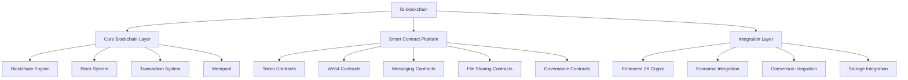

# Blockchain — docs

# Blockchain — docs Module Documentation

## Overview

The **Blockchain — docs** module serves as the comprehensive documentation for the `lib-blockchain` library, which implements the Zero Hash Transfer Protocol (ZHTP). This module provides detailed information about the blockchain's architecture, core components, smart contract capabilities, economic features, and integration with other components in the ZHTP ecosystem. It is designed to help developers understand, utilize, and contribute to the blockchain implementation effectively.

## Purpose

The primary purpose of this module is to document the functionality and usage of the `lib-blockchain` library, which includes:

- **Zero-Knowledge Transactions**: Enabling private transactions using advanced cryptographic techniques.
- **Smart Contracts**: Supporting a variety of contract types, including token contracts, Web4 contracts, and governance contracts.
- **Decentralized Websites**: Facilitating the hosting of decentralized websites through the Web4 framework.
- **Economic Features**: Implementing a Universal Basic Income (UBI) system and other economic incentives.
- **Integration**: Providing seamless integration with cryptographic, storage, and consensus components.

## Architecture

The architecture of the `lib-blockchain` module is modular, consisting of several key components that interact with each other to provide a robust blockchain solution. Below is a high-level overview of the architecture:



### Core Components

1. **Blockchain Engine (`blockchain.rs`)**: The main logic for managing the blockchain state, processing transactions, and coordinating with other components.

2. **Block System (`block/`)**: Responsible for defining the structure of blocks, validating them, and managing the blockchain's history.

3. **Transaction System (`transaction/`)**: Handles the creation, validation, and processing of zero-knowledge transactions.

4. **Mempool (`mempool.rs`)**: Manages the pool of pending transactions before they are included in a block.

### Smart Contract Platform

The smart contract platform supports various contract types, including:

- **Token Contracts**: For creating and managing both native and custom tokens.
- **Web4 Contracts**: For hosting decentralized websites.
- **Messaging Contracts**: For secure and private messaging.
- **File Sharing Contracts**: For decentralized file storage and sharing.
- **Governance Contracts**: For managing decentralized autonomous organization (DAO) functionalities.

### Integration Layer

The integration layer connects the blockchain with other components of the ZHTP ecosystem:

- **Enhanced ZK Crypto**: Integrates zero-knowledge proof systems for privacy.
- **Economic Integration**: Manages UBI distribution and economic incentives.
- **Consensus Integration**: Coordinates with the consensus engine for block validation and production.
- **Storage Integration**: Manages persistent storage and retrieval of blockchain state.

## Key Features

### Zero-Knowledge Privacy

- **Private Transactions**: Transactions can be conducted without revealing amounts or participants.
- **Nullifier Prevention**: Mechanisms to prevent double-spending while maintaining privacy.
- **Identity Privacy**: Optional identity revelation with cryptographic proofs.

### Smart Contract Capabilities

- **WASM Runtime**: Smart contracts are executed in a WebAssembly environment.
- **Gas System**: Prevents resource abuse by enforcing gas limits on contract execution.
- **Multi-Contract Support**: Allows for the deployment of various contract types.

### Economic Features

- **Universal Basic Income**: Automated distribution of UBI to verified citizens.
- **DAO Treasury**: Decentralized management of funds with voting mechanisms.
- **Network Rewards**: Incentives for infrastructure providers and validators.

### Web4 Decentralized Websites

- **Domain System**: Register and manage decentralized domains.
- **Content Routing**: Route requests through DHT storage for website content.
- **Access Control**: Control access to website content using smart contracts.

## Quick Start

### Basic Usage

To initialize the blockchain and add a transaction:

```rust
use lib_blockchain::{Blockchain, Transaction, TransactionType};
use lib_crypto::generate_keypair;

// Initialize blockchain
let mut blockchain = Blockchain::new()?;

// Create and add transaction
let keypair = generate_keypair()?;
let transaction = Transaction::new_transfer(
    from_address,
    to_address, 
    amount,
    fee,
    &keypair
)?;

blockchain.add_pending_transaction(transaction)?;
blockchain.mine_pending_block()?;
```

### Smart Contract Deployment

To deploy a token contract:

```rust
use lib_blockchain::contracts::{TokenContract, ContractCall};

// Deploy token contract
let contract = TokenContract::new(
    "MyToken".to_string(),
    "MTK".to_string(),
    1000000, // initial supply
    18,      // decimals
    false,   // not deflationary
)?;

let call = ContractCall::deploy_contract(contract);
blockchain.execute_contract_call(call, &deployer_keypair)?;
```

### Web4 Website Deployment

To deploy a Web4 website:

```rust
use lib_blockchain::contracts::Web4Contract;

// Deploy Web4 website
let web4_contract = Web4Contract::new();
let domain = "example.zhtp";
let manifest = WebsiteManifest::new(domain, content_hash);

web4_contract.register_domain(domain, &owner_keypair)?;
web4_contract.deploy_manifest(domain, manifest, &owner_keypair)?;
```

## Integration

### With lib-crypto

Integrate with the cryptographic library for key management and signing:

```rust
use lib_crypto::{generate_keypair, sign_message};

// Generate keypair for transactions
let keypair = generate_keypair()?;

// Sign transaction
let tx_hash = transaction.hash();
let signature = sign_message(&keypair, tx_hash.as_bytes())?;
```

### With lib-proofs

Integrate with the proof library for zero-knowledge transactions:

```rust
use lib_proofs::{ZkTransactionProof, initialize_zk_system};

// Initialize ZK system
let zk_system = initialize_zk_system()?;

// Create ZK transaction proof
let zk_proof = ZkTransactionProof::prove_transaction(
    sender_balance,
    amount,
    fee,
    secret_seed,
    nullifier_seed,
)?;
```

### With lib-storage

Integrate with the storage library for persistent state management:

```rust
use lib_storage::UnifiedStorageSystem;

// Store blockchain state
let storage_manager = BlockchainStorageManager::new(config).await?;
let result = storage_manager.store_blockchain_state(&blockchain).await?;
```

## Testing

Run the test suite to ensure the integrity of the blockchain:

```bash
# Run all tests
cargo test

# Run with features enabled
cargo test --features "contracts,wasm-runtime"

# Run specific module tests
cargo test blockchain::tests
cargo test contracts::tests
```

## Performance and Security

### Performance

The blockchain is optimized for high performance with features such as:

- **Zero-Knowledge Proofs**: Fast proving and verification using Plonky2.
- **WASM Execution**: High-performance WebAssembly runtime for smart contracts.
- **Parallel Processing**: Multi-threaded transaction validation.

### Security

Security features include:

- **Zero-Knowledge Privacy**: Cryptographically private transactions.
- **Post-Quantum Cryptography**: Support for quantum-resistant algorithms.
- **Smart Contract Sandboxing**: Isolated execution environment for contracts.

## Conclusion

The **Blockchain — docs** module provides a comprehensive overview of the `lib-blockchain` library, detailing its architecture, features, and integration capabilities. This documentation serves as a valuable resource for developers looking to understand and contribute to the ZHTP blockchain ecosystem. For further information, refer to the API reference, architecture guide, and integration guide provided in the documentation.