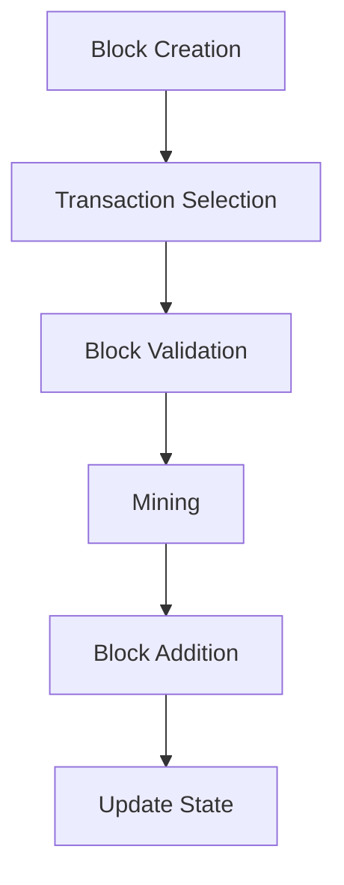

# Blockchain — src

# Blockchain Module Documentation

## Overview

The **Blockchain** module is a core component of the ZHTP blockchain implementation. It encapsulates the data structures and logic necessary for managing the blockchain's state, including blocks, transactions, and consensus mechanisms. This module is designed to facilitate the creation, validation, and management of blocks in a decentralized network, ensuring data integrity and continuity.

## Key Components

### 1. Block Structure

The `Block` struct represents a single block in the blockchain. It contains:

- **Header**: An instance of `BlockHeader`, which holds metadata about the block, including consensus-critical fields.
- **Transactions**: A vector of `Transaction` objects that are included in the block.

#### Block Header

The `BlockHeader` struct contains both consensus-critical and informational fields:

- **Consensus-Critical Fields**: These fields are included in the block hash and are essential for maintaining the integrity of the blockchain. They include:
  - `version`: Protocol version.
  - `previous_block_hash`: Hash of the previous block.
  - `merkle_root`: Root hash of the transactions in the block.
  - `timestamp`: Time when the block was created.
  - `difficulty`: Difficulty target for mining the block.
  - `nonce`: Nonce used in the mining process.
  - `height`: Height of the block in the chain.
  - `transaction_count`: Number of transactions in the block.
  - `block_size`: Size of the block in bytes.

- **Informational Fields**: These fields are not included in the block hash but provide useful information, such as `block_hash`, `cumulative_difficulty`, and `fee_model_version`.

### 2. Genesis Block

The genesis block is the first block in the blockchain and serves as the root of trust. It is created using the `create_genesis_block` function, which initializes the block with hardcoded parameters. The legitimacy of the genesis block is based on social consensus rather than cryptographic proof.

### 3. Block Creation

The `BlockBuilder` struct provides a fluent interface for constructing new blocks. It allows developers to set various parameters, such as the previous block hash, height, difficulty, and transactions. The `build` method finalizes the block creation process, calculating the merkle root and block size.

### 4. Block Validation

The module includes functions for validating blocks, such as `validate_genesis_snapshot` and `has_valid_header`. These functions ensure that blocks meet the necessary criteria before being added to the blockchain.

### 5. Mining

The module provides mining functionality through the `mine_block` and `mine_block_with_config` functions. These functions attempt to find a valid nonce for a block that meets the specified difficulty target.

### 6. Transaction Management

The blockchain maintains a set of pending transactions and a UTXO (Unspent Transaction Output) set for transaction validation. Functions like `select_transactions_for_block` help in selecting transactions based on their fee rates and sizes.

## Execution Flow

The execution flow of the blockchain module can be summarized as follows:

1. **Block Creation**: A new block is created using the `BlockBuilder`.
2. **Transaction Selection**: Transactions are selected for inclusion in the block based on their fee rates and sizes.
3. **Block Validation**: The block is validated to ensure it meets all necessary criteria.
4. **Mining**: The block is mined to find a valid nonce that satisfies the difficulty target.
5. **Block Addition**: The block is added to the blockchain, updating the state and UTXO set.

### Mermaid Diagram

## Integration with the Codebase

The Blockchain module interacts with various other components of the ZHTP ecosystem:

- **Transactions**: The module relies on the `Transaction` struct for managing the transactions included in each block.
- **Consensus**: The module integrates with consensus mechanisms to ensure that blocks are validated and added to the chain in a decentralized manner.
- **Storage**: The blockchain state can be persisted using a storage manager, allowing for recovery and state reconstruction.
- **Utilities**: Helper functions and utilities are provided for calculating transaction sizes, fees, and other metrics.

## Conclusion

The Blockchain module is a critical part of the ZHTP architecture, providing the necessary structures and logic for managing the blockchain's state. Its design emphasizes modularity and clarity, making it easier for developers to understand and contribute to the codebase. By following the outlined execution flow and utilizing the provided components, developers can effectively work with the blockchain and its associated functionalities.