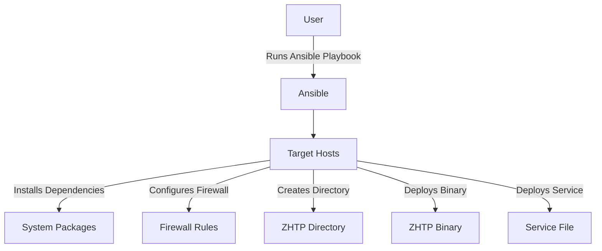

# Deployment

# Deployment Module Documentation

## Overview

The **Deployment** module provides an Ansible playbook for deploying ZHTP nodes on various Linux distributions. It automates the installation of dependencies, configuration of firewalls, creation of necessary directories, and deployment of the ZHTP binary and service files. This module is designed to simplify the deployment process, ensuring that ZHTP nodes are set up consistently across different environments.

## Supported Distributions

The module supports the following Linux distributions:

| Distro                | Package Manager | Firewall | Init System |
|----------------------|----------------|----------|-------------|
| Ubuntu/Debian        | apt            | UFW      | systemd     |
| RHEL/CentOS/Fedora   | dnf            | firewalld| systemd     |
| Arch Linux           | pacman         | iptables | systemd     |
| Alpine               | apk            | iptables | OpenRC      |

## Prerequisites

Before using the deployment module, ensure the following prerequisites are met:

- Ansible is installed on your local machine. You can install it using:
  ```bash
  pip install ansible
  ```
  or
  ```bash
  brew install ansible
  ```
- You have SSH key access to the target server.

## Configuration

### Inventory Setup

Edit the `inventory.ini` file to specify the target hosts for deployment. Here’s an example configuration:

```ini
[zhtp_dev]
77.42.74.80 ansible_user=root ansible_ssh_private_key_file=~/.ssh/kode_ocr.pem
91.98.113.188 ansible_user=root ansible_ssh_private_key_file=~/.ssh/kode_ocr.pem
```

### Ansible Configuration

The `ansible.cfg` file contains default settings for Ansible, including the inventory file and SSH connection options:

```ini
[defaults]
inventory = inventory.ini
host_key_checking = False
timeout = 30

[ssh_connection]
ssh_args = -o StrictHostKeyChecking=no -o UserKnownHostsFile=/dev/null
```

## Usage

To deploy ZHTP nodes, navigate to the `deploy/ansible` directory and run the following commands:

1. **Test Connection:**
   ```bash
   ansible all -m ping
   ```

2. **Setup Server:**
   ```bash
   ansible-playbook playbook.yml
   ```

3. **Deploy New Binary:**
   After building the binary locally, deploy it with:
   ```bash
   ansible-playbook playbook.yml -e "deploy_binary=true"
   ```

4. **Dry Run:**
   To perform a dry run (check mode):
   ```bash
   ansible-playbook playbook.yml --check
   ```

5. **Skip Service Start:**
   To set up without starting the service:
   ```bash
   ansible-playbook playbook.yml -e "start_service=false"
   ```

6. **Target Specific Host:**
   To limit the deployment to a specific host:
   ```bash
   ansible-playbook playbook.yml --limit 77.42.74.80
   ```

## What It Does

The playbook performs the following tasks:

1. **Installs System Dependencies:** 
   - Installs required packages based on the detected distribution.

2. **Creates ZHTP Directory:**
   - Creates the directory `/opt/zhtp` for storing the ZHTP binary and configuration files.

3. **Configures Firewall:**
   - Automatically detects the firewall in use (UFW, firewalld, or iptables) and configures rules for necessary ports:
     - TCP 22 (SSH)
     - UDP 37775 (multicast discovery)
     - TCP 33444 (mesh networking)
     - TCP 9334 (API port)

4. **Deploys Service File:**
   - Deploys a service file for managing the ZHTP node, using either systemd or OpenRC based on the init system.

5. **Optionally Deploys the Binary:**
   - Copies the ZHTP binary from the specified build location to the target directory.

## Building the Binary

Before deploying, ensure the ZHTP binary is built:

```bash
# From project root
cargo build --release -p zhtp
```

## Service Management

### Systemd (Ubuntu, RHEL, Arch)

To manage the ZHTP service using systemd, use the following commands:

```bash
systemctl status zhtp
journalctl -u zhtp -f
systemctl restart zhtp
systemctl stop zhtp
```

### OpenRC (Alpine)

For managing the ZHTP service on Alpine using OpenRC:

```bash
rc-service zhtp status
tail -f /var/log/messages | grep zhtp
rc-service zhtp restart
rc-service zhtp stop
```

## Troubleshooting

### SSH Locked Out

If you are locked out via SSH, use your VPS provider's console to execute the following commands based on your distribution:

- **Ubuntu/Debian:**
  ```bash
  ufw allow 22/tcp && ufw reload
  ```

- **RHEL/CentOS:**
  ```bash
  firewall-cmd --add-port=22/tcp --permanent && firewall-cmd --reload
  ```

- **Arch/Alpine:**
  ```bash
  iptables -A INPUT -p tcp --dport 22 -j ACCEPT
  ```

### Host Key Changed

If you encounter a host key change error, you can remove the old key with:

```bash
ssh-keygen -R <ip-address>
```

### Check Detected OS

To verify the detected operating system, run:

```bash
ansible all -m setup -a "filter=ansible_os_family"
ansible all -m setup -a "filter=ansible_service_mgr"
```

## Architecture Overview

The following diagram illustrates the high-level architecture of the deployment process:



## Conclusion

The Deployment module streamlines the process of setting up ZHTP nodes across various Linux distributions. By leveraging Ansible, it ensures that all necessary components are installed and configured correctly, allowing developers to focus on building and improving the ZHTP application rather than managing deployment intricacies.