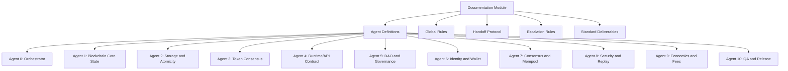

# Documentation

# Documentation Module Overview

The **Documentation** module serves as a comprehensive guide for developers working on The Sovereign Network. It outlines the architecture, components, and operational guidelines necessary for understanding and contributing to the codebase. This document is structured to provide clarity on the purpose of the module, its key components, and how it integrates with the overall system.

## Purpose

The primary purpose of the Documentation module is to ensure that developers have access to clear, concise, and accurate information about the codebase. This includes:

- Defining the roles and responsibilities of various agents within the system.
- Providing guidelines for maintaining consensus, determinism, and security.
- Outlining the handoff protocols and escalation rules for code changes.
- Documenting the standard deliverables required for each change.

## Key Components

### 1. Agent Definitions

The module defines a series of specialized agents, each responsible for a specific domain within The Sovereign Network. Each agent has its own focus, owned surfaces, responsibilities, critical invariants, and done criteria. Below is a summary of the agents:

- **Agent 0: Orchestrator Agent**
  - Focus: Intake, triage, sequencing, and cross-agent handoff control.
  - Responsibilities: Convert requests into execution plans, route work, and block merges without signoff.

- **Agent 1: Blockchain Core State Agent**
  - Focus: Canonical chain state and restart reconstruction.
  - Responsibilities: Guarantee deterministic reconstruction and ensure state transitions are replay-safe.

- **Agent 2: Storage and Atomicity Agent**
  - Focus: Persistence correctness and transaction boundaries.
  - Responsibilities: Enforce block transaction semantics and ensure crash safety.

- **Agent 3: Token Consensus Agent**
  - Focus: Canonical token execution for SOV and multi-token safety.
  - Responsibilities: Maintain a single token mutation path and enforce nonce protection.

- **Agent 4: Runtime/API Contract Agent**
  - Focus: zhtp API surface and runtime consistency.
  - Responsibilities: Prevent unsafe execution paths and ensure request validation aligns with consensus.

- **Agent 5: DAO and Governance Agent**
  - Focus: Governance proposal/vote/execution correctness.
  - Responsibilities: Ensure DAO execution is in the canonical blockchain state path.

- **Agent 6: Identity and Wallet Agent**
  - Focus: DID ownership and wallet authorization.
  - Responsibilities: Enforce identity ownership checks and maintain deterministic identity state updates.

- **Agent 7: Consensus and Mempool Agent**
  - Focus: Proposal, validation ordering, and mempool admission safety.
  - Responsibilities: Align mempool admission with consensus validation rules.

- **Agent 8: Security and Replay Assurance Agent**
  - Focus: Threat-model-driven review for consensus safety.
  - Responsibilities: Review replay and signature trust boundaries.

- **Agent 9: Economics and Fees Agent**
  - Focus: Fee model integrity and treasury/accounting correctness.
  - Responsibilities: Ensure fee calculation is deterministic and auditable.

- **Agent 10: QA and Release Readiness Agent**
  - Focus: Production readiness gates for multi-token and contract deployment.
  - Responsibilities: Maintain acceptance suites for restart, replay, and crash safety.

### 2. Global Rules

The module establishes global rules that all agents must adhere to, ensuring the integrity of the system:

- Preserve consensus determinism.
- Maintain a single canonical mutation path per state domain.
- Avoid writing consensus state outside block transaction boundaries.
- Implement replay protection and nonce continuity as consensus requirements.
- Ensure every change is accompanied by tests.

### 3. Handoff Protocol

The handoff protocol outlines the process for code changes, ensuring that all modifications are reviewed and validated by the appropriate agents. The protocol includes:

- The primary agent opens the change with explicit invariants.
- Secondary reviewers validate domain-specific risks.
- The security agent signs off on critical consensus changes.
- The QA agent validates required gates before merging.

### 4. Escalation Rules

Escalation rules are in place to prevent merging changes that could compromise the system's integrity. These rules include:

- Any detected consensus divergence risk is a merge blocker.
- Any out-of-transaction consensus write path is a merge blocker.
- Any duplicate executable token or DAO engine in the consensus path is a merge blocker.

### 5. Standard Deliverables Per Change

For each change, developers are required to provide:

- A scope summary.
- A list of affected invariants.
- A file-level diff map.
- Tests added or updated.
- A risk note and rollback strategy.

## Integration with the Codebase

The Documentation module is integral to the development process of The Sovereign Network. It connects with various components of the codebase, including:

- **Agent Implementations**: Each agent's implementation is found in their respective directories, such as `lib-blockchain`, `lib-consensus`, and `lib-identity`.
- **Testing Framework**: The module emphasizes the importance of testing, with each agent required to ship changes with corresponding tests.
- **Release Management**: The QA and Release Readiness Agent ensures that all changes meet the necessary criteria before being merged into the main branch.

## Conclusion

The Documentation module is a vital resource for developers working on The Sovereign Network. By providing clear guidelines, agent responsibilities, and integration points, it facilitates a collaborative and efficient development environment. Adhering to the outlined rules and protocols ensures the integrity and security of the network, ultimately contributing to its success.

This diagram illustrates the relationships between the Documentation module and its key components, providing a visual representation of how they interconnect.