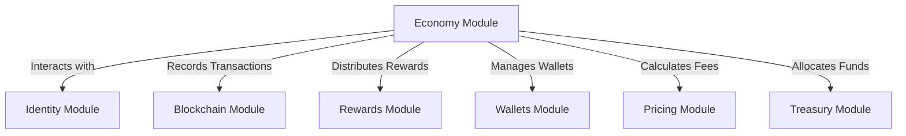

# Economy

# Economy Module Documentation

## Overview

The **Economy** module is a comprehensive economic framework designed to facilitate a post-scarcity economic model for the Sovereign Network. It encompasses various components that manage economic transactions, treasury allocations, rewards, and wallet management. The module aims to create a decentralized economic system that rewards infrastructure contributions while ensuring fair distribution of resources, such as Universal Basic Income (UBI) and welfare.

## Purpose

The primary purpose of the Economy module is to:
- Implement a post-scarcity economic model that mints tokens based on utility rather than artificial scarcity.
- Manage economic transactions, including fee calculations and treasury allocations.
- Distribute rewards for infrastructure services and manage wallets for different economic activities.
- Ensure transparency and efficiency in the allocation of funds for UBI, welfare, and development.

## Key Components

### 1. Economic Constants

The module defines several constants that govern the economic parameters, such as fee rates, allocation percentages, and minimum staking amounts. These constants are crucial for maintaining consistency across the economic calculations.

```rust
pub const DEFAULT_DAO_FEE_RATE: u64 = 200; // 2%
pub const UBI_ALLOCATION_PERCENTAGE: u64 = 40; // 40% of DAO fees
pub const WELFARE_ALLOCATION_PERCENTAGE: u64 = 30; // 30% of DAO fees
pub const DEVELOPMENT_ALLOCATION_PERCENTAGE: u64 = 30; // 30% of DAO fees
```

### 2. Economic Model

The `EconomicModel` struct serves as the core of the economic framework, managing network-wide economic parameters. It includes methods for creating new models, adjusting parameters based on network load, and calculating transaction fees.

#### Key Methods:
- `new()`: Initializes a new economic model with default parameters.
- `adjust_parameters(&mut self, network_load: f64)`: Adjusts economic parameters based on current network utilization.
- `calculate_fee(&self, tx_size: u64, amount: u64, priority: Priority)`: Calculates the base fee, DAO fee, and total fee for a transaction.

### 3. Token Reward

The `TokenReward` struct calculates rewards for infrastructure services based on work metrics. It includes methods for calculating rewards based on different types of work, such as routing, storage, and compute.

#### Key Methods:
- `calculate(work: &WorkMetrics, model: &EconomicModel)`: Calculates comprehensive token rewards based on useful work.
- `calculate_isp_bypass(work: &IspBypassWork)`: Calculates specific rewards for ISP bypass work.
- `combine(&mut self, other: &TokenReward)`: Combines multiple reward sources into a single reward.

### 4. DAO Treasury

The `DaoTreasury` struct manages the DAO treasury, including the allocation of funds for UBI, welfare, and development. It tracks the treasury balance and ensures that funds are allocated according to predefined percentages.

#### Key Methods:
- `new()`: Creates a new DAO treasury with zero balances.
- `receive_dao_fee(&mut self, amount: u64)`: Receives DAO fees from transactions.
- `allocate_funds(&mut self)`: Allocates received fees to UBI, welfare, and development based on predefined percentages.

### 5. Wallet Management

The module includes a multi-wallet management system that allows users to create and manage different types of wallets for various economic activities. Each wallet type serves a specific purpose, such as personal spending, business operations, or rewards.

#### Key Components:
- `Wallet`: Represents an individual wallet with attributes like balance, owner identity, and transaction history.
- `MultiWalletManager`: Manages multiple wallets for a single identity, allowing for easy transfers and balance tracking.

### 6. Transactions

The `Transaction` struct represents economic transactions within the system. It includes methods for creating new transactions, calculating fees, and validating transaction types.

#### Key Methods:
- `new(from: [u8; 32], to: [u8; 32], amount: u64, tx_type: TransactionType, tx_size: u64, priority: Priority)`: Creates a new transaction with automatic fee calculation.
- `is_fee_exempt(&self)`: Checks if the transaction type is fee-exempt.

### 7. Incentives and Rewards

The module includes an incentives system that rewards users for participating in the network. This includes rewards for bandwidth sharing, mesh networking, and uptime bonuses.

### 8. Pricing

Dynamic pricing functions adjust transaction fees based on network conditions, ensuring that fees reflect current demand and congestion levels.

## Architecture Overview

The Economy module interacts with various components of the Sovereign Network, including identity verification, blockchain integration, and reward distribution. Below is a high-level overview of the architecture:



## Integration Points

The Economy module integrates with several other modules within the Sovereign Network:

- **Identity Module**: Ensures that all wallets are linked to verified identities, preventing fraud and ensuring accountability.
- **Blockchain Module**: Records all transactions on the blockchain, providing transparency and immutability.
- **Rewards Module**: Handles the aggregation and distribution of rewards based on the contributions of network participants.
- **Wallets Module**: Manages the creation and operation of various wallet types, allowing users to engage in different economic activities.
- **Pricing Module**: Adjusts transaction fees dynamically based on network conditions, ensuring fair compensation for services rendered.

## Conclusion

The Economy module is a foundational component of the Sovereign Network, enabling a decentralized economic system that rewards participation and ensures fair distribution of resources. By implementing a post-scarcity economic model, it aims to create a sustainable and equitable network for all participants. Developers contributing to this module should focus on maintaining the integrity of economic calculations, enhancing reward mechanisms, and ensuring seamless integration with other network components.