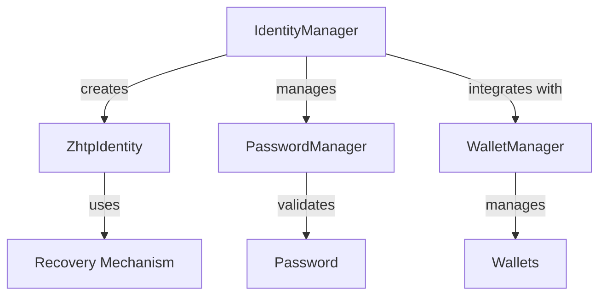

# Identity

# Identity Module Documentation

## Overview

The **Identity** module is a core component of the `lib-identity` library, responsible for managing decentralized identities (DIDs) within the ZHTP network. It provides functionalities for creating, managing, and recovering identities, as well as integrating with wallet management and password security systems. The module is designed with a focus on privacy, security, and ease of use, leveraging quantum-resistant cryptography to ensure the integrity and confidentiality of user identities.

## Key Components

### 1. **IdentityManager**
The `IdentityManager` is the primary interface for identity operations. It handles the creation, import, and management of identities, including password management and wallet integration.

#### Key Functions:
- **create_identity**: Generates a new identity and returns the associated identity ID and recovery seed phrase.
- **import_identity_from_phrase**: Imports an existing identity using a 20-word seed phrase.
- **set_identity_password**: Sets a password for an imported identity.
- **change_identity_password**: Changes the password for an identity, requiring the old password for verification.
- **remove_identity_password**: Removes the password from an identity, requiring the current password for verification.

### 2. **ZhtpIdentity**
The `ZhtpIdentity` struct represents a decentralized identity. It encapsulates the identity's attributes, including the identity ID, associated wallets, and recovery mechanisms.

### 3. **Password Management**
The module integrates with the password management system to provide secure authentication for identities. This includes:
- **PasswordManager**: Manages password hashes and validation for imported identities.
- **PasswordError**: Enumerates possible errors related to password operations, such as weak passwords or invalid password attempts.

### 4. **Wallet Integration**
The Identity module connects with the wallet management system, allowing users to manage multiple wallets associated with their identity. Each wallet can have its own password for additional security.

### 5. **Recovery Mechanisms**
The module supports recovery through a master 20-word seed phrase, which can be used to recover the entire identity and its associated wallets on any device.

## Architecture

The architecture of the Identity module is designed to facilitate modularity and separation of concerns. Below is a high-level overview of the relationships between the key components:



## How It Works

### Identity Creation
When a new identity is created, the `IdentityManager` generates a unique identity ID and a master 20-word seed phrase. This seed phrase is critical for recovery and must be stored securely offline.

```rust
let result = identity_manager.create_identity("citizen_123").await?;
println!("Your 20-word seed phrase: {}", result.master_seed_phrase.words.join(" "));
```

### Identity Import
Users can import an existing identity using the master seed phrase. This process initializes the identity in the system and allows the user to set a password for secure access.

```rust
let identity_id = identity_manager.import_identity_from_phrase("word1 word2 ... word20").await?;
identity_manager.set_identity_password(&identity_id, "mySecurePassword123")?;
```

### Password Management
The `PasswordManager` handles all password-related operations. It validates password strength, checks for common passwords, and ensures that passwords meet security requirements.

```rust
let validation = password_manager.validate_password(&identity_id, "mySecurePassword123", identity_seed)?;
if validation.valid {
    // Proceed with identity operations
}
```

### Wallet Management
Each identity can manage multiple wallets, each of which can have its own password. The `WalletManager` allows users to set, change, and remove wallet passwords independently of the identity password.

```rust
let wallet_manager = identity_manager.get_wallet_manager(&identity_id)?;
wallet_manager.set_wallet_password(&wallet_id, "walletPass123")?;
```

### Recovery
In case of loss of access, users can recover their identity using the master seed phrase. This process reinstates the identity and allows the user to set a new password.

```rust
let identity_id = identity_manager.import_identity_from_phrase("word1 word2 ... word20").await?;
identity_manager.set_identity_password(&identity_id, "newPassword123")?;
```

## Integration with Other Modules

The Identity module interacts closely with several other modules within the `lib-identity` library:

- **Wallets Module**: Provides wallet management capabilities, allowing identities to manage multiple wallets with different security settings.
- **Recovery Module**: Facilitates recovery mechanisms using the master seed phrase.
- **Cryptography Module**: Utilizes quantum-resistant cryptographic functions for secure identity management and password hashing.

## Testing

The Identity module includes comprehensive tests to ensure the reliability of identity creation, import, password management, and wallet integration. Tests can be run using the following command:

```bash
cd lib-identity
cargo test
```

## Conclusion

The Identity module is a critical component of the `lib-identity` library, providing robust identity management capabilities with a focus on security and privacy. By leveraging modular architecture and quantum-resistant cryptography, it ensures that users can manage their identities and associated wallets securely and efficiently. 

For further details, refer to the complete user guide available in the documentation.