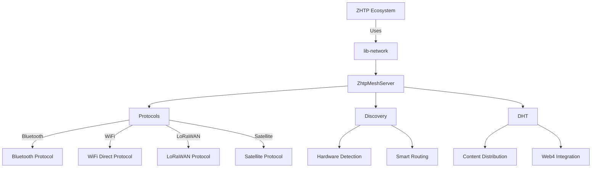

# Network — docs

# ZHTP lib-network Module Documentation

## Overview

The **lib-network** module is a core component of the ZHTP (Zero-Hash Transport Protocol) ecosystem, designed to facilitate decentralized mesh networking. Its primary purpose is to replace traditional Internet Service Providers (ISPs) by enabling peer-to-peer communication across various protocols, allowing users to connect, share resources, and earn rewards for their participation in the network.

## Purpose

The lib-network module provides the infrastructure necessary for:
- **Decentralized Networking**: Establishing a mesh network that operates independently of centralized ISPs.
- **Economic Incentives**: Rewarding users for their contributions to the network, such as routing traffic and providing storage.
- **Cross-Platform Compatibility**: Supporting multiple hardware and software platforms, including Bluetooth, WiFi, LoRaWAN, and Satellite connections.
- **Security and Privacy**: Implementing robust security measures, including post-quantum cryptography and wallet-based authentication.

## Architecture

The architecture of the lib-network module is designed to be modular and extensible, allowing for easy integration of new protocols and features. Below is a high-level overview of the architecture:



### Key Components

1. **ZhtpMeshServer**: The central server that manages the mesh network, coordinates protocols, and handles network operations.
   - **Lifecycle Management**: Methods to start, stop, and emergency stop the server.
   - **Network Operations**: Handles incoming messages and processes requests from clients.
   - **Statistics & Monitoring**: Provides network statistics and health checks.

2. **Protocols**: A collection of networking protocols that the server can utilize.
   - **Bluetooth**: Supports Bluetooth LE and Classic for device-to-device communication.
   - **WiFi Direct**: Enables high-bandwidth local connections.
   - **LoRaWAN**: Facilitates long-range, low-power communication.
   - **Satellite**: Provides global coverage for remote areas.

3. **Discovery**: Responsible for detecting available hardware and managing peer discovery.
   - **HardwareCapabilities**: Detects available hardware and enables appropriate protocols.
   - **Smart Routing**: Implements intelligent routing based on geographic location and peer reputation.

4. **DHT (Distributed Hash Table)**: A native binary protocol handler for efficient content distribution.
   - **Content Operations**: Methods to query and store content in the DHT.
   - **Peer Operations**: Discover and manage DHT peers.

5. **Security**: Implements wallet-based authentication and post-quantum cryptography to ensure secure communications and operations.

## How It Works

### Initialization

To set up a mesh node, the following steps are typically followed:

1. **Create a Storage Backend**: Initialize the storage system that will be used for the DHT.
2. **Generate a Unique Node ID**: Create a unique identifier for the mesh node.
3. **Configure Protocols**: Specify which networking protocols to enable based on available hardware.
4. **Instantiate the ZhtpMeshServer**: Create an instance of the server with the necessary parameters.
5. **Start the Server**: Begin the mesh networking operations.

### Example Code

```rust
use lib_network::{ZhtpMeshServer, NetworkProtocol, UnifiedStorageSystem};
use lib_crypto::PublicKey;

#[tokio::main]
async fn main() -> anyhow::Result<()> {
    let storage = UnifiedStorageSystem::new().await?;
    let owner_key = PublicKey::new(your_public_key_bytes);
    
    let protocols = vec![
        NetworkProtocol::BluetoothLE,
        NetworkProtocol::WiFiDirect,
        NetworkProtocol::LoRaWAN,
        NetworkProtocol::Satellite,
    ];
    
    let mut server = ZhtpMeshServer::new(
        generate_node_id(),
        owner_key,
        storage,
        protocols
    ).await?;
    
    server.start().await?;
    Ok(())
}
```

### Network Operations

The server can handle various network operations, including:
- **Processing Incoming Messages**: The `handle_mesh_message` method processes messages from other nodes.
- **Serving Web4 Content**: The `serve_web4_content` method allows serving content over the mesh network.
- **Monitoring Network Statistics**: The `get_network_stats` method retrieves current network performance metrics.

### Economic Incentives

The lib-network module includes mechanisms for rewarding users based on their contributions:
- **Routing Rewards**: Users earn tokens for routing messages through the network.
- **Storage Rewards**: Users are compensated for providing storage in the DHT.
- **Universal Basic Income (UBI)**: A portion of the network's earnings is distributed to users as UBI.

## Integration with Other Modules

The lib-network module interacts with several other components in the ZHTP ecosystem:
- **lib-storage**: Provides the backend for the DHT, enabling efficient content storage and retrieval.
- **lib-crypto**: Implements cryptographic functions for secure communications and wallet management.
- **lib-economy**: Manages the economic model, including token distribution and reward calculations.

## Conclusion

The **lib-network** module is a foundational element of the ZHTP ecosystem, enabling decentralized mesh networking with robust security and economic incentives. Its modular architecture allows for easy integration of new protocols and features, making it a versatile solution for building a community-owned internet infrastructure.

For further details, refer to the specific sections in the API documentation, architecture overview, and configuration guide.