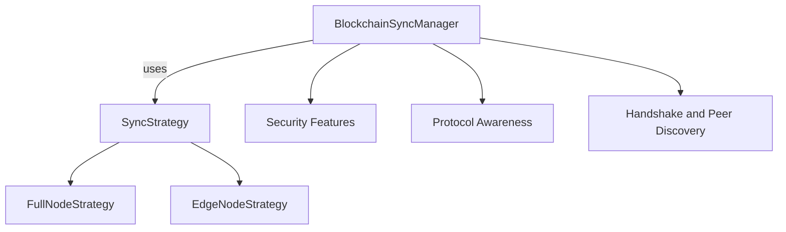

# Network — src

# Network Module Documentation

## Overview

The **Network** module provides a robust framework for peer-to-peer blockchain synchronization over various mesh protocols, including Bluetooth, WiFi Direct, and LoRaWAN. It implements a strategy pattern to facilitate different synchronization modes, specifically **Full Node** and **Edge Node** synchronization. This module is designed to ensure secure, efficient, and reliable communication between nodes in a decentralized network.

## Key Components

### 1. Synchronization Strategies

The synchronization strategies are defined by the `SyncStrategy` trait, which includes two primary implementations:

- **FullNodeStrategy**: This strategy is used for full nodes that maintain a complete copy of the blockchain. It handles the synchronization of all blocks and transactions.
  
- **EdgeNodeStrategy**: This strategy is tailored for edge nodes that may only need to synchronize headers or a limited subset of the blockchain data.

### 2. BlockchainSyncManager

The `BlockchainSyncManager` is the central component responsible for managing synchronization operations. It coordinates the interactions between different nodes and ensures that the appropriate strategy is applied based on the node type (full or edge). 

#### Example Usage

```rust
use lib_network::blockchain_sync::BlockchainSyncManager;

// Create a full node sync manager
let sync_manager = BlockchainSyncManager::new_full_node();

// Create an edge node sync manager with limited headers
let edge_sync = BlockchainSyncManager::new_edge_node(500);
```

### 3. Security Features

The module incorporates several security measures to protect against various threats:

- **Authentication**: Ensures that only authorized nodes can participate in the synchronization process.
- **Rate Limiting**: Controls the number of requests a peer can make to prevent abuse.
- **Buffer Limits**: Prevents excessive memory usage by limiting the size of data chunks that can be processed.
- **Hash Verification**: Ensures data integrity by verifying the hashes of received blocks.

### 4. Protocol Awareness

The synchronization process is aware of the underlying transport protocol, allowing for automatic adjustment of chunk sizes based on the capabilities of the protocol being used. This is crucial for optimizing performance across different network conditions.

### 5. Constants and Configuration

The module defines several constants that govern its behavior, including:

- **Chunk Sizes**: Different chunk sizes for various protocols (e.g., BLE, WiFi).
- **Timeouts and Limits**: Maximum buffer sizes, pending requests, and chunk timeouts to ensure efficient resource management.

### 6. Handshake and Peer Discovery

The module also includes components for peer discovery and handshake protocols, which are essential for establishing connections between nodes. The `handshake` module provides a unified handshake protocol (UHP) that supports secure authentication and capability negotiation across different transport layers.

## Architecture

The architecture of the Network module can be visualized as follows:



## Integration with the Codebase

The Network module is designed to integrate seamlessly with other components of the system, including:

- **lib_crypto**: For cryptographic operations such as signing and verification.
- **lib_identity**: For managing node identities and ensuring secure authentication.
- **lib_types**: For defining common types used across the network, such as messages and capabilities.

### Example Integration

When a new node joins the network, it can utilize the `BlockchainSyncManager` to initiate synchronization with existing peers. The node will first perform a handshake to establish its identity and capabilities, then proceed to synchronize its blockchain data using the appropriate strategy.

## Conclusion

The Network module is a critical component of the decentralized blockchain architecture, providing the necessary tools for secure and efficient peer-to-peer synchronization. By leveraging various strategies and security features, it ensures that nodes can communicate effectively while maintaining the integrity and reliability of the blockchain. Developers can extend and contribute to this module by implementing new synchronization strategies or enhancing existing security features.