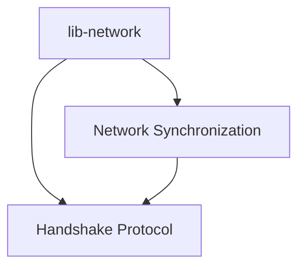

# Network

# Network Module Overview

The **Network** module is a pivotal part of the ZHTP (Zero-Hash Transport Protocol) ecosystem, designed to enable decentralized mesh networking. It comprises several sub-modules that work in concert to facilitate peer-to-peer communication, resource sharing, and economic incentives for users participating in the network.

## Purpose

The primary objectives of the Network module include:

- **Decentralized Networking**: Establishing a resilient mesh network that operates independently of traditional ISPs.
- **Blockchain Synchronization**: Ensuring efficient and secure synchronization of blockchain data across nodes.
- **Economic Incentives**: Rewarding users for their contributions, such as routing traffic and providing storage.

## Sub-modules and Their Interactions

### 1. **lib-network**
The [lib-network](lib-network.md) sub-module serves as the backbone of the ZHTP ecosystem, enabling decentralized networking and economic incentives. It allows users to connect and share resources while earning rewards for their participation.

### 2. **Network Synchronization**
The [Network Synchronization](network-synchronization.md) sub-module implements various synchronization strategies, including **Full Node** and **Edge Node** synchronization. It utilizes the `SyncStrategy` trait to manage how nodes synchronize their blockchain data, ensuring that both full and edge nodes can operate effectively within the mesh network.

### 3. **Handshake Protocol**
The [Handshake Protocol](handshake-protocol.md) sub-module is crucial for establishing secure connections between nodes. It manages the initial communication and verification processes, ensuring that nodes can trust each other before exchanging data. This sub-module interacts closely with the synchronization strategies to ensure that only verified nodes participate in the network.

## Key Workflows

The interaction between these sub-modules creates several key workflows:

- **Node Connection and Verification**: The Handshake Protocol initiates a secure connection between nodes, which is essential for establishing trust before any data synchronization occurs.
- **Data Synchronization**: Once nodes are verified, the Network Synchronization sub-module takes over, employing the appropriate synchronization strategy to ensure that blockchain data is accurately shared and updated across the network.
- **Resource Sharing and Incentivization**: As nodes participate in the network, the lib-network sub-module tracks their contributions and rewards them accordingly, fostering a collaborative environment.

## Conclusion

The Network module, through its sub-modules, provides a comprehensive framework for decentralized networking, blockchain synchronization, and economic incentivization. For detailed information on each sub-module, please refer to the following links:

- [lib-network](lib-network.md)
- [Network Synchronization](network-synchronization.md)
- [Handshake Protocol](handshake-protocol.md)

This diagram illustrates the relationships between the sub-modules, highlighting how they collaborate to create a robust decentralized network.