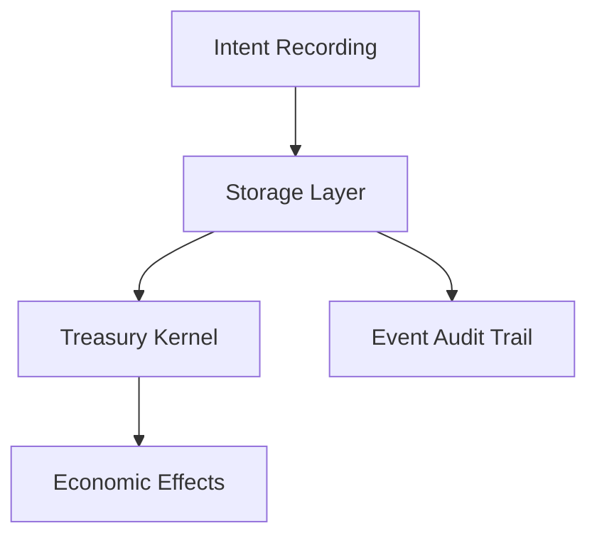

# Other — adr

# Documentation for the **Other — adr** Module

## Overview

The **Other — adr** module is a critical component of the ZHTP blockchain architecture, specifically focusing on the transition from a permissionless to a governed, policy-enforcing system. This module outlines the architectural constraints and principles that govern the interaction between smart contracts, the storage layer, and the Treasury Kernel, ensuring a clear separation of concerns regarding economic intent, execution, and governance.

## Purpose

The primary purpose of this module is to enforce a strict execution boundary that prevents smart contracts from directly manipulating token balances or encoding economic policies. This is essential for maintaining a single, auditable execution path and ensuring that all economic laws are enforced exclusively by the Treasury Kernel.

## Key Components

### 1. Execution Boundary

The execution boundary is a core principle that prohibits any direct mutation of token balances within smart contracts. Instead, contracts must express their economic intents declaratively. This separation helps avoid multiple execution paths and hardcoded policies.

#### Example of Allowed and Forbidden Operations

```rust
// ❌ FORBIDDEN in any contract
balance[addr] -= amount;           // Direct mutation
mint_token(amount);                // Direct mint
transfer(from, to, amount);        // Direct transfer
lock_stake(amount);                // Direct lock

// ✅ ALLOWED in any contract
TransactionIntent {
  op: Transfer { from, to, amount }  // Declarative intent only
}
```

### 2. Policy Neutrality

Contracts must not encode any economic policies. Instead, they should only express intents. This ensures that all policy decisions are handled by the Treasury Kernel, which can be updated independently of the contract code.

#### Disallowed Patterns

```rust
// ❌ Fee percentages
fee: 5,  // embedded

// ❌ Allocation ratios
allocation: 0.3,  // hardcoded
```

#### Allowed Patterns

```rust
// ✅ Requested amount (not guaranteed)
UbiClaim {
  amount: 1000,        // what they're claiming
  citizen_id: ...,     // who they are
  epoch: 42,           // when
}
```

### 3. Mint/Burn Privilege

Any minting or burning operations must be marked as privileged, requiring governance approval and indicating that they will have delayed effects. This ensures that only the Treasury Kernel can execute these operations.

#### Example of Privileged Mint Intent

```rust
UbiDistribution {
  citizen_id: ...,
  amount: 1000,
  kind: MintIntent {           // NOT an actual mint
    kernel_only: true,         // Marker
    requires_governance: true, // Marker
    delayed_effect: true,      // Marker
  }
}
```

### 4. ABI Compatibility

All transaction definitions must adhere to ABI standardization requirements. This ensures that the structures are compatible with future implementations and can be easily validated.

#### Example of ABI-Compatible Structure

```rust
pub struct Transfer {
  pub from: [u8; 32],      // Fixed size, deterministic
  pub to: [u8; 32],        // Fixed size, deterministic
  pub amount: u64,         // Numeric, no ambiguity
}
```

## Architectural Constraints

The architectural constraints dictate that all work under the mega-ticket #840 must follow a specific flow:



### Flow Explanation

1. **Intent Recording**: Contracts express their economic intents without executing them.
2. **Storage Layer**: The intents are recorded in a persistent storage layer.
3. **Treasury Kernel**: The Treasury Kernel is responsible for executing the intents and enforcing economic laws.
4. **Economic Effects**: The actual changes to token states (minting, burning, locking) occur here.
5. **Event Audit Trail**: An audit trail is maintained for governance and compensation purposes.

## Implementation Guidelines

### For Contract Authors

When implementing contracts, ensure that you follow the intent-based approach:

```rust
// DO THIS: Intent-based
pub enum ContractTransaction {
  UbiClaim { citizen_id: [u8; 32], amount: u64, epoch: u64 },
  DaoProposal { proposer: [u8; 32], description: String },
}

// NOT THIS: Effect-based
pub fn claim_ubi(citizen_id: [u8; 32], amount: u64) {
  balance[citizen_id] += amount;  // ❌ FORBIDDEN
}
```

### For Storage Layer

The storage layer should only record intents, not execute effects:

```rust
// DO THIS: Record intent
storage.set(
  key("ubi_claim", citizen_id),
  serde_json::to_vec(&UbiClaim { amount, epoch })?,
)?;
```

### For Treasury Kernel (Future)

The Treasury Kernel will handle the execution of intents:

```rust
// DO THIS: Execute intents via kernel
for claim in claims {
  validate_citizenship(claim.citizen_id)?;
  validate_epoch_cap(claim.epoch)?;
  mint_ubi(claim.citizen_id, claim.amount)?;
  emit_audit_event(claim)?;
}
```

## Monitoring & Compliance

### Success Criteria

- All code under mega-ticket #840 passes the governance checklist.
- No economic policy is hardcoded in contracts.
- All mint/burn operations are marked as privileged.
- Structures are ABI-compatible.

### Failure Modes

- Code bypasses the Treasury Kernel.
- Multiple economic execution paths exist.
- Non-ABI-compatible structures in events.

## Related Documents

- [#840 Mega-ticket](https://github.com/SOVEREIGN-NET/The-Sovereign-Network/issues/840)
- [#841 Persistent Storage](https://github.com/SOVEREIGN-NET/The-Sovereign-Network/issues/841)
- [#843 ABI Standardization](https://github.com/SOVEREIGN-NET/The-Sovereign-Network/issues/843)
- [#844 UBI Distribution](https://github.com/SOVEREIGN-NET/The-Sovereign-Network/issues/844)

## Conclusion

The **Other — adr** module is essential for ensuring that the ZHTP blockchain operates under a governed, policy-enforcing architecture. By adhering to the principles outlined in this documentation, developers can contribute to a robust and auditable economic system that maintains the integrity of the blockchain.