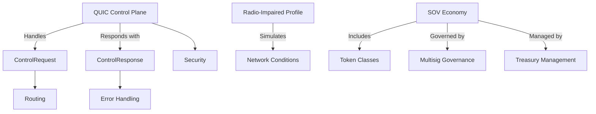

# Other — architecture

# Other — Architecture Module Documentation

## Overview

The **Other — Architecture** module serves as a foundational component of the Sovereign Network, focusing on the architectural design and migration strategies for various protocols and systems. This module encompasses the QUIC Control Plane Migration, Radio-Impaired Profile specifications, and the SOV economy's implementation plan. It aims to streamline communication protocols, enhance network resilience, and establish a robust economic framework for the Sovereign Network.

## Purpose

The primary goals of this module are:

1. **QUIC Control Plane Migration**: Transition control-plane traffic from HTTP/UDP to QUIC while maintaining UDP for discovery purposes.
2. **Radio-Impaired Profile**: Simulate constrained radio conditions to validate network resilience and performance under adverse conditions.
3. **SOV Economy Implementation**: Establish a minimum viable economy on the ZHTP blockchain, including token creation, governance, and treasury management.

## Key Components

### 1. QUIC Control Plane Migration

#### API Shape

The QUIC Control Plane API is designed to facilitate bidirectional communication using QUIC streams. The API includes:

- **ControlRequest**: Represents a request sent to the control plane.
- **ControlResponse**: Represents a response from the control plane.

```rust
struct ControlRequest {
  request_id: u64,
  path: String,          // e.g., "network/status"
  method: String,        // "GET" | "POST"
  headers: Vec<(String, String)>,
  body: Vec<u8>,         // JSON payload
}

struct ControlResponse {
  request_id: u64,
  status: u16,           // HTTP-like status code
  headers: Vec<(String, String)>,
  body: Vec<u8>,         // JSON payload
}
```

#### Routing

Existing HTTP routes are mapped to the new QUIC paths, removing the `/api/v1` prefix. For example, `GET /api/v1/network/status` becomes `path = "network/status"`.

#### Error Handling

Non-200 responses return a status code and a JSON error in the body. The caller is responsible for handling retries.

#### Security

The control API reuses existing identity and authentication mechanisms from the QUIC mesh, ensuring that all control actions are authenticated.

### 2. Radio-Impaired Profile

The Radio-Impaired Profile simulates extreme radio conditions to validate the network's performance and resilience. Key parameters include:

- **Bandwidth**: 125 kHz equivalent
- **Max Payload**: 16–64 bytes
- **Latency**: 200–1500 ms
- **Packet Loss**: 1–50 percent

This profile is crucial for testing fallback logic, routing resilience, and fragmentation behavior under adverse conditions.

### 3. SOV Economy Implementation

The SOV economy is designed to operate alongside the existing ZHTP token system. Key components include:

- **Token Classes**: SOV (civic currency), DAO tokens (NP/FP), and ZHTP (infrastructure token).
- **Governance**: A multisig governance model controls key parameters and contract interactions.
- **Treasury Management**: A treasury contract manages funds and allocations, ensuring proper distribution of fees and rewards.

### 4. Migration Plan

The migration plan outlines a series of pull requests (PRs) to transition from the existing architecture to the new QUIC-based control plane. Each PR focuses on specific components, such as:

- **QUIC Control Server + Router**: Introduces the QUIC control handler and routing logic.
- **QUIC Control Client Library**: Provides a reusable client for CLI interactions.
- **CLI Migration**: Updates CLI commands to use the new QUIC control client.
- **Node-to-Node Migration**: Removes HTTP dependencies between nodes.
- **Documentation Updates**: Aligns documentation with the new API.

## Architecture Diagram



## Integration with the Codebase

The Other — Architecture module integrates with various components of the Sovereign Network:

- **QUIC Control Plane**: Interfaces with the existing network protocols and replaces HTTP endpoints with QUIC streams.
- **Radio-Impaired Profile**: Provides a testing framework for validating network performance under simulated conditions.
- **SOV Economy**: Interacts with the blockchain layer to manage token transactions, governance proposals, and treasury allocations.

## Conclusion

The Other — Architecture module is a critical part of the Sovereign Network's infrastructure, enabling efficient communication, robust testing, and a sustainable economic model. By transitioning to QUIC, simulating radio conditions, and implementing a comprehensive SOV economy, this module lays the groundwork for a resilient and scalable network. Developers are encouraged to contribute to the ongoing migration efforts and enhance the module's capabilities.