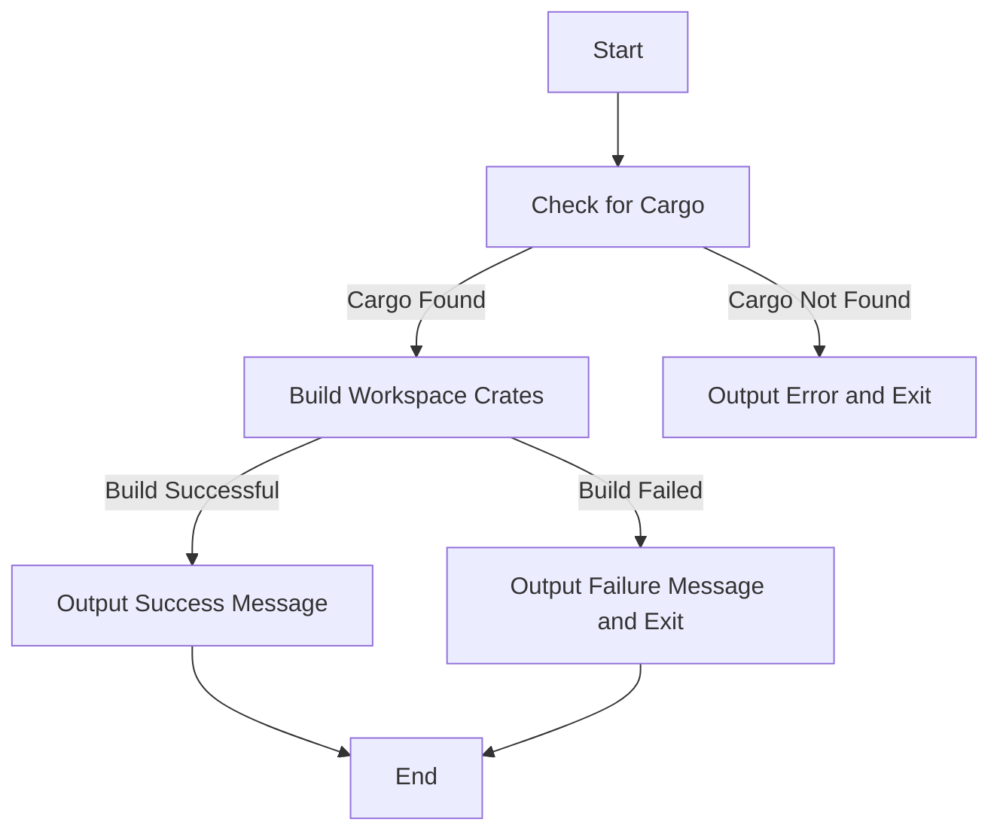

# Other — build.ps1

# Documentation for `build.ps1` Module

## Overview

The `build.ps1` module is a PowerShell script designed to automate the build process for the Sovereign Network Mono-Repo. It checks for the necessary Rust installation, builds all workspace crates using Cargo, and provides feedback on the build status. This script is essential for developers working on the Sovereign Network, as it simplifies the process of compiling the Rust codebase.

## Purpose

The primary purpose of `build.ps1` is to:
- Ensure that the Rust toolchain is installed and accessible.
- Compile all Rust crates in the workspace in release mode.
- Provide clear output messages to the user regarding the build status and next steps.

## Key Components

### 1. Rust Installation Check

The script begins by checking if the `cargo` command is available. This is crucial because Cargo is the Rust package manager and build system. If Cargo is not found, the script will output an error message and terminate the execution.

```powershell
if (-not (Get-Command cargo -ErrorAction SilentlyContinue)) {
    Write-Host "❌ Cargo not found. Please install Rust from https://rustup.rs/" -ForegroundColor Red
    exit 1
}
```

### 2. Building the Workspace

Once the Rust installation is confirmed, the script proceeds to build all crates in the workspace using the following command:

```powershell
cargo build --release --workspace
```

This command compiles all the Rust packages in the current workspace in release mode, optimizing the binaries for performance.

### 3. Build Status Feedback

After the build process, the script checks the exit code of the last command executed (`$LASTEXITCODE`). Based on this code, it provides feedback to the user:

- If the build is successful (`$LASTEXITCODE -eq 0`), it outputs a success message along with the location of the generated binary and instructions on how to run a node.
  
```powershell
if ($LASTEXITCODE -eq 0) {
    Write-Host "`n✅ Build complete!" -ForegroundColor Green
    Write-Host ""
    Write-Host "Binary location: target\release\zhtp.exe" -ForegroundColor White
    Write-Host ""
    Write-Host "To run a node:" -ForegroundColor Cyan
    Write-Host "  .\run-node.ps1" -ForegroundColor White
    Write-Host "  or" -ForegroundColor White
    Write-Host "  .\target\release\zhtp.exe --config crates\zhtp\configs\test-node1.toml" -ForegroundColor White
}
```

- If the build fails, it outputs an error message and exits the script.

```powershell
else {
    Write-Host "`n❌ Build failed!" -ForegroundColor Red
    exit 1
}
```

## Execution Flow

The execution flow of the `build.ps1` script is linear and straightforward. It starts with the Rust installation check, proceeds to the build command, and finally provides feedback based on the build result. There are no internal or outgoing calls, making the script self-contained.

### Execution Flow Diagram



## Conclusion

The `build.ps1` module is a critical component of the Sovereign Network Mono-Repo, facilitating the build process for developers. By ensuring that the necessary tools are available and providing clear feedback, it enhances the developer experience and streamlines the workflow. Understanding this script is essential for any developer looking to contribute to the Sovereign Network codebase.