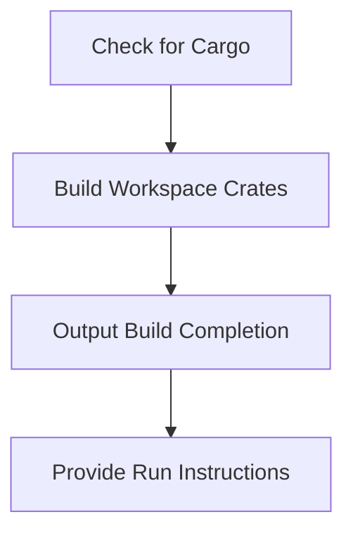

# Other — build.sh

# Documentation for the **build.sh** Module

## Overview

The `build.sh` script is a shell script designed to automate the build process for the Sovereign Network Mono-Repo. It ensures that all necessary dependencies are installed and compiles the Rust workspace crates, producing the final binaries required to run the network nodes.

## Purpose

The primary purpose of `build.sh` is to streamline the build process for developers working on the Sovereign Network. By encapsulating the build commands and checks within a single script, it reduces the complexity of setting up the development environment and ensures that all components are built consistently.

## Key Components

### 1. Rust Installation Check

The script begins by checking if Rust's package manager, Cargo, is installed on the system. This is crucial because the build process relies on Cargo to compile the Rust code.

```bash
if ! command -v cargo &> /dev/null; then
    echo "❌ Cargo not found. Please install Rust from https://rustup.rs/"
    exit 1
fi
```

### 2. Building Workspace Crates

Once the Rust installation is confirmed, the script proceeds to build all the crates in the workspace. This is done using the following command:

```bash
cargo build --release --workspace
```

This command compiles all the Rust packages in the workspace in release mode, optimizing the binaries for performance.

### 3. Build Completion Message

After the build process is complete, the script provides feedback to the user, indicating the location of the built binary:

```bash
echo "✅ Build complete!"
echo ""
echo "Binary location: target/release/zhtp"
```

### 4. Running a Node

Finally, the script provides instructions on how to run a node using the built binary. It offers two options for executing the node:

```bash
echo "To run a node:"
echo "  ./run-node.sh"
echo "  or"
echo "  ./target/release/zhtp --config zhtp/configs/test-node1.toml"
```

## Execution Flow

The execution flow of the `build.sh` script is straightforward, as it follows a linear path from checking for dependencies to building the project and providing output instructions. There are no internal or outgoing calls, making it a self-contained script.

### Execution Steps

1. Check for Cargo installation.
2. Build all workspace crates using Cargo.
3. Output the build completion message and binary location.
4. Provide instructions for running a node.

## Integration with the Codebase

The `build.sh` script is a critical component of the Sovereign Network's development workflow. It connects to the rest of the codebase by ensuring that all Rust crates are built correctly, which is essential for the functionality of the network nodes. The built binary, located at `target/release/zhtp`, is the executable that developers will use to run the network.

## Conclusion

The `build.sh` script is an essential tool for developers working on the Sovereign Network. By automating the build process and providing clear instructions, it enhances the development experience and ensures that all components are built consistently. Developers are encouraged to use this script as part of their workflow to maintain efficiency and reliability in the project.

### Mermaid Diagram

While the `build.sh` script does not have complex interactions, the following diagram illustrates its linear execution flow:



This diagram summarizes the key steps in the execution of the `build.sh` script, highlighting its straightforward nature.