# Other — Cargo.toml

# Cargo.toml Module Documentation

## Overview

The `Cargo.toml` file is a crucial component of Rust projects, serving as the manifest for the Cargo package manager. This specific `Cargo.toml` file defines a workspace that encompasses multiple Rust packages, each representing a library or tool within the Sovereign Network ecosystem. The workspace structure allows for efficient management of dependencies, compilation, and versioning across related packages.

## Purpose

The primary purpose of this `Cargo.toml` file is to:

- Define a workspace that groups multiple related Rust packages.
- Specify package metadata such as version, authors, and license.
- Configure build profiles for different environments, optimizing for performance, memory usage, or development speed.

## Key Components

### Workspace Definition

The `[workspace]` section defines the workspace and its members. Each member is a path to a package within the workspace. The members listed in this file include:

- **Libraries**: Core components like `lib-types`, `lib-fees`, `lib-tokens`, etc.
- **Tools**: Utility packages such as `tools/zhtp-dilithium-signer`.
- **Tests**: Packages dedicated to testing, including `tests/lib-identity/test-lib-identity-imports` and `tests/integration`.
- **Explorers**: Packages like `explorer` that may provide visualization or interaction capabilities.

### Package Metadata

The `[workspace.package]` section contains metadata about the workspace package itself:

- **version**: The current version of the workspace, set to `0.1.0`.
- **edition**: Specifies the Rust edition being used, which is `2021`.
- **authors**: Lists the authors of the package, in this case, the "Sovereign Network Team".
- **license**: Indicates the licensing terms, allowing for both MIT and Apache-2.0 licenses.

### Build Profiles

The `[profile.*]` sections define various build profiles that customize the compilation process based on the target environment. Each profile can inherit settings from another profile, allowing for shared configurations. The following profiles are defined:

- **release**: Optimized for performance with high optimization level (`opt-level = 3`), link-time optimization (`lto = true`), and a single codegen unit for better performance.
  
- **dev**: Focused on development with no optimizations (`opt-level = 0`) and debug information enabled.

- **rpi**: Tailored for Raspberry Pi, optimizing for lower memory usage during compilation. It inherits from the `release` profile but adjusts settings for lower optimization and more codegen units.

- **edge**: Designed for ultra-lightweight edge nodes, optimizing for binary size rather than speed. It disables link-time optimization and enables stripping of symbols.

- **dev-fast**: Aimed at fast development iterations, this profile inherits from `dev` but applies minimal optimizations and enables incremental compilation.

## Connection to the Codebase

The `Cargo.toml` file serves as the entry point for the Cargo package manager, which orchestrates the build process for all the defined members. Each member package can define its own dependencies, which are resolved based on the workspace configuration. This modular approach allows developers to work on individual components while maintaining a cohesive build process.

### Mermaid Diagram

The following diagram illustrates the relationship between the workspace and its member packages:

```mermaid
graph TD;
    A[Workspace] --> B[lib-types]
    A --> C[lib-fees]
    A --> D[lib-tokens]
    A --> E[lib-governance]
    A --> F[lib-utxo]
    A --> G[lib-mempool]
    A --> H[lib-blockchain]
    A --> I[lib-client]
    A --> J[lib-consensus]
    A --> K[lib-crypto]
    A --> L[lib-dht]
    A --> M[lib-dns]
    A --> N[lib-economy]
    A --> O[lib-identity-core]
    A --> P[lib-identity]
    A --> Q[lib-network]
    A --> R[lib-proofs]
    A --> S[lib-protocols]
    A --> T[tools]
    A --> U[tools/zhtp-dilithium-signer]
    A --> V[lib-storage]
    A --> W[zhtp]
    A --> X[zhtp-cli]
    A --> Y[explorer]
    A --> Z[tests/lib-identity/test-lib-identity-imports]
    A --> AA[tests/integration]
```

## Conclusion

The `Cargo.toml` file is a foundational element of the Sovereign Network's Rust codebase, enabling efficient management of multiple packages within a single workspace. Understanding its structure and configuration is essential for developers looking to contribute to the project, as it directly influences the build process and package interdependencies.