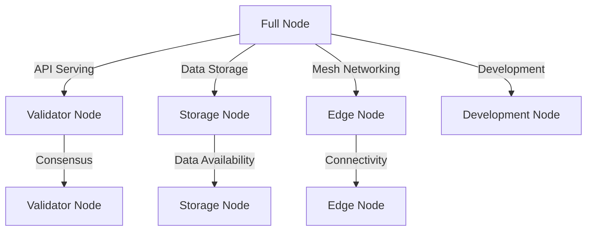

# Other — configs

# ZHTP Node Configuration Module Documentation

## Overview

The **ZHTP Node Configuration Module** is a critical component of the ZHTP ecosystem, designed to facilitate the setup and management of various node types within the SOVEREIGN_NET blockchain network. This module provides a structured way to define node configurations, ensuring that each node operates optimally according to its designated role, whether it be a full node, validator, storage node, edge node, or development node.

## Purpose

The primary purpose of this module is to:
- Provide specialized configuration templates for different node types.
- Enable easy deployment and management of nodes through command-line interfaces and scripts.
- Validate configurations to prevent misconfigurations that could lead to network issues or security vulnerabilities.
- Offer comprehensive documentation and usage examples to assist developers in setting up and managing nodes effectively.

## Key Components

### 1. Configuration Templates

The module includes several pre-defined configuration templates, each tailored for specific node roles:

- **Full Node** (`full-node.toml`): Provides complete blockchain functionality, suitable for API servers and general-purpose nodes.
- **Validator Node** (`validator-node.toml`): Optimized for consensus participation with maximum security.
- **Storage Node** (`storage-node.toml`): Designed for distributed storage services, focusing on high capacity and data availability.
- **Edge Node** (`edge-node.toml`): Configured for mesh networking, ideal for rural connectivity and censorship resistance.
- **Development Node** (`dev-node.toml`): Simplified settings for testing and development purposes.

### 2. Command-Line Interface (CLI) Integration

The module enhances the ZHTP command-line interface with shortcuts for quick node type selection:

```bash
zhtp --node-type full
zhtp --node-type validator
zhtp --node-type storage
zhtp --node-type edge
zhtp --node-type dev
```

Additionally, traditional configuration file approaches are supported:

```bash
zhtp node start --config ./configs/custom-node.toml
```

### 3. Interactive Startup Scripts

Two interactive scripts are provided for user-friendly node startup:
- `start-node.sh` (Linux/Mac): Allows users to select the node type interactively.
- `start-node.bat` (Windows): Similar functionality for Windows users.

### 4. Configuration Validation

The module includes a validation script (`validate-config.sh`) that checks for:
- TOML syntax correctness.
- Port conflicts.
- Appropriate security levels for node types.
- Reasonableness of resource allocations.
- Protocol compatibility for mesh mode.

### 5. Comprehensive Documentation

The module provides extensive documentation, including:
- Descriptions and use cases for each node type.
- Resource requirements for each configuration.
- Quick start commands and troubleshooting guides.
- Security considerations and architecture overview.

## Architecture Overview

The architecture of the ZHTP Node Configuration Module is designed to ensure that each node type operates efficiently and securely within the SOVEREIGN_NET ecosystem. The following diagram illustrates the relationships between different node types and their roles:



## How It Works

### Configuration Files

Each node type has a corresponding TOML configuration file that defines its settings. These files include parameters for:
- **Core Node Settings**: Defines the node's role, security level, and data directory.
- **Cryptography Configuration**: Specifies post-quantum cryptography settings.
- **Zero-Knowledge Proof Configuration**: Configures settings for zk-SNARKs.
- **Identity Management**: Manages identity-related settings.
- **Storage Configuration**: Defines storage parameters and DHT settings.
- **Network Configuration**: Specifies network-related settings, including mesh ports and protocols.
- **Blockchain Configuration**: Configures blockchain-specific parameters.
- **Consensus Configuration**: Defines consensus-related settings.
- **Economic Configuration**: Manages economic parameters, including UBI and DAO settings.
- **Resource Allocations**: Specifies resource limits for memory, CPU, and disk.

### Validation Process

Before starting a node, the configuration file can be validated using the `validate-config.sh` script. This script performs checks to ensure that the configuration adheres to the expected standards and does not contain any conflicting settings.

### Deployment

Once validated, nodes can be deployed using the command-line interface or interactive scripts. The configurations ensure that each node operates with the appropriate settings for its role, optimizing performance and security.

## Usage Examples

### Quick Development Setup

To start a development node with a single command:

```bash
zhtp --node-type dev
```

### Production Validator Setup

To set up a validator node with full security:

```bash
# Validate configuration first
./configs/validate-config.sh ./configs/validator-node.toml

# Start validator node
zhtp --node-type validator
```

### Custom Configuration

To create and deploy a custom configuration:

```bash
# Copy template and modify
cp configs/storage-node.toml configs/my-custom-node.toml
vim configs/my-custom-node.toml

# Validate before deployment
./configs/validate-config.sh configs/my-custom-node.toml

# Deploy
zhtp node start --config ./configs/my-custom-node.toml
```

## Conclusion

The ZHTP Node Configuration Module is a vital part of the ZHTP ecosystem, providing developers with the tools and templates necessary to deploy and manage various node types effectively. By ensuring that each node is configured correctly, the module contributes to the overall stability and security of the SOVEREIGN_NET blockchain network.