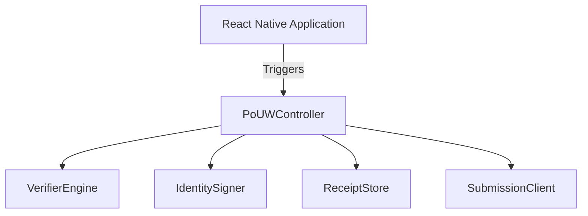

# Other — dapps_auth

# DApps Authentication Module Documentation

## Overview

The **dapps_auth** module is designed to facilitate secure and verifiable content work on mobile devices through the Proof-of-Useful-Work (PoUW) protocol. This module enables decentralized applications (dApps) to authenticate users and manage cryptographic operations, ensuring that receipts for completed work are securely generated, stored, and submitted for rewards.

## Purpose

The primary purpose of the **dapps_auth** module is to provide a robust framework for handling user authentication and cryptographic verification in dApps. It ensures that all operations are performed securely, with a focus on cross-platform consistency between iOS and Android implementations. The module is built to support the PoUW protocol, which allows users to earn rewards for their contributions to the network.

## Key Components

The **dapps_auth** module consists of several key components, each responsible for specific functionalities:

### 1. **PoUWController**

The `PoUWController` is the core orchestration component of the module. It coordinates the interactions between various subcomponents, handling the verification of content and the management of receipts.

```kotlin
class PoUWController(
    private val verifier: VerifierEngine,
    private val signer: IdentitySigner,
    private val store: ReceiptStore,
    private val submission: SubmissionClient
) {
    suspend fun verifyAndRecord(contentId: ByteArray, bytes: ByteArray, providerId: ByteArray?)
    suspend fun flushReceipts()
}
```

#### Responsibilities:
- Fetch or reuse valid, unexpired `ChallengeToken`.
- Verify content using the `VerifierEngine`.
- Build and serialize a `Receipt`.
- Sign the receipt and enqueue it in the `ReceiptStore`.
- Flush receipts for submission to the network.

### 2. **VerifierEngine**

The `VerifierEngine` is responsible for performing cryptographic verifications locally. It provides methods to verify hashes and Merkle proofs.

```kotlin
interface VerifierEngine {
    fun verifyHash(contentId: ByteArray, bytes: ByteArray): Boolean
    fun verifyMerkle(leaf: ByteArray, proof: List<ByteArray>, root: ByteArray): Boolean
}
```

#### Implementation Notes:
- Utilizes SHA-256 for hashing.
- Must operate on a background thread to avoid blocking the UI.

### 3. **IdentitySigner**

The `IdentitySigner` manages the signing of data and retrieval of identity information. It ensures that private keys are securely stored and never exposed.

```kotlin
interface IdentitySigner {
    fun sign(bytes: ByteArray): ByteArray
    fun getDid(): String
    fun getNodeId(): ByteArray
}
```

#### Key Storage:
- Uses Android Keystore or Secure Enclave for key management.
- Only signatures are exported; private keys remain secure.

### 4. **ReceiptStore**

The `ReceiptStore` acts as a persistent queue for storing signed receipts. It ensures that receipts survive app restarts and maintains FIFO ordering.

```kotlin
interface ReceiptStore {
    suspend fun enqueue(receipt: SignedReceipt)
    suspend fun pending(limit: Int): List<SignedReceipt>
    suspend fun markAccepted(nonces: List<ByteArray>)
    suspend fun markRejected(nonce: ByteArray, reason: String)
}
```

#### Requirements:
- Must be replay-safe and indexed by nonce.
- Supports encrypted storage for security.

### 5. **SubmissionClient**

The `SubmissionClient` is responsible for communicating with the network to request challenges and submit batches of receipts.

```kotlin
interface SubmissionClient {
    suspend fun requestChallenge(capabilities: List<ProofType>): ChallengeToken
    suspend fun submitBatch(batch: ReceiptBatch): SubmissionResult
}
```

#### Important Notes:
- This component is designed to be latency tolerant and retry-safe.

## Architecture

The architecture of the **dapps_auth** module is designed to ensure a clear separation of concerns, with each component handling specific tasks. The following diagram illustrates the relationships between the components:



### Execution Flow

1. **Content Verification**:
   - The `PoUWController` calls `verifyAndRecord`, which fetches a `ChallengeToken`.
   - The `VerifierEngine` verifies the content.
   - A `Receipt` is built and signed using the `IdentitySigner`.
   - The signed receipt is enqueued in the `ReceiptStore`.

2. **Receipt Submission**:
   - The `flushReceipts` method retrieves pending receipts from the `ReceiptStore`.
   - A `ReceiptBatch` is created and submitted via the `SubmissionClient`.
   - Responses are processed to mark receipts as accepted or rejected.

## Cross-Platform Consistency

The **dapps_auth** module is designed to maintain strict cross-platform invariants between iOS and Android implementations. This includes:

- Identical protobuf schemas for receipts.
- Deterministic serialization rules.
- Consistent signing algorithms (Ed25519 or Dilithium).
- Shared challenge binding logic and replay detection mechanisms.

### Hard Rules for React Native

The React Native layer interacts with the module through a minimal interface, ensuring that it never directly handles cryptographic operations or sensitive data:

```typescript
interface PoUW {
  verifyContent(contentId: Uint8Array, bytes: Uint8Array, providerId?: Uint8Array): Promise<void>;
  flush(): Promise<void>;
}
```

## Conclusion

The **dapps_auth** module provides a comprehensive framework for managing authentication and cryptographic operations in decentralized applications. By adhering to strict security practices and ensuring cross-platform consistency, it enables developers to build secure and reliable dApps that leverage the PoUW protocol for user rewards. 

For further details, refer to the [PoUW Marketplace](https://bogo-ncw-updigital.web.app/marketplace/games/Rktza4tZXYJ4RVEQr7gA).