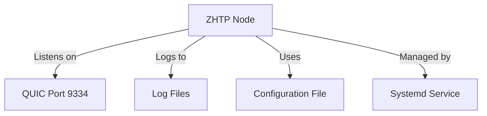

# Other — deployment

# ZHTP Deployment Module Documentation

## Overview

The **ZHTP Deployment Module** provides a comprehensive guide for deploying ZHTP nodes on Ubuntu 22.04 LTS servers. This module outlines the necessary prerequisites, installation steps, configuration, and maintenance procedures to ensure a successful deployment of both development and production servers.

## Purpose

The primary purpose of this module is to facilitate the deployment of ZHTP nodes, which serve as bootstrap nodes for the ZHTP network. These nodes are essential for establishing connectivity among community nodes and ensuring the network's robustness.

## Key Components

### 1. Prerequisites

Before deploying a ZHTP node, ensure the following:

- **Server Requirements**: Refer to `SERVER_REQUIREMENTS.md` for hardware specifications.
- **SSH Access**: Ensure SSH access is configured for secure server management.
- **Firewall Configuration**: Properly configure the firewall to allow necessary ports.

### 2. Initial Server Setup

The initial setup involves creating a dedicated user, configuring the firewall, and installing required dependencies. The following steps are crucial:

- **Create ZHTP User**: A dedicated user (`zhtp`) is created for running the ZHTP node.
- **Configure Firewall**: The firewall is configured to allow SSH and ZHTP-specific ports (UDP 9334).
- **Install Dependencies**: Essential packages and Rust (if building from source) are installed.

### 3. Binary Deployment

There are two options for deploying the ZHTP binary:

- **Option A: Upload Pre-built Binary**: Build the binary locally and upload it to the server.
- **Option B: Build on Server**: Clone the repository and build the binary directly on the server.

### 4. Configuration

Configuration is done through a `config.toml` file, which specifies network settings, storage options, and logging levels. The configuration differs for development and production environments.

### 5. Systemd Service Setup

To manage the ZHTP node as a service, a systemd service file (`/etc/systemd/system/zhtp.service`) is created. This file defines how the service runs, including restart policies and logging configurations.

### 6. Monitoring and Maintenance

Monitoring the ZHTP node involves checking logs, service status, and resource usage. Maintenance tasks include updating the binary, restarting or stopping the service, and ensuring security hardening measures are in place.

## Deployment Steps

### Step 1: Initial Server Setup

```bash
# SSH into server
ssh root@YOUR_SERVER_IP

# Create zhtp user
sudo useradd -m -s /bin/bash zhtp
sudo usermod -aG sudo zhtp

# Switch to zhtp user
sudo su - zhtp

# Configure firewall
sudo ufw --force enable
sudo ufw allow 22/tcp
sudo ufw allow 9334/udp comment 'ZHTP QUIC Mesh Protocol'
sudo ufw status

# Install dependencies
sudo apt update && sudo apt upgrade -y
sudo apt install -y build-essential curl git libssl-dev pkg-config ca-certificates
```

### Step 2: Binary Deployment

#### Option A: Upload Pre-built Binary

```bash
# On your local machine
cargo build --release --package zhtp
scp target/release/zhtp zhtp@YOUR_SERVER_IP:/home/zhtp/
chmod +x /home/zhtp/zhtp
```

#### Option B: Build on Server

```bash
# On server
cd /home/zhtp
git clone https://github.com/SOVEREIGN-NET/The-Sovereign-Network.git
cd The-Sovereign-Network
cargo build --release --package zhtp
cp target/release/zhtp /home/zhtp/
```

### Step 3: Configuration

Create the configuration directory and file:

```bash
mkdir -p /home/zhtp/.zhtp
cd /home/zhtp/.zhtp
nano config.toml
```

**Example Configuration for Production:**

```toml
[network]
bind_address = "0.0.0.0"
quic_port = 9334
bootstrap_peers = []

[storage]
max_size_gb = 90
data_dir = "/home/zhtp/.zhtp/data"

[logging]
level = "info"
file = "/home/zhtp/.zhtp/logs/zhtp.log"
```

### Step 4: Systemd Service Setup

Create the service file:

```bash
sudo nano /etc/systemd/system/zhtp.service
```

**Service Configuration:**

```ini
[Unit]
Description=ZHTP Bootstrap Node
After=network-online.target
Wants=network-online.target

[Service]
Type=simple
User=zhtp
Group=zhtp
WorkingDirectory=/home/zhtp
ExecStart=/home/zhtp/zhtp node start --config /home/zhtp/.zhtp/config.toml
Restart=always
RestartSec=10
StandardOutput=append:/home/zhtp/.zhtp/logs/stdout.log
StandardError=append:/home/zhtp/.zhtp/logs/stderr.log

# Security hardening
NoNewPrivileges=true
PrivateTmp=true
ProtectSystem=strict
ProtectHome=read-only
ReadWritePaths=/home/zhtp/.zhtp

# Environment
Environment="RUST_LOG=info"
Environment="RUST_BACKTRACE=1"

[Install]
WantedBy=multi-user.target
```

Enable and start the service:

```bash
sudo systemctl daemon-reload
sudo systemctl enable zhtp
sudo systemctl start zhtp
```

## Monitoring and Maintenance

### Monitoring Logs

To monitor logs, use:

```bash
sudo journalctl -u zhtp -f
```

### Maintenance Tasks

- **Update Binary**: Stop the service, upload the new binary, and restart the service.
- **Restart Service**: Use `sudo systemctl restart zhtp`.
- **Check Configuration**: View the configuration with `cat /home/zhtp/.zhtp/config.toml`.

## Security Hardening

For production environments, implement security measures such as disabling password authentication, installing Fail2Ban, and enabling automatic security updates.

## Troubleshooting

Common issues include service failures, port conflicts, and connectivity problems. Use the provided commands to diagnose and resolve these issues.

## Post-Deployment Verification

After deployment, verify that the service is running, check logs for errors, and ensure that the QUIC port is listening.

## Bootstrap Node Registration

Once deployed, add your server to the bootstrap node list in the configuration of other nodes to enable connectivity.

```toml
[network]
bootstrap_peers = [
    "YOUR_SERVER_IP:9333",
    "YOUR_SERVER_IP:9334"
]
```

## Architecture Overview



This diagram illustrates the key components of the ZHTP node and their interactions, providing a high-level overview of the architecture.

## Conclusion

This documentation serves as a comprehensive guide for deploying and managing ZHTP nodes. By following the outlined steps and best practices, developers can ensure a successful deployment and contribute effectively to the ZHTP network.