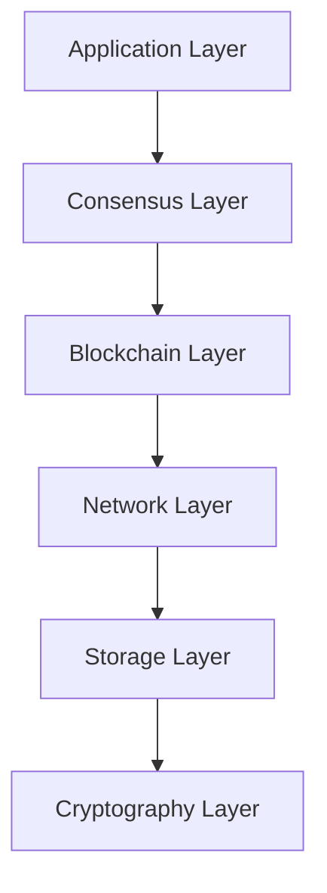
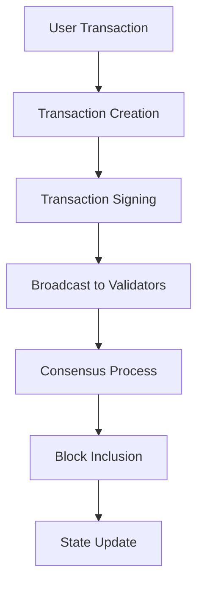

# Other — docs

# ZHTP Blockchain Technical Overview Documentation

## Overview

The **ZHTP Blockchain** is a modular, production-grade blockchain system implemented in Rust (1.70+). This documentation provides a comprehensive overview of the architecture, key components, and operational mechanics of the blockchain, focusing on its consensus mechanism, cryptography, data structures, state management, transaction system, and performance characteristics.

## Purpose

The ZHTP Blockchain is designed to provide a robust, decentralized platform for managing digital assets and executing transactions securely and efficiently. It emphasizes:
- Immutable ledger
- Consensus-driven block production
- Deterministic execution of transactions
- Support for smart contracts as an optional feature

## Architecture

The architecture of the ZHTP Blockchain is organized into several layers, each responsible for distinct functionalities. The following diagram illustrates the layered architecture:



### Layer Descriptions

1. **Application Layer**: Contains the main orchestrator node binary (`zhtp`), configuration management, and RPC interfaces.
2. **Consensus Layer**: Implements the Byzantine Fault Tolerance (BFT) consensus algorithm, validator management, and DAO governance.
3. **Blockchain Layer**: Manages block creation, validation, transaction execution, and state management.
4. **Network Layer**: Handles peer-to-peer communication, message broadcasting, and validator discovery.
5. **Storage Layer**: Provides persistent storage solutions for blockchain data, including blocks, transactions, and state.
6. **Cryptography Layer**: Implements post-quantum cryptographic algorithms for signatures, encryption, and hashing.

## Key Components

### 1. Consensus Mechanism

The consensus mechanism is based on a BFT algorithm that ensures safety and liveness in the presence of faulty nodes. The consensus process consists of four phases: Propose, PreVote, PreCommit, and Commit. 

#### BFT Properties
- **Safety**: Honest validators always agree on the same block.
- **Liveness**: Consensus eventually progresses.
- **Immediate Finality**: Once 2/3+ validators commit, the block is finalized.

#### Key Files
- `lib-consensus/src/engines/bft_engine.rs`: BFT engine implementation.
- `lib-consensus/src/types/mod.rs`: Contains types for consensus rounds and votes.

### 2. Cryptography

The blockchain employs a post-quantum cryptography stack to ensure security against future threats.

#### Key Algorithms
- **Signatures**: Dilithium (NIST-selected).
- **Encryption**: Kyber + ChaCha20Poly1305 (hybrid).
- **Hashing**: BLAKE3.

#### Key Files
- `lib-crypto/src/post_quantum.rs`: Contains post-quantum signature structures.
- `lib-crypto/src/classical.rs`: Implements hybrid encryption.

### 3. Data Structures

The blockchain utilizes specific data structures to represent blocks, transactions, and state.

#### Block Structure
```rust
pub struct Block {
    pub header: BlockHeader,
    pub transactions: Vec<Transaction>,
}
```

#### Transaction Structure
```rust
pub struct Transaction {
    pub version: u32,
    pub chain_id: u8,
    pub transaction_type: TransactionType,
    pub inputs: Vec<TransactionInput>,
    pub outputs: Vec<TransactionOutput>,
    pub fee: u64,
    pub signature: Signature,
}
```

### 4. State Management

State transitions occur through the execution of transactions contained within blocks. The blockchain maintains a UTXO set to manage spendable outputs.

#### Key Functions
- `add_block()`: Validates and adds a new block to the blockchain.
- `execute_transactions()`: Executes transactions and updates the state.

### 5. Transaction System

The transaction system is responsible for creating, signing, broadcasting, and including transactions in blocks.

#### Transaction Lifecycle
1. Create transaction.
2. Sign transaction.
3. Broadcast transaction.
4. Include in block.
5. Achieve consensus.
6. Update state.

### 6. Performance Characteristics

The ZHTP Blockchain is designed for high throughput and low latency, achieving approximately 400 transactions per second (TPS) with a finality time of around 7 seconds.

## Integration with Other Components

The ZHTP Blockchain is designed to work seamlessly with other components of the Sovereign Network ecosystem, including:
- **Validator Nodes**: Participate in consensus and maintain the blockchain.
- **Storage Solutions**: Provide persistent storage for blockchain data.
- **Network Protocols**: Facilitate communication between nodes.

### Example Integration Flow



## Conclusion

The ZHTP Blockchain is a comprehensive, production-grade blockchain solution that leverages advanced cryptographic techniques and a robust consensus mechanism to ensure security, efficiency, and scalability. Its modular architecture allows for easy integration with other components, making it a versatile choice for decentralized applications and digital asset management.

For further details, refer to the specific sections of this documentation or the source code in the repository.