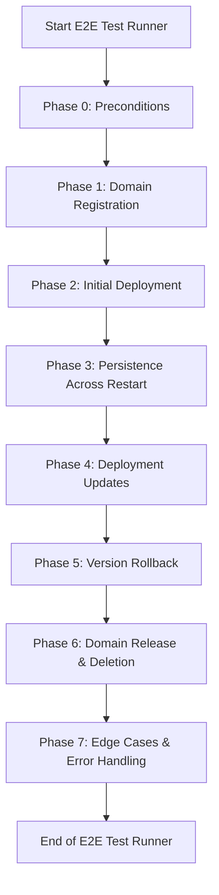

# Other — e2e

# E2E Testing Module Documentation

## Overview

The **Other — e2e** module is designed to facilitate end-to-end (E2E) testing for the Web4 CLI application. It automates the process of testing various functionalities of the CLI, ensuring that the system behaves as expected across different scenarios. This module is crucial for maintaining the integrity of the application as it evolves, allowing developers to catch regressions and verify new features.

## Purpose

The primary purpose of this module is to provide a comprehensive testing framework that:
- Validates domain registration and management.
- Tests deployment and rollback functionalities.
- Ensures persistence of state across node restarts.
- Handles edge cases and error scenarios.

## Key Components

The E2E module consists of several key components, each serving a specific role in the testing process:

### 1. **Runner Script (`runner.sh`)**

The entry point for executing the E2E tests. It orchestrates the entire testing process, including:
- Setting up the environment.
- Running various phases of tests.
- Cleaning up resources after tests are completed.

### 2. **CLI Wrapper (`cli.sh`)**

This script provides a set of functions that wrap around the `zhtp-cli` commands. It simplifies the interaction with the CLI by providing functions for:
- Domain registration and checking.
- Site deployment and status retrieval.
- Deployment history and rollback.

### 3. **Node Control (`node_ctrl.sh`)**

This component manages the lifecycle of the local `zhtp` node used during testing. It includes functions to:
- Start, stop, and restart the node.
- Handle process management and logging.

### 4. **Site Generator (`site_generator.sh`)**

A utility for generating simple static site content for testing purposes. It creates HTML, CSS, and JavaScript files that can be deployed to the registered domains.

### 5. **Assertions (`asserts.sh`)**

This script contains assertion functions that validate expected outcomes during tests. It includes:
- `assert_equal`: Checks if two values are equal.
- `assert_contains`: Verifies if a string contains a specific substring.

### 6. **Bug Report Template (`BUG_REPORT_TEMPLATE.md`)**

A markdown template for reporting bugs discovered during E2E testing. It standardizes the information required to diagnose issues effectively.

## Execution Flow

The execution flow of the E2E tests is structured into several phases, each focusing on different aspects of the application. Below is a high-level overview of the phases executed by the `runner.sh` script:

### Phase Breakdown

1. **Phase 0: Preconditions**
   - Checks for required tools (`zhtp-cli`, `jq`).
   
2. **Phase 1: Domain Registration**
   - Registers multiple domains and verifies their registration.

3. **Phase 2: Initial Deployment**
   - Deploys a site to a registered domain and checks deployment status.

4. **Phase 3: Persistence Across Restart**
   - Stops and restarts the node, verifying that domain registrations and deployments persist.

5. **Phase 4: Deployment Updates**
   - Tests the ability to deploy updated versions of a site and checks the deployment history.

6. **Phase 5: Version Rollback**
   - Tests rolling back to a previous version of a deployment and verifies the rollback.

7. **Phase 6: Domain Release & Deletion**
   - Tests the deletion of deployments and the release of domains, ensuring state persistence.

8. **Phase 7: Edge Cases & Error Handling**
   - Validates the system's behavior under erroneous conditions, such as missing keystore files.

## Integration with the Codebase

The E2E module is integrated into the broader Web4 CLI codebase by relying on the `zhtp-cli` command-line interface for executing commands. The tests are designed to simulate real-world usage scenarios, ensuring that the CLI behaves correctly when interacting with the underlying services.

### Dependencies

- **zhtp-cli**: The command-line interface that the E2E tests interact with.
- **jq**: A command-line JSON processor used for parsing and manipulating JSON output from the CLI.

## Conclusion

The **Other — e2e** module is a vital part of the Web4 CLI testing strategy, providing a robust framework for validating the application's functionality. By automating the testing process, it helps ensure that the application remains reliable and meets user expectations as it evolves. Developers are encouraged to contribute to this module by adding new tests, improving existing ones, and maintaining the overall quality of the E2E testing framework.