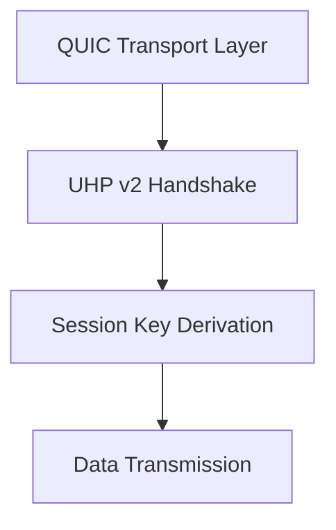

# Other — encryption

# Encryption Module Documentation

## Overview

The **Encryption Module** is designed to provide a secure transport layer for QUIC (Quick UDP Internet Connections) while delegating all cryptographic identity, authentication, and key agreement responsibilities to the UHP v2 (Universal Handshake Protocol version 2). This module is currently in alpha status and focuses on ensuring that QUIC operates as a transport-only protocol, enhancing security and simplifying the cryptographic landscape.

## Purpose

The primary purpose of this module is to facilitate reliable and encrypted transport using QUIC while ensuring that all cryptographic operations are handled by UHP v2. This design choice eliminates potential downgrade paths and legacy states, aligning with modern cryptographic practices.

## Key Components

### 1. QUIC Transport Layer

- **Transport-Only Model**: QUIC is designed to provide transport security and reliability without engaging in cryptographic identity or key agreement processes.
- **TLS Integration**: QUIC utilizes the system's TLS stack (e.g., rustls or platform TLS) for transport security.

### 2. UHP v2 Handshake

- **Sole Handshake Model**: UHP v2 is the only handshake mechanism employed, ensuring that all cryptographic operations are centralized and managed outside of the QUIC layer.
- **Post-Quantum Algorithms**: The module exclusively uses Kyber1024 for key encapsulation and Dilithium5 for signature generation, ensuring post-quantum security.

### 3. Session Key Derivation

- **Transcript Hash**: The session key is derived from a cryptographic transcript hash computed from UHP v2 messages. This hash serves as the HKDF (HMAC-based Key Derivation Function) salt, session binding, and audit artifact.
  
  ```plaintext
  handshake_hash = HASH(transcript_bytes)
  ```

### 4. Cryptographic Invariants

- **No Legacy Paths**: The design ensures that there are no legacy or downgrade paths, maintaining a clean and secure protocol.
- **Transcript Composition**: The transcript hash is constructed from the following UHP v2 messages:
  - ClientHello (including version, capabilities, and public keys)
  - ServerHello (including selected parameters and server public keys)
  - Kyber encapsulation/decapsulation messages
  - Dilithium signatures over the transcript
  - Final handshake confirmation

## How It Works

1. **Initiation**: A QUIC connection is established, and the UHP v2 handshake is initiated over the QUIC stream.
2. **Handshake Execution**: The UHP v2 handshake messages are exchanged, and the cryptographic transcript is built.
3. **Session Key Derivation**: Once the handshake is complete, the session key is derived from the transcript hash.
4. **Data Transmission**: Encrypted application data can now be transmitted over the QUIC connection using the derived session key.

## Integration with the Codebase

The Encryption Module is designed to work seamlessly with the QUIC transport layer and the UHP v2 handshake. It does not have any internal calls, outgoing calls, or incoming calls, as it operates independently to provide encryption services.

### Call Graph



## Operational Guidance

- **Using QUIC**: Developers should utilize QUIC for reliable and encrypted transport, ensuring that all cryptographic identity and key agreement processes are handled by UHP v2.
- **Performing Handshakes**: Always perform the UHP v2 handshake over the QUIC stream to establish a secure connection.
- **Key Management**: Derive all application keys from the session key produced by the UHP v2 handshake.

## Conclusion

The Encryption Module is a critical component of the QUIC protocol, ensuring that transport security is maintained while delegating cryptographic responsibilities to UHP v2. By adhering to modern cryptographic standards and eliminating legacy paths, this module provides a robust foundation for secure communication in the alpha phase of development.