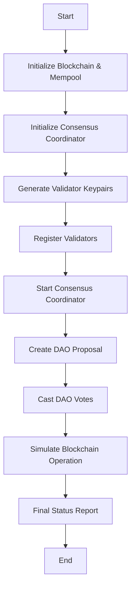

# Other — examples

# Other — Examples Module Documentation

## Overview

The **Other — examples** module serves as a collection of example scripts that demonstrate various functionalities of the blockchain framework. These examples are primarily intended for developers to understand how to utilize the core features of the blockchain library, including consensus integration, DAO governance, and economic systems. 

### Purpose

The examples in this module provide practical demonstrations of how to:
- Initialize and run a blockchain with full consensus integration.
- Create and manage DAO proposals and votes.
- Distribute Universal Basic Income (UBI) and welfare funding.
- Interact with the blockchain's transaction and block systems.

## Key Components

### 1. Full Consensus Integration Example

The most comprehensive example in this module is `full_consensus_integration.rs`. This script demonstrates the complete flow of initializing a blockchain with consensus mechanisms, registering validators, and executing DAO governance.

#### Execution Flow

The execution flow of the `full_consensus_integration.rs` script can be summarized as follows:

1. **Initialization**:
   - The blockchain and mempool are initialized.
   - The consensus coordinator is set up with Byzantine Fault Tolerance (BFT).

2. **Validator Registration**:
   - Key pairs for validators are generated.
   - Validators are registered with their respective stakes and storage capacities.

3. **Consensus Coordination**:
   - The consensus coordinator is started, enabling block production.
   - The initial consensus status is retrieved and displayed.

4. **DAO Proposal Creation**:
   - A DAO proposal transaction is created and added to the blockchain.

5. **DAO Voting**:
   - Validators cast their votes on the proposal, which are also added to the blockchain.

6. **Blockchain Operation Simulation**:
   - The blockchain runs for a few rounds to demonstrate ongoing consensus and transaction processing.

7. **Final Reporting**:
   - The final status of the blockchain and consensus is reported, including treasury statistics and transaction details.

#### Code Snippet

Here is a key snippet from the `full_consensus_integration.rs` that illustrates the registration of validators:

```rust
for (i, ((name, &stake), &storage_gb)) in validator_names.iter().zip(stakes.iter()).zip(storage_capacities.iter()).enumerate() {
    let identity = IdentityId::from_bytes(&validator_keypairs[i].public_key.dilithium_pk);
    let storage_bytes = storage_gb * 1024 * 1024 * 1024;
    let networking_keypair = KeyPair::generate().unwrap();
    let rewards_keypair = KeyPair::generate().unwrap();

    consensus_coordinator.register_as_validator(
        identity.clone(),
        stake,
        storage_bytes,
        &validator_keypairs[i],
        &networking_keypair,
        &rewards_keypair,
        5, // 5% commission rate
    ).await?;
}
```

### 2. Placeholder Examples

The module also contains placeholder examples for future implementations:
- `deploy_web4_site.rs`: Intended to demonstrate the deployment flow for Web4, pending updates to the manifest/storage APIs.
- `test_recursive_aggregation.rs`: A placeholder for a recursive aggregation example, awaiting API stabilization.
- `wasm_sandboxing_demo.rs`: A placeholder for a WASM sandboxing demo, pending finalization of runtime APIs and dependencies.

These placeholders indicate areas for future development and serve as reminders for developers to implement these features.

## Integration with the Codebase

The examples in this module interact with several key components of the blockchain framework:

- **Blockchain and Mempool**: The core data structures that manage transactions and blocks.
- **Consensus Integration**: The module utilizes functions from `lib_blockchain` and `lib_consensus` to manage consensus mechanisms and validator interactions.
- **Transaction Creation**: Functions like `create_dao_proposal_transaction` and `create_dao_vote_transaction` are used to demonstrate DAO governance.
- **Economic Systems**: The examples illustrate how to create UBI and welfare funding transactions, showcasing the economic functionalities of the blockchain.

### Mermaid Diagram

The following diagram illustrates the high-level flow of the `full_consensus_integration.rs` example:



## Conclusion

The **Other — examples** module is a vital resource for developers looking to understand and contribute to the blockchain framework. By providing practical examples and demonstrating key functionalities, it serves as both a learning tool and a reference for future development. Developers are encouraged to expand upon the placeholder examples and enhance the existing functionalities to further enrich the blockchain ecosystem.