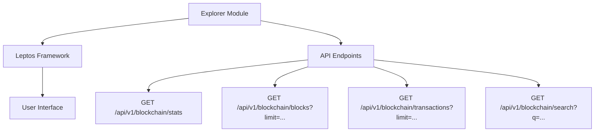

# Other — explorer

# Explorer Module Documentation

## Overview

The **Explorer** module is a client-side WebAssembly (WASM) single-page application (SPA) designed for the Sovereign Network block explorer. It provides a user-friendly interface to interact with blockchain data, allowing users to view statistics, blocks, transactions, and perform searches. The application is built using the Leptos framework, which facilitates the development of reactive web applications in Rust.

### Key Features
- **Client-Side Rendering**: Utilizes Leptos for efficient rendering and state management.
- **API Integration**: Communicates with the Sovereign Network's backend API to fetch blockchain data.
- **Responsive Design**: Adapts to various screen sizes, ensuring usability across devices.

## Architecture

The Explorer module is structured to separate concerns effectively, with a clear focus on the user interface and API interactions. Below is a high-level overview of the architecture:



## Key Components

### 1. **Cargo.toml**
The `Cargo.toml` file defines the module's dependencies and configuration. Key dependencies include:
- **Leptos**: For building the SPA.
- **Leptos Router**: For handling client-side routing.
- **Serde**: For serializing and deserializing JSON data.
- **Gloo-net**: For making HTTP requests to the API.

### 2. **Trunk.toml**
The `Trunk.toml` file configures the build process using Trunk, specifying the output directory for static assets and public URL settings.

### 3. **index.html**
The entry point of the application, `index.html`, sets up the basic HTML structure and links to the necessary CSS and WASM files. The `<div id="root"></div>` serves as the mounting point for the Leptos application.

### 4. **style.css**
This file contains the styling for the application, defining variables for colors, fonts, and layout. It ensures a consistent look and feel across the application.

### 5. **API Integration**
The Explorer module interacts with the Sovereign Network's API through several endpoints:
- **GET /api/v1/blockchain/stats**: Fetches blockchain statistics.
- **GET /api/v1/blockchain/blocks?limit=...**: Retrieves a list of blocks with an optional limit.
- **GET /api/v1/blockchain/transactions?limit=...**: Fetches transactions with an optional limit.
- **GET /api/v1/blockchain/search?q=...**: Allows users to search for specific blockchain data.

### 6. **User Interface Components**
The UI is built using Leptos components, which are reactive and can update based on state changes. Key UI components include:
- **Header**: Displays the application title and navigation links.
- **Main Content Area**: Shows the main content, including statistics, blocks, and transactions.
- **Search Bar**: Allows users to search for specific blockchain entries.
- **Footer**: Contains additional information and links.

## Build and Deployment

To build the Explorer module, navigate to the `explorer` directory and run the following command:

```bash
trunk build --release
```

The output will be generated in the `zhtp/static/explorer` directory, which can then be deployed as Web4 content.

## Publishing as a Web4 Citizen

To publish the Explorer as a Web4 citizen:
1. Build the application as described above.
2. Upload the contents of the `zhtp/static/explorer` directory.
3. Register a `.sov` domain to point to the manifest CID of the uploaded content.

## Conclusion

The Explorer module serves as a vital component of the Sovereign Network ecosystem, providing users with an intuitive interface to explore blockchain data. By leveraging modern web technologies and a modular architecture, it ensures maintainability and scalability for future enhancements. Developers looking to contribute to this module should familiarize themselves with the Leptos framework and the API endpoints utilized within the application.