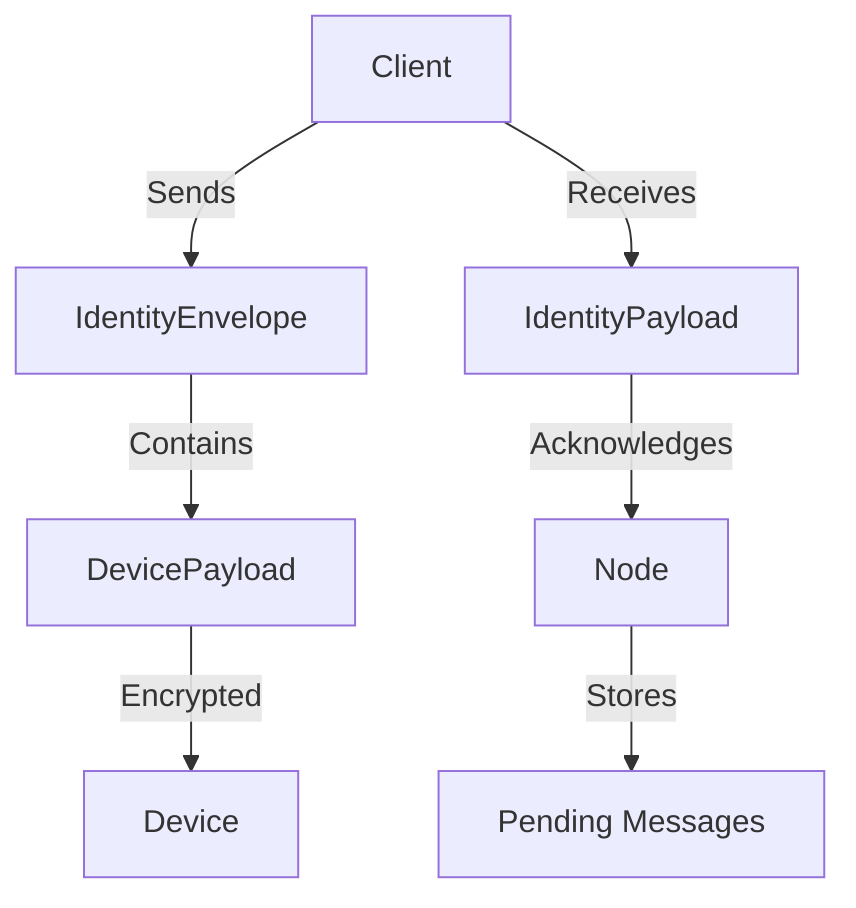

# Other — identity

# Identity Module Documentation

## Overview

The **Identity** module is responsible for managing identity messaging within a decentralized network. It facilitates the sending, receiving, and acknowledgment of identity messages between devices using Decentralized Identifiers (DIDs). This document outlines the client implementation requirements, key components, and integration points with the node, providing developers with the necessary information to contribute to and extend the module.

## Purpose

The primary purpose of the Identity module is to enable secure communication between devices by:
- Maintaining user identity and device state.
- Sending encrypted messages to multiple devices associated with a recipient DID.
- Acknowledging message delivery without exposing plaintext data.
- Supporting delivery receipts to confirm message receipt.

## Key Components

### 1. Client Responsibilities

The client is responsible for several key tasks to ensure proper identity messaging:

#### 1.1 DID + Device State Management
- **DID Storage**: The client must maintain the user's Decentralized Identifier (DID) and seed phrase locally.
- **Device List**: It should keep an active list of devices, including their IDs and associated signing and encryption keys.
- **Key Loading**: On startup, the client loads local device keys, ensuring that no server can reconstruct missing keys.

#### 1.2 Sending Messages
- **Recipient Resolution**: The client resolves the recipient's DID to its active device registry.
- **Encryption**: For each active device, the client encrypts the same plaintext payload using the device's public encryption key.
- **Envelope Construction**: An `IdentityEnvelope` is constructed containing one `DevicePayload` for each device.
- **TTL Selection**: The client selects a Time-To-Live (TTL) for the message, defaulting to 7 days.
- **Transmission**: The envelope is transmitted to the network.

#### 1.3 Receiving Messages
- **Envelope Processing**: For each incoming envelope, the client locates the `DevicePayload` that matches its local `device_id`.
- **Decryption**: The client decrypts the ciphertext using its private encryption key and deserializes the payload into an `IdentityPayload`.

#### 1.4 Delivery Acknowledgment
- **Acknowledgment Sending**: Upon successful decryption, the client sends an acknowledgment to the node using the `POST /api/v1/network/identity/ack` endpoint.

#### 1.5 Delivery Receipt
- **Receipt Creation**: The client creates a `DeliveryReceipt` signed by the device's signing key and encrypts it to the sender DID.
- **Receipt Transmission**: The receipt is sent back to the sender as an `IdentityEnvelope`.

### 2. Client ↔ Node Integration

The client must effectively communicate with the node to send and receive identity messages.

#### 2.1 Transmission Path
The client can implement one of the following methods to send `IdentityEnvelope` objects:
- **A)** Direct mesh message send via QUIC (preferred).
- **B)** Client API endpoint to submit an envelope to the node for routing (requires server-side support).

#### 2.2 Pending Pull
The client can pull pending messages using the `POST /api/v1/network/identity/pending` endpoint, which returns an array of `IdentityEnvelope` objects.

#### 2.3 Delivery Acknowledgment
The client can acknowledge message delivery using the `POST /api/v1/network/identity/ack` endpoint, which confirms whether the acknowledgment was successful.

### 3. Message Formats

#### 3.1 Envelope
- The `IdentityEnvelope` contains per-device ciphertexts and should be treated as opaque for devices not owned by the client.

#### 3.2 Payload Types
- `IdentityPayload::UserMessage`: For user messages.
- `IdentityPayload::ControlMessage`: For device updates.
- `IdentityPayload::DeliveryReceipt`: For delivery acknowledgments.

#### 3.3 Receipt
- The `DeliveryReceipt` is signed by the device's signing key and encrypted to the sender DID.

### 4. Minimal Client Flow (MVP)

#### 4.1 Sending a Message
1. Resolve the recipient DID to active devices.
2. Encrypt the payload for each device.
3. Build the `IdentityEnvelope`.
4. Transmit the envelope to the node or mesh.

#### 4.2 Receiving a Message
1. Pull pending envelopes for the device.
2. Decrypt the matching ciphertext.
3. Process the payload.
4. Post a delivery acknowledgment to the node.
5. Send an encrypted delivery receipt to the sender DID.

### 5. Testing Requirements
Developers should implement tests to cover the following scenarios:
- Sending a message to a DID with multiple devices and ensuring both can decrypt it.
- Handling offline devices by pulling envelopes later within the TTL.
- Confirming that delivery acknowledgments remove envelopes from the node store.
- Ensuring delivery receipts decrypt correctly on the sender's side and mark messages as delivered.

### 6. Open Items
- **Envelope Submission Endpoint**: A dedicated endpoint for envelope submission is needed if not using QUIC directly.
- **Sealed-Sender Routing**: This feature is planned for Phase 4 and is not part of the MVP.
- **Read Receipts**: This feature is planned for Phase 6 and is not part of the MVP.

## Architecture Overview

## Conclusion

The Identity module is a critical component for enabling secure identity messaging in a decentralized network. By following the outlined responsibilities and integration points, developers can effectively contribute to the module and ensure robust communication between devices.