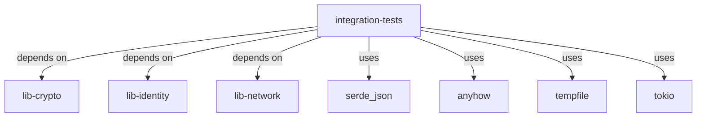

# Other — integration

# Integration Module Documentation

## Overview

The **integration** module is designed to facilitate integration testing for the various components of the system. It primarily focuses on ensuring that the interactions between different libraries—such as `lib-crypto`, `lib-identity`, and `lib-network`—function correctly when combined. This module is essential for validating the overall behavior of the application in a real-world scenario, particularly when components are expected to work together seamlessly.

## Purpose

The main purpose of the integration module is to provide a structured environment for running tests that validate the integration points between different libraries. It helps in identifying issues that may arise when components interact, which might not be evident in unit tests that focus on isolated functionality.

## Key Components

### Cargo.toml

The `Cargo.toml` file defines the package metadata and dependencies required for the integration tests. Here are the key sections:

- **Package Information**: 
  - Name: `integration-tests`
  - Version: `0.1.0`
  - Edition: `2021`

- **Dependencies**: The module relies on several external crates:
  - `anyhow`: For error handling.
  - `lib-crypto`: A local library for cryptographic functions.
  - `lib-identity`: A local library for identity management.
  - `lib-network`: A local library for network operations.
  - `serde_json` and `serde`: For serialization and deserialization of JSON data.
  - `tempfile`: For creating temporary files during tests.
  - `tokio`: An asynchronous runtime for executing tests that require concurrency.

### Test Files

The integration module contains a test file named `test_orchestrator_restart_determinism.rs`. This file is responsible for testing the determinism of the orchestrator when it is restarted. The tests in this file ensure that the state and behavior of the orchestrator remain consistent across restarts, which is crucial for maintaining reliability in production environments.

## How It Works

The integration tests are executed using the Rust testing framework. When you run the tests, the following occurs:

1. **Setup**: The test environment is prepared, including any necessary initialization of the libraries being tested.
2. **Execution**: Each test function is executed in isolation, allowing for the verification of specific integration points.
3. **Validation**: Assertions are made to check that the expected outcomes match the actual results. This may involve checking the state of the system, the output of functions, or the behavior of components after certain actions.

### Example Test Structure

Here is a simplified example of what a test function might look like in `test_orchestrator_restart_determinism.rs`:

```rust
#[tokio::test]
async fn test_orchestrator_restart_determinism() {
    // Setup the orchestrator
    let orchestrator = Orchestrator::new();
    
    // Perform actions
    orchestrator.start().await;
    
    // Restart the orchestrator
    orchestrator.restart().await;
    
    // Validate the state
    assert_eq!(orchestrator.state(), expected_state);
}
```

## Integration with the Codebase

The integration module connects with the rest of the codebase through its dependencies on the local libraries. Each library provides specific functionality that is tested in conjunction with others. For example:

- **lib-crypto** may be used to validate cryptographic operations during the orchestration process.
- **lib-identity** could be involved in managing user identities and ensuring that they are correctly handled across restarts.
- **lib-network** might be responsible for handling network requests that the orchestrator makes.

### Mermaid Diagram

The following diagram illustrates the relationships between the integration module and its dependencies:



## Conclusion

The integration module is a critical part of the testing strategy for the application, ensuring that various components work together as expected. By leveraging the capabilities of the Rust testing framework and the dependencies defined in `Cargo.toml`, developers can confidently validate the integration points of the system. This module not only helps in identifying issues early in the development cycle but also contributes to the overall reliability and robustness of the application.