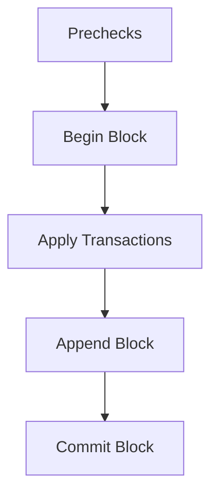

# Other — lib-blockchain

# lib-blockchain Module Documentation

## Overview

The `lib-blockchain` module is the core implementation of the ZHTP blockchain, designed to handle the execution of transactions, block management, and state persistence. This module is built to ensure a deterministic and crash-safe execution pipeline, adhering to the Phase 2 requirements of the blockchain's architecture. It integrates various components such as transaction validation, fee computation, and state management through a structured lifecycle.

## Purpose

The primary purpose of the `lib-blockchain` module is to provide a robust framework for executing blockchain transactions while maintaining the integrity and consistency of the blockchain state. It enforces a minimum fee model, supports various transaction types, and ensures that all state mutations occur through defined primitives.

## Key Components

### 1. Execution Lifecycle

The execution lifecycle is a critical aspect of the `lib-blockchain` module, ensuring that every block undergoes a series of well-defined steps:

- **Prechecks**: Validate the block's height, structure, and other criteria before processing.
- **Begin Block**: Initialize the block processing context.
- **Apply Transactions**: Sequentially validate and apply each transaction.
- **Append Block**: Add the block to the blockchain.
- **Commit Block**: Finalize the block application and persist changes.



### 2. Transaction Types

The module supports several transaction types, each with specific validation and application rules:

- **NativeTransfer**: Standard UTXO-based transfers.
- **TokenTransfer**: Transfers of tokens (incomplete implementation).
- **Coinbase**: Special transactions that reward miners.

### 3. Fee Model v2

The fee model is a crucial part of the transaction processing, ensuring that each transaction meets a minimum fee requirement. The `compute_fee_v2` function calculates the fee based on various parameters, including transaction type, signature scheme, and resource usage.

#### Fee Calculation Formula

```rust
fee = base_tx_fee
    + exec_units * price_exec_unit
    + state_reads * price_state_read
    + state_writes * price_state_write
    + state_write_bytes * price_state_write_byte
    + payload_bytes * price_payload_byte
    + charged_witness_bytes * price_witness_byte
    + verify_units * price_verify_unit
```

### 4. State Management

The module utilizes a `BlockchainStore` trait to manage the blockchain's state. The `SledStore` implementation provides a persistent storage backend, allowing for efficient state retrieval and updates. All state mutations are routed through the `StateMutator` to ensure consistency.

### 5. Error Handling

The module employs the `thiserror` crate to define custom error types for transaction and block application failures. This structured error handling allows for clear communication of issues during execution.

## Integration with Other Modules

The `lib-blockchain` module interacts with several other internal modules, including:

- **lib-types**: Provides foundational types used throughout the blockchain.
- **lib-fees**: Contains the fee model and related computations.
- **lib-crypto**: Handles cryptographic operations.
- **lib-storage**: Manages persistent storage solutions.
- **lib-consensus**: Ensures consensus rules are followed during block validation.

### Example of Interaction

When a new block is received, the following sequence occurs:

1. The block is passed to the `BlockExecutor`.
2. The executor performs prechecks and begins the block processing.
3. Each transaction is validated and applied using the `StateMutator`.
4. The block is appended and committed to the `BlockchainStore`.

## Development and Contribution

### Setting Up the Environment

To contribute to the `lib-blockchain` module, ensure you have the following dependencies in your `Cargo.toml`:

```toml
[dependencies]
serde = { version = "1.0", features = ["derive"] }
tokio = { version = "1.0", features = ["full"] }
sled = "0.34"
```

### Running Tests

The module includes a suite of tests to validate the execution lifecycle, rollback behavior, and fee model compliance. Use the following command to run the tests:

```bash
cargo test
```

### Current Status and Roadmap

As of now, the module has completed the basic execution structure and is in progress on implementing the `TokenTransfer` functionality. Future work includes:

- Completing the fee model integration.
- Finalizing the coinbase transaction rules.
- Enhancing block structural validation.

## Conclusion

The `lib-blockchain` module is a foundational component of the ZHTP blockchain, providing essential functionality for transaction execution and state management. By adhering to a structured lifecycle and integrating with other modules, it ensures a robust and efficient blockchain implementation. Developers are encouraged to contribute by enhancing existing features and implementing new transaction types as outlined in the Phase 2 checklist.