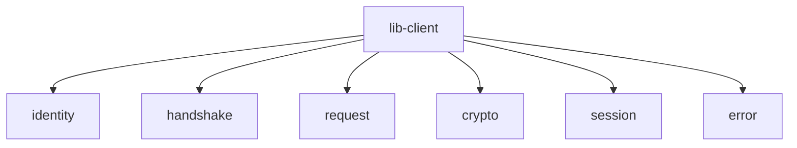

# Other — lib-client

# lib-client Module Documentation

## Overview

The **lib-client** module is a cross-platform client library designed for the Zero-Trust Handshake Transport Protocol (ZHTP). It provides a unified implementation for iOS, Android, Web (via WebAssembly), and native CLI applications, allowing developers to handle identity generation, handshake protocols, request/response serialization, and session encryption without needing separate implementations for each platform.

### Key Features
- **Cross-Platform Compatibility**: Supports iOS, Android, Web, and CLI.
- **Identity Management**: Generates and manages cryptographic identities using post-quantum cryptography (PQC).
- **Handshake Protocol**: Implements the UHP v2 handshake protocol for secure communication.
- **Serialization**: Handles ZHTP request and response serialization using CBOR.
- **Session Management**: Manages encrypted sessions using ChaCha20-Poly1305.

## Architecture

The architecture of the **lib-client** module is designed to be modular, with distinct components handling specific functionalities. Below is a high-level overview of the module's structure:



### Components

1. **Identity Management (`identity.rs`)**
   - Responsible for generating and managing user identities.
   - Uses post-quantum cryptographic algorithms (Dilithium5 and Kyber1024) for key generation.
   - Provides functions to generate identities, sign registration proofs, and retrieve public identity information.

2. **Handshake Protocol (`handshake.rs`)**
   - Implements the UHP v2 handshake protocol.
   - Manages the state of the handshake process, including creating and processing handshake messages.
   - Ensures secure communication by verifying signatures and deriving session keys.

3. **Request/Response Serialization (`request.rs`)**
   - Handles serialization and deserialization of ZHTP requests and responses using CBOR.
   - Provides functions to create ZHTP frames and parse incoming frames.

4. **Cryptographic Functions (`crypto.rs`)**
   - Wraps cryptographic primitives for ease of use.
   - Implements key generation, signing, verification, and hashing using Dilithium5, Kyber1024, and Blake3.
   - Provides utility functions for random byte generation and key derivation.

5. **Session Management (`session.rs`)**
   - Manages encrypted sessions using ChaCha20-Poly1305.
   - Provides methods for encrypting and decrypting messages, as well as managing session state.

6. **Error Handling (`error.rs`)**
   - Defines custom error types for the client library.
   - Uses the `thiserror` crate for easy error management.

## Usage

### Building the Library

To build the **lib-client** module, use the following commands:

```bash
# Development build
cargo build -p lib-client

# Release build
cargo build -p lib-client --release

# Run tests
cargo test -p lib-client
```

### Generating an Identity

To generate a new identity, use the `generate_identity` function from the `identity` module:

```rust
let identity = identity::generate_identity(device_id);
```

### Handshake Process

The handshake process involves creating a `HandshakeState`, generating a `ClientHello`, processing a `ServerHello`, and finalizing the handshake:

```rust
let mut handshake = handshake::HandshakeState::new(identity, channel_binding);
let client_hello = handshake.create_client_hello()?;
send(client_hello);

let server_hello_data = receive();
let client_finish = handshake.process_server_hello(server_hello_data)?;
send(client_finish);

let result = handshake.finalize()?;
```

### Serializing a Request

To serialize a ZHTP request, create a `ZhtpRequest` and use the `serialize_request` function:

```rust
let request = request::ZhtpRequest {
    method: "GET".to_string(),
    uri: "/api/v1/resource".to_string(),
    version: "1.0".to_string(),
    headers: request::ZhtpHeaders::default(),
    body: vec![],
    timestamp: current_timestamp(),
    requester: None,
};

let serialized_request = request::serialize_request(&request)?;
```

### Session Encryption

To manage session encryption, create a `Session` instance and use its `encrypt` and `decrypt` methods:

```rust
let mut session = session::Session::new(session_key, peer_did)?;
let encrypted_data = session.encrypt(plaintext)?;
let decrypted_data = session.decrypt(&encrypted_data)?;
```

## Integration with Other Modules

The **lib-client** module relies on several other modules within the codebase:

- **lib-crypto**: Provides cryptographic primitives and algorithms used for identity generation and session encryption.
- **lib-blockchain**: Used for transaction serialization and other blockchain-related functionalities.
- **lib-identity-core**: Manages identity-related operations and integrates with the identity management in **lib-client**.

## Conclusion

The **lib-client** module serves as a comprehensive solution for implementing the ZHTP client functionality across multiple platforms. Its modular design allows for easy maintenance and extension, making it a valuable asset for developers working on secure communication applications. By leveraging modern cryptographic techniques and a unified API, it simplifies the complexities of cross-platform development while ensuring robust security.