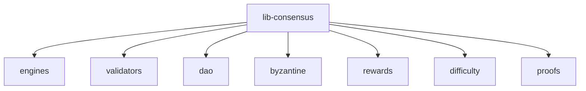

# Other — lib-consensus

# lib-consensus Module Documentation

## Overview

The `lib-consensus` module is a core component of the ZHTP blockchain network, implementing a multi-layered consensus system. It integrates various consensus mechanisms, including Proof of Stake (PoS), Proof of Storage (PoStorage), Proof of Useful Work (PoUW), and Byzantine Fault Tolerance (BFT). This module is designed to ensure secure, efficient, and decentralized decision-making within the blockchain ecosystem.

## Purpose

The primary purpose of the `lib-consensus` module is to manage the consensus process among validators in the ZHTP network. It provides mechanisms for validator registration, slashing, governance through a Decentralized Autonomous Organization (DAO), and reward distribution. The module aims to enhance security, promote decentralization, and ensure the integrity of the blockchain.

## Key Components

### 1. Consensus Engines

The module supports multiple consensus engines, allowing for flexibility in how consensus is achieved. The main engines include:

- **PoS Engine**: Selects validators based on their stake in the network.
- **PoStorage Engine**: Requires validators to provide storage capacity.
- **PoUW Engine**: Rewards validators for useful contributions to the network.
- **Hybrid Engine**: Combines PoS and PoStorage for enhanced security.
- **BFT Engine**: Ensures consensus with a 2/3 majority requirement.

### 2. Validator Management

The `validators` submodule handles all aspects of validator lifecycle management, including:

- **Registration**: Validators can register with specific parameters such as stake amount and storage capacity.
- **Slashing**: Implements penalties for misbehavior, such as double-signing or inactivity.
- **Statistics**: Provides insights into active validators and total stake.

### 3. DAO Governance

The `dao` submodule facilitates decentralized governance, allowing stakeholders to propose and vote on changes to the network. Key features include:

- **Proposal Creation**: Stakeholders can create proposals for changes in economic parameters, treasury allocations, and more.
- **Voting Mechanisms**: Implements weighted voting based on stake and reputation, with quorum requirements.
- **Treasury Management**: Manages funds and ensures secure allocation.

### 4. Byzantine Fault Tolerance

The `byzantine` submodule implements mechanisms to detect and handle Byzantine faults, ensuring the network can withstand malicious actors. Features include:

- **Fault Detection**: Identifies double-signing and invalid proposals.
- **Liveness Monitoring**: Tracks validator participation to ensure network activity.

### 5. Reward System

The `rewards` submodule calculates and distributes rewards to validators based on their contributions. It includes:

- **Dynamic Reward Calculation**: Adjusts rewards based on validator performance and network conditions.
- **Multi-Type Rewards**: Rewards for validation, useful work, and participation.

### 6. Difficulty Management

The `difficulty.rs` file manages the consensus-owned difficulty adjustment policy, ensuring that the network remains stable and secure. It includes:

- **Adjustment Logic**: Implements a Bitcoin-compatible difficulty adjustment algorithm.
- **Governance Control**: Allows DAO governance to modify parameters related to difficulty.

## Architecture

The architecture of the `lib-consensus` module is organized into several submodules, each responsible for a specific aspect of the consensus process. Below is a simplified representation of the module structure:



## How It Works

### Initialization

To use the consensus engine, developers must initialize it with a configuration that specifies the consensus type, minimum stake, storage requirements, and other parameters. The following example demonstrates how to initialize the hybrid consensus engine:

```rust
let config = ConsensusConfig {
    consensus_type: ConsensusType::Hybrid,
    min_stake: 1000 * 1_000_000, // 1000 SOV
    min_storage: 100 * 1024 * 1024 * 1024, // 100 GB
    max_validators: 100,
    block_time: 10,
    ..Default::default()
};

let mut consensus = ConsensusEngine::new(config)?;
```

### Validator Registration

Validators can register with the consensus engine, providing their identity, stake amount, storage capacity, and other relevant information. The registration process is asynchronous and can be initiated as follows:

```rust
consensus.register_validator(
    identity,
    stake_amount,
    storage_capacity,
    consensus_key,
    commission_rate,
    false, // not genesis
).await?;
```

### DAO Governance

Proposals can be created and voted on through the DAO governance system. The following example shows how to create a proposal and cast a vote:

```rust
let proposal_id = consensus.dao_engine_mut().create_dao_proposal(
    proposer_id,
    "Increase Validator Rewards".to_string(),
    "Proposal to increase base validator rewards by 20%".to_string(),
    DaoProposalType::EconomicParams,
    7, // 7 days voting period
).await?;

consensus.dao_engine_mut().cast_dao_vote(
    voter_id,
    proposal_id,
    DaoVoteChoice::Yes,
    Some("Supporting increased validator incentives".to_string()),
).await?;
```

### Reward Distribution

The reward system automatically calculates and distributes rewards based on validator performance. This ensures that validators are incentivized to act in the best interest of the network.

## Integration with Other Modules

The `lib-consensus` module interacts with several other modules within the ZHTP ecosystem:

- **lib-crypto**: Provides cryptographic functions for secure validator identity and transaction signing.
- **lib-identity**: Manages validator identities and ensures their authenticity.
- **lib-storage**: Integrates with storage solutions to verify validator storage capacity.
- **lib-proofs**: Implements zero-knowledge proofs for privacy and efficiency in transactions.

## Development and Testing

### Running Examples

To run the consensus demo, use the following command:

```bash
cargo run --example consensus_demo --features="full"
```

### Testing

To run tests for the module, execute:

```bash
cargo test
```

For specific module tests, you can run:

```bash
cargo test validators::tests
cargo test dao::tests
cargo test byzantine::tests
```

## Conclusion

The `lib-consensus` module is a critical component of the ZHTP blockchain, providing a robust and flexible consensus mechanism. Its modular architecture allows for easy integration of various consensus types and governance features, ensuring a secure and efficient network. Developers are encouraged to explore the module, contribute to its development, and leverage its capabilities in their applications.