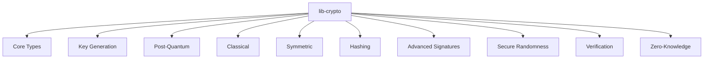

# Other — lib-crypto

# lib-crypto Documentation

## Overview

The `lib-crypto` module is a foundational library designed to provide robust cryptographic primitives that are resistant to quantum attacks. It implements NIST-standardized post-quantum algorithms, ensuring secure communications, digital signatures, key management, and privacy-preserving protocols. This module is essential for applications that require high security in the face of evolving computational threats.

## Purpose

The primary purpose of `lib-crypto` is to offer a suite of cryptographic functionalities that include:

- **Post-Quantum Cryptography**: Implementations of CRYSTALS-Dilithium for digital signatures and CRYSTALS-Kyber for key encapsulation.
- **Classical Cryptography**: Support for Ed25519 signatures and Curve25519 operations for compatibility with existing systems.
- **Symmetric Encryption**: Secure encryption using the ChaCha20-Poly1305 authenticated encryption with associated data (AEAD) scheme.
- **Cryptographic Hashing**: Fast and secure hashing using BLAKE3 and SHA-3.
- **Advanced Signatures**: Support for ring signatures and multi-signatures to enhance privacy and control.

## Key Components

### 1. Core Types

Located in the `src/types/` directory, this component defines the fundamental data structures used throughout the library, such as `KeyPair`, `Signature`, and `Ciphertext`.

### 2. Key Generation and Operations

The `src/keypair/` module is responsible for generating key pairs and performing operations related to key management. The `KeyPair` struct provides methods for generating keys, signing messages, and verifying signatures.

### 3. Post-Quantum Implementations

The `src/post_quantum/` directory contains the implementations of CRYSTALS-Dilithium and CRYSTALS-Kyber. These algorithms are designed to be secure against quantum attacks and are critical for future-proofing cryptographic applications.

### 4. Classical Cryptography

In `src/classical/`, the library provides classical cryptographic functions, including Ed25519 for digital signatures and Curve25519 for key exchange. This ensures compatibility with existing systems while transitioning to post-quantum solutions.

### 5. Symmetric Encryption

The `src/symmetric/` module implements the ChaCha20-Poly1305 AEAD scheme, which is known for its performance and security. This module handles encryption and decryption of data securely.

### 6. Hashing

The `src/hashing/` module provides implementations for BLAKE3 and SHA-3 hashing algorithms. These are used for generating secure hashes and are integral to various cryptographic protocols.

### 7. Advanced Signatures

The `src/advanced/` module includes implementations for ring signatures and multi-signatures, allowing for anonymous transactions and shared control over signed messages.

### 8. Secure Randomness

The `src/random/` module ensures that all cryptographic operations utilize secure random number generation, which is crucial for key generation and other cryptographic processes.

### 9. Signature Verification

The `src/verification/` module is responsible for verifying signatures generated by the library, ensuring that the integrity and authenticity of messages can be confirmed.

### 10. Zero-Knowledge Integration

The `src/zk_integration/` module provides trait interfaces for zero-knowledge proof systems, allowing for integration with external libraries that implement ZK proofs.

## Architecture Diagram



## Usage

### Quick Start

To get started with `lib-crypto`, you can use the following example:

```rust
use lib_crypto::KeyPair;

// Generate quantum-resistant keypair
let keypair = KeyPair::generate()?;

// Sign and verify
let message = b"Hello, post-quantum world!";
let signature = keypair.sign(message)?;
assert!(keypair.verify(&signature, message)?);

// Encrypt and decrypt
let plaintext = b"Secret message";
let ciphertext = keypair.encrypt(plaintext, b"metadata")?;
let decrypted = keypair.decrypt(&ciphertext, b"metadata")?;
```

### Building the Library

To build and test the library, use the following commands:

```bash
cargo build --release
cargo test
cargo bench
```

## Security Considerations

`lib-crypto` implements cryptographic algorithms that are designed to withstand both classical and quantum attacks. The library emphasizes secure memory management, including automatic zeroization of sensitive data to prevent leakage. All cryptographic operations are designed to be resistant to side-channel attacks.

## Conclusion

The `lib-crypto` module is a critical component of the ZHTP Post-Quantum Cryptography Foundation, providing a comprehensive suite of cryptographic functionalities. Its architecture is designed for extensibility and security, making it suitable for modern applications that require robust cryptographic solutions. For further details and advanced usage, refer to the comprehensive documentation that will be provided in the upcoming crypto documentation package.