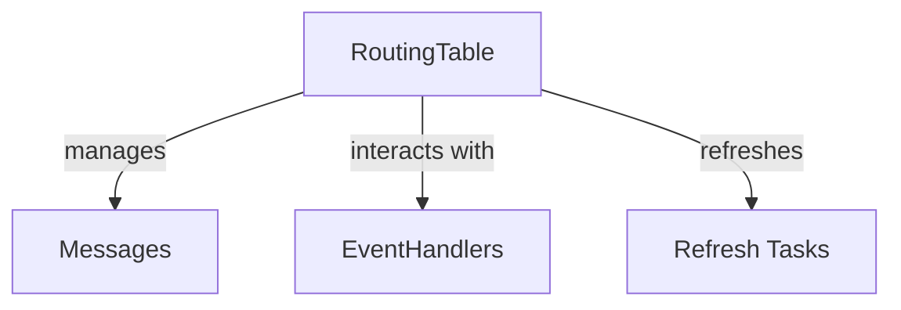

# Other — lib-dht

# rlibdht Documentation

## Overview

`rlibdht` is a Rust library that implements a Kademlia Distributed Hash Table (DHT) compatible with the BitTorrent protocol. This library provides a straightforward interface for developers to create and manage DHTs, making it easier to build applications that require decentralized data storage and retrieval.

### Key Features
- **Kademlia Protocol**: Implements the Kademlia DHT algorithm, which is known for its efficiency and robustness.
- **Customizable Components**: Allows developers to create their own `RoutingTable`, `Messages`, `EventHandlers`, and `Refresh Tasks`.
- **Easy Integration**: Simple to integrate into existing Rust projects.

## Getting Started

### Prerequisites

To use `rlibdht`, you need to include it in your Rust project. Ensure you have the following dependency in your `Cargo.toml`:

```toml
[dependencies]
rlibbencode = "0.1.0"
```

### Installation

To add `rlibdht` to your project, include it in your `Cargo.toml`:

```toml
[dependencies]
rlibdht = { git = "https://github.com/sectorrent/rlibdht" }
```

Then, run:

```bash
cargo build
```

## Core Components

### 1. RoutingTable

The `RoutingTable` is a crucial component of the DHT, responsible for maintaining a list of peers and their associated information. It allows for efficient lookups and routing of messages.

#### Example Usage

```rust
let mut routing_table = RoutingTable::new();
routing_table.add_peer(peer_id, peer_address);
```

### 2. Messages

The `Messages` module handles the creation and parsing of messages sent between peers in the DHT. This includes requests for data, responses, and error messages.

#### Example Usage

```rust
let message = Message::new_request(request_id, target_id);
```

### 3. EventHandlers

`EventHandlers` allow developers to define custom behavior when certain events occur in the DHT, such as when a new peer joins or when a message is received.

#### Example Usage

```rust
let handler = EventHandler::new();
handler.on_peer_joined(|peer| {
    println!("New peer joined: {:?}", peer);
});
```

### 4. Refresh Tasks

`Refresh Tasks` are periodic tasks that help maintain the health of the DHT by refreshing peer information and ensuring that stale entries are removed.

#### Example Usage

```rust
let refresh_task = RefreshTask::new(interval);
refresh_task.start();
```

## Architecture

The architecture of `rlibdht` is designed to be modular, allowing developers to extend or replace components as needed. Below is a simplified diagram illustrating the main components and their interactions.



## Integration with Other Modules

`rlibdht` is designed to work seamlessly with other Rust libraries, particularly `rlibbencode`, which is used for encoding and decoding messages in the DHT. Ensure that you have `rlibbencode` included in your project as shown in the prerequisites.

## Conclusion

`rlibdht` provides a robust and flexible implementation of the Kademlia DHT protocol in Rust. With its customizable components and easy integration, it is an excellent choice for developers looking to implement decentralized applications. For more information, refer to the [GitHub repository](https://github.com/sectorrent/rlibdht) for source code and examples.