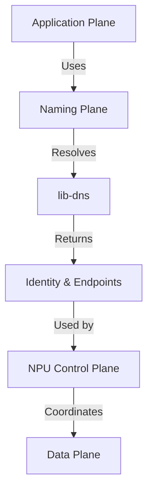
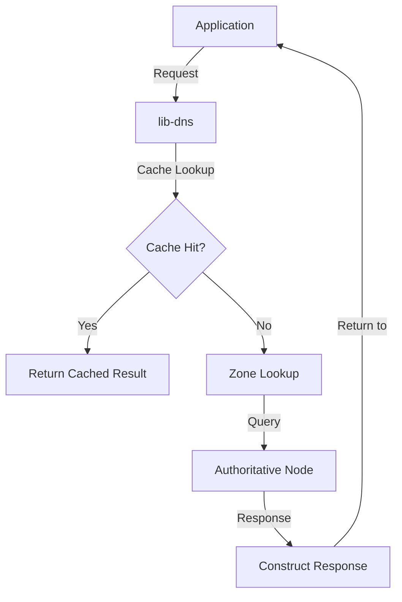

# Other — lib-dns

# lib-dns Module Documentation

## Overview

The **lib-dns** module serves as the foundational naming system for the Sovereign Network's decentralized mesh architecture. It is responsible for resolving names to identities, facilitating service discovery, and providing a cacheable, offline-capable naming system. This module is designed to operate independently of traditional DNS paradigms, ensuring resilience and efficiency in a mesh network environment.

### Key Features

- **Decentralized Name Resolution**: Resolves names to identities without relying on a central authority.
- **Service Discovery**: Facilitates the discovery of services and endpoints within the mesh.
- **Offline Capability**: Operates effectively without Internet connectivity, utilizing local zone files and mesh gossip for data distribution.
- **Caching Mechanism**: Implements aggressive caching strategies to enhance performance and reduce latency.
- **Blockchain Integration**: Anchors identities asynchronously to a blockchain, ensuring trust without impacting performance.

## Architecture

The architecture of **lib-dns** is designed to fit seamlessly into the Sovereign Mesh Network, adhering to the principles of plane separation and modularity. The following diagram illustrates the high-level architecture of the module:



### Components

1. **Public API**: The entry point for external interactions with the lib-dns module, providing methods for name resolution and record management.
2. **Messages**: Handles DNS wire format, parsing, and serialization, ensuring compatibility with standard DNS protocols.
3. **Resource Record Data Types**: Defines various DNS record types (A, AAAA, CNAME, etc.) and their associated data structures.
4. **Zone Management**: Manages zone files, including parsing, storage, and retrieval of DNS records.
5. **Keyring**: Manages DNSSEC keys for secure zone transfers and record validation.
6. **Journal**: Implements incremental zone transfer (IXFR) capabilities for efficient updates.

## Integration with the Sovereign Network

### Naming Plane

**lib-dns** operates within the Naming Plane of the Sovereign Mesh Network, which is responsible for decentralized name resolution and identity binding. It interacts with the NPU-accelerated control plane to provide endpoint information and service metadata.

### Data Flow

The data flow within the **lib-dns** module is structured to ensure efficient resolution and service discovery. The following steps outline the typical resolution process:

1. **Query Initiation**: An application requests the resolution of a name (e.g., `alice.sovereign`).
2. **Cache Lookup**: The module first checks the local cache for a valid entry.
3. **Zone Lookup**: If the cache miss occurs, the module queries the authoritative zone for the requested name.
4. **Response Generation**: The module constructs a response containing the resolved identity and endpoints.
5. **NPU Interaction**: The resolved endpoints are passed to the NPU control plane for scoring and selection based on current network conditions.

### Example Resolution Flow



## API Surface

### Core API

The core API of **lib-dns** provides essential functions for name resolution and record management. Below are some key functions:

```rust
pub mod messages {
    pub struct Message { ... }
    impl Message {
        pub fn from_bytes(buf: &[u8]) -> Result<Self, WireError>;
        pub fn to_bytes(&self, max_size: usize) -> Vec<u8>;
    }
}

pub mod rr_data {
    pub trait RRData {
        fn from_bytes(buf: &[u8]) -> Result<Self, RRDataError>;
        fn to_bytes(&self) -> Result<Vec<u8>, RRDataError>;
    }
}
```

### ZDNS Extended API

The ZDNS extended API allows for additional functionality specific to the Sovereign Network, including support for custom record types and enhanced service discovery.

```rust
pub struct ZdnsRecord {
    pub name: String,
    pub record_type: ZdnsRecordType,
    pub value: String,
    pub ttl: u32,
    pub ownership_proof: String,    // ZK proof
    pub pq_signature: String,       // Post-quantum signature
}
```

## Critical Constraints & Invariants

### Resolver Invariants

The **lib-dns** module enforces strict invariants to ensure correct behavior, especially in partitioned environments. Key invariants include:

- **Authoritative Ambiguity Resolution**: When multiple authoritative sources respond with different data, the resolver must follow deterministic rules based on serial numbers, timestamps, and latency.
- **Dual-Valid Answer Handling**: In cases where two responses are both valid but differ, the module must handle them according to established rules to avoid data loss or inconsistency.

### Forbidden Behaviors

Certain behaviors are strictly forbidden within the **lib-dns** module to maintain its integrity and performance:

- **Blocking Connection Establishment**: The module must never block or delay connection establishment.
- **Per-Packet Queries**: The module must not be queried per packet; resolution should occur once per session.

## Conclusion

The **lib-dns** module is a critical component of the Sovereign Network, providing a robust and efficient naming system that operates independently of traditional DNS paradigms. Its design emphasizes decentralization, resilience, and performance, making it well-suited for the unique challenges of a mesh network environment. By adhering to strict invariants and integrating seamlessly with other components of the Sovereign Network, **lib-dns** ensures reliable name resolution and service discovery for all applications within the ecosystem.