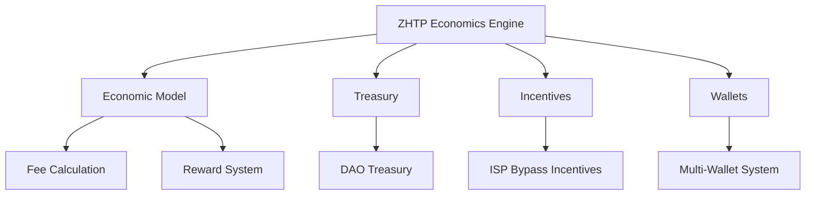

# Other — lib-economy

# lib-economy Module Documentation

## Overview

The **lib-economy** module serves as the economic engine for the ZHTP (Zero-knowledge Hypertext Transfer Protocol) network, implementing a post-scarcity economic model. This model aims to replace traditional Internet Service Providers (ISPs) with a decentralized, incentivized mesh network. The module facilitates Universal Basic Income (UBI) distribution, incentivizes network participation, and integrates with other components of the ZHTP ecosystem.

## Purpose

The primary goals of the **lib-economy** module are:

- **Incentivizing Network Participation**: Participants earn tokens for sharing internet connectivity, routing packets, and providing storage.
- **Implementing UBI**: A portion of network activity funds UBI for verified users, promoting economic equality.
- **Decentralizing Internet Services**: By replacing ISPs with a mesh network, the module aims to democratize internet access and reduce costs for users.

## Architecture

The architecture of the **lib-economy** module can be visualized as follows:



### Key Components

1. **Economic Model**
   - **Fee Calculation**: Implements a dual-fee structure for transactions, including network fees and mandatory DAO fees for UBI and welfare.
   - **Reward System**: Calculates rewards based on contributions to the network, such as packet routing, data storage, and validation.

2. **Treasury**
   - **DAO Treasury**: Manages the allocation of funds for UBI, sector DAOs, emergency reserves, and development grants. It applies fee distributions to maintain a sustainable economic model.

3. **Incentives**
   - **ISP Bypass Incentives**: Provides economic rewards for participants who share their internet connectivity and contribute to the mesh network.

4. **Wallets**
   - **Multi-Wallet System**: Supports various wallet types for different economic activities, allowing users to manage their tokens effectively.

## Core Economic Principles

### Post-Scarcity Model

The **lib-economy** module operates on a post-scarcity model, which includes:

- **Unlimited Token Supply**: Tokens are minted based on utility rather than artificial scarcity.
- **Utility-Driven Value**: Token value is derived from network utility.
- **Anti-Speculation Mechanics**: Policies discourage hoarding and promote usage.

### ISP Replacement Economics

The economic incentives mirror traditional ISP revenue streams, converting them into token rewards:

```rust
// Economic incentives mirror traditional ISP revenue streams
ISP Traditional Revenue → SOV Token Rewards
├── Bandwidth fees → Routing rewards (1 SOV/MB)
├── Storage fees → Storage rewards (10 SOV/GB/month)
├── Service fees → Validation rewards (5 SOV/validation)
└── Infrastructure → Quality bonuses (up to 50% multiplier)
```

### Universal Basic Income Integration

- **Mandatory DAO Fee**: 2% of all transactions fund UBI and welfare.
- **Automatic Distribution**: 60% to UBI, 40% to welfare services.
- **Human Verification**: Integration with the ZHTP Identity system for citizen verification.

## Usage

### Adding Dependency

To use the **lib-economy** module in your project, add the following to your `Cargo.toml`:

```toml
[dependencies]
lib-economy = { path = "../lib-economy" }
```

### Basic Usage Example

Here’s a simple example of how to create an economic model and calculate transaction fees:

```rust
use lib_economy::*;

// Create economic model
let mut economic_model = EconomicModel::new();

// Calculate transaction fees
let (network_fee, dao_fee, total) = economic_model.calculate_fee(
    1000,              // transaction size in bytes
    50_000,            // transaction amount in SOV
    Priority::Normal   // transaction priority
);

// Process economic rewards
let work_metrics = WorkMetrics {
    routing_work: 1_000_000,    // 1MB routed
    storage_work: 1_000_000_000, // 1GB stored
    compute_work: 10,           // 10 validations
    quality_score: 0.95,        // 95% quality
    uptime_hours: 24,           // 24h uptime
};

let reward = TokenReward::calculate(&work_metrics, &economic_model)?;
println!("Earned {} SOV tokens", reward.total_reward);
```

### Multi-Wallet System Example

The multi-wallet system allows for specialized wallets for different economic activities:

```rust
use lib_economy::wallets::*;
use lib_identity::Identity;

// Create comprehensive wallet system
let identity = create_test_identity(); // Your identity system
let mut wallet_manager = create_comprehensive_multi_wallet_manager(identity).await?;

// Specialized wallets for different economic activities
wallet_manager.create_specialized_wallet(WalletType::IspBypassRewards).await?;
wallet_manager.create_specialized_wallet(WalletType::Staking).await?;
wallet_manager.create_specialized_wallet(WalletType::Governance).await?;

// Transfer between wallets
let tx_id = wallet_manager.transfer_between_wallets(
    WalletType::IspBypassRewards,
    WalletType::Primary,
    100_000, // 100K SOV
    "Consolidating rewards".to_string()
).await?;
```

## Integration with Other Modules

The **lib-economy** module integrates with several other modules in the ZHTP ecosystem:

- **lib-identity**: For verifying user identities and eligibility for UBI.
- **lib-crypto**: For secure transactions and cryptographic operations.
- **lib-proofs**: For validating economic activities and ensuring trust in the system.

### Example of Identity System Integration

```rust
use lib_economy::wasm::IdentityId;

// Verify UBI eligibility through identity system
let verified_citizens = verify_ubi_eligibility(&citizen_identities);
let ubi_amount = calculate_ubi_amount(&dao_treasury, &verified_citizens)?;
```

## Development and Testing

### Running Tests

To run tests for the **lib-economy** module, use the following command:

```bash
cargo test
```

### Performance Testing

For performance testing, you can run:

```bash
cargo test --features benchmark
```

### Building for WebAssembly

To build the module for WebAssembly, use:

```bash
cargo build --target wasm32-unknown-unknown --features wasm
```

## Conclusion

The **lib-economy** module is a critical component of the ZHTP ecosystem, enabling a decentralized economic model that incentivizes participation and promotes social equity through UBI. By understanding its architecture, core principles, and integration points, developers can effectively contribute to and extend the capabilities of the ZHTP Economics Engine.

For further information, please refer to the [README.md](README.md) and the [Contributing Guide](CONTRIBUTING.md).