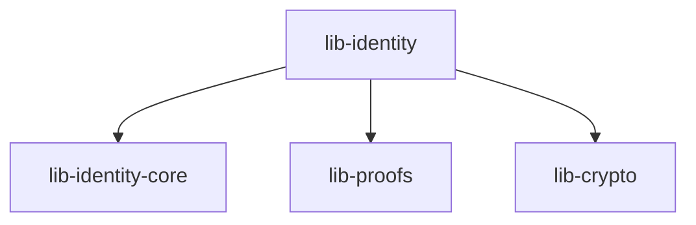

# Other — lib-identity

# lib-identity Module Documentation

## Overview

The `lib-identity` module is a core component of the ZHTP Identity Management system, designed to facilitate a zero-knowledge identity system with quantum-resistant cryptography. This module is responsible for managing identity proofs, ensuring secure citizen onboarding, and providing a framework for proof validation and serialization.

### Key Features
- **Zero-Knowledge Proofs**: Implements various proof types to ensure privacy and security.
- **Quantum-Resistant Cryptography**: Utilizes cryptographic methods that are secure against quantum attacks.
- **Versioning and Migration**: Supports versioning of proofs and provides a migration path from legacy systems.

## Architecture

The `lib-identity` module interacts with several other modules, including `lib-crypto`, `lib-identity-core`, and `lib-proofs`. It serves as a bridge between identity management and cryptographic operations, ensuring that proofs are generated, validated, and serialized correctly.

### Component Diagram



## Key Components

### 1. Proof Types

The module defines various proof types that are essential for identity verification. Each proof type is represented as a struct and implements specific traits for serialization and validation.

#### Example Proof Types
- **SignaturePopV1**: Binds operational keys to a root-key-anchored DID.
- **CredentialProofV1**: Verifies credentials issued by external authorities.

### 2. Proof Registry

The `ProofRegistry` struct manages proof specifications, validation rules, and version compatibility. It provides functions to register new proof types and validate existing ones.

#### Key Functions
- `register_proof_type(&self, proof_type: ProofType, spec: ProofSpec)`: Registers a new proof type.
- `validate_proof(&self, proof: &ProofEnvelope)`: Validates a given proof against the registry.

### 3. Serialization

The module supports serialization of proofs using both JSON and CBOR formats. The transition to CBOR is crucial for ensuring canonical encoding, which is necessary for cryptographic proofs.

#### Serialization Functions
- `serialize_proof(&self, proof: &ProofEnvelope) -> Result<Vec<u8>, Error>`: Serializes a proof into the specified format.
- `deserialize_proof(data: &[u8]) -> Result<ProofEnvelope, Error>`: Deserializes data back into a proof.

### 4. Migration Support

The module includes mechanisms for migrating from legacy proof types to the new system. This is facilitated through version markers and detailed migration documentation.

#### Migration Steps
- **Update Serialization**: Wrap existing serialization points with version markers.
- **Document Migration Path**: Create guides for transitioning from V0 to V1 proof types.

## Integration with Other Modules

The `lib-identity` module relies on several dependencies to function effectively:

- **lib-crypto**: Provides cryptographic primitives and operations.
- **lib-identity-core**: Contains core identity management functionalities.
- **lib-proofs**: Defines the proof types and their associated logic.

### Example Usage

To create a new proof, a developer would typically follow these steps:

1. **Instantiate a Proof Type**:
   ```rust
   let proof = SignaturePopV1::new(...);
   ```

2. **Register the Proof**:
   ```rust
   proof_registry.register_proof_type(ProofType::SignaturePopV1, proof_spec);
   ```

3. **Serialize the Proof**:
   ```rust
   let serialized_proof = serialize_proof(&proof)?;
   ```

4. **Validate the Proof**:
   ```rust
   let is_valid = proof_registry.validate_proof(&serialized_proof)?;
   ```

## Conclusion

The `lib-identity` module is a critical part of the ZHTP Identity Management system, providing robust identity proofing capabilities with a focus on security and privacy. Its integration with other modules and support for versioning and migration make it a flexible and powerful tool for developers working on identity management solutions. 

For further contributions, developers are encouraged to follow the outlined migration paths and adhere to the established proof types and serialization standards.