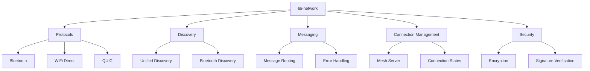

# Other — lib-network

# lib-network Module Documentation

## Overview

The `lib-network` module is a core component of the ZHTP (Zero-Hierarchy Transport Protocol) Mesh Protocol, designed to facilitate decentralized networking and communication. This module provides the necessary abstractions and implementations for various networking protocols, including Bluetooth, WiFi Direct, and QUIC, while ensuring secure and efficient data transmission.

### Purpose

The primary purpose of the `lib-network` module is to enable peer-to-peer communication in a decentralized network environment. It handles the complexities of different transport protocols, manages connections, and ensures secure data exchange between nodes in the network.

## Key Components

### 1. Transport Protocols

The module supports multiple transport protocols, each implemented in its respective submodule:

- **Bluetooth**: Implemented in `lib-network/src/protocols/bluetooth`, this submodule handles Bluetooth Low Energy (BLE) communication, including device discovery and data transfer.
- **WiFi Direct**: Located in `lib-network/src/protocols/wifi_direct`, this submodule manages peer-to-peer connections over WiFi, allowing devices to communicate directly without an access point.
- **QUIC**: Implemented in `lib-network/src/protocols/quic`, this submodule provides a transport layer that supports multiplexing and low-latency communication.

### 2. Discovery Mechanisms

The discovery mechanisms are crucial for identifying and connecting to peers in the network. The `lib-network/src/discovery` directory contains implementations for various discovery protocols, including:

- **Unified Discovery**: A unified approach to discovering peers across different transport protocols.
- **Bluetooth Discovery**: Specific implementations for discovering Bluetooth devices.

### 3. Message Handling

The message handling system is responsible for processing incoming and outgoing messages. It is implemented in `lib-network/src/messaging/message_handler.rs`, which includes:

- **Message Routing**: Logic for routing messages to the appropriate handlers based on the protocol and message type.
- **Error Handling**: Mechanisms for managing errors during message processing.

### 4. Connection Management

Connection management is handled in `lib-network/src/mesh/server.rs`, which includes:

- **Mesh Server**: The main server that manages connections to peers, handles incoming requests, and maintains the state of the mesh network.
- **Connection States**: Logic for managing the state of each connection, including connection establishment, maintenance, and teardown.

### 5. Security Features

Security is a critical aspect of the `lib-network` module. It employs various cryptographic techniques to ensure secure communication, including:

- **Encryption**: Implemented in `lib-network/src/encryption`, this submodule provides encryption and decryption functionalities for data transmitted over the network.
- **Signature Verification**: Ensures the integrity and authenticity of messages exchanged between peers.

## Architecture Diagram

## How It Works

The `lib-network` module operates by establishing connections between peers using various transport protocols. When a peer wants to communicate, it initiates a discovery process to find other peers in the network. Once a peer is discovered, a connection is established, and messages can be exchanged securely.

1. **Discovery**: Peers use the discovery mechanisms to find each other. For example, a Bluetooth device may broadcast its presence, while a WiFi Direct device may search for available connections.
  
2. **Connection Establishment**: Once a peer is discovered, a connection is established using the appropriate transport protocol. The connection management system handles the state of the connection.

3. **Message Exchange**: After establishing a connection, peers can send and receive messages. The messaging system routes these messages to the appropriate handlers based on their type and protocol.

4. **Security**: All messages exchanged are encrypted, and their integrity is verified using cryptographic signatures. This ensures that the communication remains secure and tamper-proof.

## Integration with the Codebase

The `lib-network` module is designed to work seamlessly with other modules in the ZHTP ecosystem. It relies on several dependencies, including:

- **lib-identity**: For managing peer identities and authentication.
- **lib-crypto**: For cryptographic operations, including encryption and signature verification.
- **lib-protocols**: For defining and implementing various protocols used in the network.

### Dependencies

The module uses several external crates for functionality, including:

- `tokio`: For asynchronous runtime support.
- `serde`: For serialization and deserialization of messages.
- `tracing`: For logging and debugging.

## Conclusion

The `lib-network` module is a vital part of the ZHTP ecosystem, providing the necessary infrastructure for decentralized communication. Its modular design allows for easy integration with various transport protocols and security features, making it a robust solution for peer-to-peer networking. Developers looking to contribute to this module should familiarize themselves with its components and how they interact with the broader codebase.