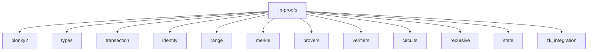

# Other — lib-proofs

# lib-proofs Documentation

## Overview

The `lib-proofs` module is a zero-knowledge proof system designed for the SOVEREIGN_NET ecosystem. It leverages the Plonky2 backend to provide efficient and privacy-preserving cryptographic proofs for various applications, including transaction validation, identity verification, and data integrity checks. This module is built to be production-ready, ensuring high performance and security.

## Purpose

The primary purpose of `lib-proofs` is to enable developers to implement zero-knowledge proofs in their applications, allowing for secure and private transactions without revealing sensitive information. This is particularly useful in blockchain and privacy-focused applications where confidentiality is paramount.

## Key Features

- **Unified Plonky2 Backend**: All proof types utilize a high-performance recursive SNARK system, ensuring efficiency and scalability.
- **Transaction Privacy**: Validate transactions without disclosing balances or sender information.
- **Identity Proofs**: Enable selective disclosure of identity attributes, maintaining user privacy.
- **Range Proofs**: Prove that a value lies within a specified range without revealing the value itself.
- **Merkle Proofs**: Provide zero-knowledge inclusion proofs for data structures, enhancing data integrity.
- **Recursive Aggregation**: Batch multiple proofs together for improved performance and reduced overhead.
- **Storage Access**: Facilitate privacy-preserving access control proofs for sensitive data.
- **Routing Privacy**: Support anonymous routing proofs for mesh networks, enhancing user privacy.
- **Data Integrity**: Ensure tamper-proof validation of data through cryptographic proofs.

## Architecture

The module is organized into several directories, each responsible for different aspects of the proof system. Below is a high-level overview of the architecture:



### Directory Breakdown

- **plonky2/**: Contains the core integration with the Plonky2 library and the necessary circuits for proof generation.
- **types/**: Defines the various zero-knowledge proof types available in the system.
- **transaction/**: Implements transaction privacy proofs, allowing for secure transaction validation.
- **identity/**: Manages identity and credential proofs, enabling users to prove attributes without revealing sensitive information.
- **range/**: Provides functionality for generating and verifying range proofs.
- **merkle/**: Implements Merkle tree inclusion proofs for data integrity.
- **provers/**: Contains modules responsible for generating proofs.
- **verifiers/**: Implements verification logic for the generated proofs.
- **circuits/**: Provides custom circuit builders for creating specific proof constraints.
- **recursive/**: Manages the recursive proof aggregation process.
- **state/**: Implements state transition proofs for validating changes in state.
- **zk_integration/**: Integrates with the `lib-crypto` package for cryptographic operations.

## Core Components

### ZkProofSystem

The `ZkProofSystem` class is the main entry point for interacting with the zero-knowledge proof system. It provides methods for generating and verifying various types of proofs.

#### Example Usage

```rust
use lib_proofs::ZkProofSystem;

// Initialize the ZK proof system
let zk_system = ZkProofSystem::new()?;

// Generate a transaction proof
let tx_proof = zk_system.prove_transaction(1000, 100, 10, 12345, 67890)?;
assert!(zk_system.verify_transaction(&tx_proof)?);
```

### Proof Types

#### Transaction Proofs

Transaction proofs allow users to validate transactions without revealing sensitive information such as balances or sender identities.

```rust
let tx_proof = zk_system.prove_transaction(
    sender_balance: 1000,
    amount: 100, 
    fee: 10,
    sender_secret: 12345,
    nullifier_seed: 67890,
)?;
```

#### Identity Proofs

Identity proofs enable users to prove certain attributes (e.g., age) without disclosing their actual values.

```rust
let id_proof = zk_system.prove_identity(
    identity_secret: 54321,
    age: 25,
    jurisdiction: 840,
    credential: 9999,
    min_age: 18,
    required_jurisdiction: 840,
    verification_level: 1,
)?;
```

#### Range Proofs

Range proofs allow users to prove that a value lies within a specified range without revealing the value itself.

```rust
let range_proof = ZkRangeProof::generate(500, 0, 1000, blinding_factor)?;
assert!(range_proof.verify()?);
```

### Storage Access Proofs

Storage access proofs enable users to prove their authorization to access certain data without revealing their credentials.

```rust
let access_proof = zk_system.prove_storage_access(
    access_key: 11111,
    requester_secret: 22222,
    data_hash: 33333,
    permission_level: 5,
    required_permission: 3,
)?;
```

## Building and Testing

To build and test the `lib-proofs` module, use the following commands:

```bash
cargo build --release
cargo test
cargo bench
```

## Features

The module supports several features that can be enabled in the `Cargo.toml`:

- `default`: Standard ZK proof system.
- `production`: Optimized circuits for production use.
- `dev`: Development utilities and test helpers.

## Security Considerations

`lib-proofs` implements production-grade zero-knowledge proofs using the Plonky2 backend. It is designed to provide strong cryptographic privacy and integrity guarantees. All implementations include proper constraint systems and verification procedures to ensure security.

## Documentation and Resources

For further information, refer to the following resources:

- **[Getting Started](docs/getting_started.md)**: Installation and basic usage.
- **[API Reference](docs/api_reference.md)**: Complete API documentation.
- **[Integration Guide](docs/integration.md)**: Integration with the SOVEREIGN_NET ecosystem.
- **[Circuit Documentation](docs/circuits.md)**: Available circuits and constraints.
- **[Performance Guide](docs/performance.md)**: Optimization and benchmarking.
- **[Examples](docs/examples.md)**: Comprehensive usage examples.
- **[TODO](TODO.md)**: Known issues and planned improvements.

## Performance Metrics

Typical performance metrics on modern hardware include:

- Transaction proof generation: ~50-100ms
- Identity proof generation: ~30-80ms
- Range proof generation: ~20-50ms
- Proof verification: ~5-15ms
- Recursive aggregation: ~100-200ms for 10 proofs

## License

This module is licensed under the MIT License. See the LICENSE file for details.