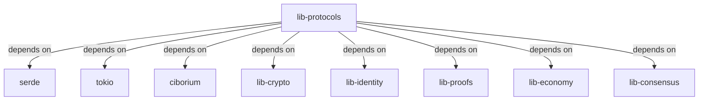

# Other — lib-protocols

# lib-protocols Module Documentation

## Overview

The `lib-protocols` module is a core component of the ZHTP (Zero Knowledge Transfer Protocol) stack, designed to facilitate the implementation of Web4 protocols. This module provides the necessary abstractions and utilities for handling network communication, serialization, and cryptographic operations within the ZHTP ecosystem. 

### Key Features
- **Protocol Implementation**: Implements the ZHTP protocol stack for secure and efficient data transfer.
- **Serialization**: Utilizes `ciborium` for wire protocol serialization, ensuring efficient data encoding and decoding.
- **Asynchronous Operations**: Built on top of `tokio`, enabling non-blocking I/O operations for high-performance networking.
- **Cryptographic Support**: Integrates various cryptographic libraries for secure data handling, including hashing and HMAC.

## Architecture

The `lib-protocols` module is structured to provide a clean interface for protocol operations while leveraging several dependencies for serialization, cryptography, and asynchronous programming. Below is a high-level overview of the module's architecture.



## Key Components

### 1. Protocol Definitions

The module defines various protocols that are essential for the ZHTP stack. Each protocol is encapsulated in its own struct, which includes methods for serialization and deserialization.

### 2. Serialization

The `ciborium` crate is used for efficient serialization of protocol messages. This allows for compact and fast encoding of data structures, which is crucial for network communication.

### 3. Asynchronous Operations

The module is built on the `tokio` runtime, which allows for asynchronous programming patterns. This is particularly important for handling multiple connections and I/O operations without blocking the main thread.

### 4. Cryptographic Functions

The module integrates several cryptographic libraries:
- **Hashing**: Uses `blake3`, `sha2`, and `sha3` for various hashing needs.
- **HMAC**: Implements HMAC using the `hmac` crate for message authentication.
- **Randomness**: Utilizes `rand` and `getrandom` for secure random number generation.

### 5. Error Handling

The module employs `anyhow` and `thiserror` for robust error handling, allowing developers to manage errors gracefully throughout the protocol operations.

## Integration with the Codebase

The `lib-protocols` module interacts with several other internal libraries:
- **lib-crypto**: Provides cryptographic primitives and utilities.
- **lib-identity**: Manages identity-related operations, such as key management.
- **lib-proofs**: Handles zero-knowledge proofs, which are integral to the ZHTP protocol.
- **lib-economy** and **lib-consensus**: Support economic and consensus mechanisms within the ZHTP ecosystem.

### Example Usage

Here is a simple example of how to use the `lib-protocols` module to create a protocol message and serialize it:

```rust
use lib_protocols::MyProtocolMessage;
use ciborium::ser::into_writer;
use std::io::Cursor;

fn main() -> Result<(), Box<dyn std::error::Error>> {
    let message = MyProtocolMessage::new("Hello, ZHTP!");
    let mut buffer = Cursor::new(Vec::new());
    
    // Serialize the message
    into_writer(&message, &mut buffer)?;
    
    // The serialized data can now be sent over the network
    let serialized_data = buffer.into_inner();
    println!("Serialized data: {:?}", serialized_data);
    
    Ok(())
}
```

## Conclusion

The `lib-protocols` module is a foundational component of the ZHTP protocol stack, providing essential functionalities for secure and efficient network communication. By leveraging modern Rust features and libraries, it ensures high performance and reliability. Developers looking to contribute to this module should familiarize themselves with the key components and their interactions with other parts of the ZHTP ecosystem. For further details, refer to the [official documentation](https://docs.zhtp.org) and the [GitHub repository](https://github.com/SOVEREIGN-NETWORK/ZHTPDEV).