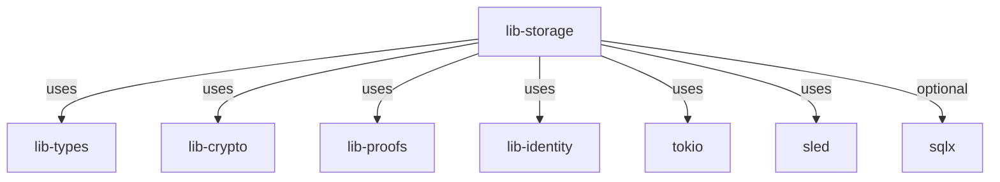

# Other — lib-storage

# lib-storage Module Documentation

## Overview

The `lib-storage` module is a core component of the ZHTP Unified Storage System, designed to provide a robust storage solution that integrates both Distributed Hash Table (DHT) and economic storage layers. This module is responsible for managing data persistence, ensuring efficient data retrieval, and facilitating interactions with various storage backends.

### Purpose

The primary purpose of the `lib-storage` module is to abstract the complexities of data storage and retrieval, allowing developers to focus on higher-level application logic. It leverages asynchronous programming paradigms to handle I/O operations efficiently, making it suitable for high-performance applications.

## Key Components

### 1. Dependencies

The module relies on several external crates to provide essential functionalities:

- **Asynchronous Runtime**: `tokio` is used for asynchronous programming, enabling non-blocking I/O operations.
- **Serialization**: `serde` and `serde_json` are utilized for data serialization and deserialization, allowing for easy conversion between Rust data structures and JSON.
- **Cryptography**: `lib-crypto` and `blake3` are included for secure hashing and cryptographic operations.
- **Error Handling**: `anyhow` and `thiserror` are used for robust error management.
- **Data Storage**: `sled` serves as the primary persistent storage backend, while `sqlx` provides optional SQLite support for structured data queries.

### 2. Core Functionality

The `lib-storage` module does not expose any direct public API functions or classes, as it primarily serves as a backend for other modules. However, it provides essential traits and structures that facilitate data storage and retrieval.

#### Traits

- **DhtTransport**: This trait defines the interface for transporting DHT messages, allowing for communication between nodes in the distributed system.
- **DhtMessageRouter**: This trait is responsible for routing messages within the DHT, ensuring that data is correctly directed to its intended destination.

### 3. Storage Backends

The module supports multiple storage backends, allowing for flexibility in how data is stored:

- **Sled**: The default backend, providing a simple key-value store with persistence.
- **SQLite**: An optional backend that can be enabled via the `sqlite` feature, allowing for structured queries and data management.

### 4. Error Handling

The module employs `anyhow` and `thiserror` for error handling, providing a consistent approach to managing errors across the storage operations. This ensures that developers can easily identify and handle issues that arise during data operations.

## Architecture

The architecture of the `lib-storage` module is designed to be modular and extensible. Below is a simplified representation of the module's structure and its interactions with other components.

### Explanation of the Diagram

- **lib-storage**: The central module that orchestrates storage operations.
- **lib-types, lib-crypto, lib-proofs, lib-identity**: These modules provide foundational types, cryptographic functions, proof generation, and identity management, respectively.
- **tokio**: The asynchronous runtime that enables non-blocking operations.
- **sled**: The primary persistent storage backend.
- **sqlx**: An optional backend for structured data queries, activated through feature flags.

## Conclusion

The `lib-storage` module is a vital part of the ZHTP Unified Storage System, providing a flexible and efficient storage solution. By leveraging asynchronous programming and modular design, it allows developers to build robust applications that can handle complex data storage needs. Understanding its components and architecture is crucial for contributing to the codebase and extending its functionality.