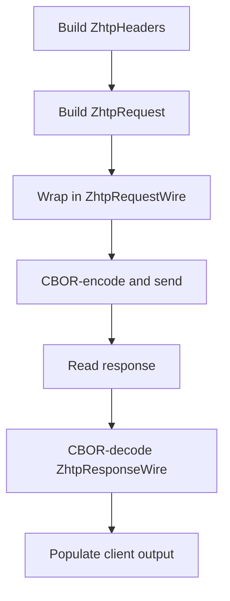

# Other — mobile

# Mobile Native ZHTP-over-QUIC Migration Documentation

## Overview

The **Mobile Native ZHTP-over-QUIC Migration** module is designed to transition mobile applications (iOS and Android) from using HTTP/1.1-over-QUIC to a native ZHTP wire protocol. This migration allows the server to eliminate the HTTP compatibility layer, enhancing performance and reducing overhead. The module focuses on implementing the ZHTP protocol for both platforms, ensuring that mobile clients can communicate effectively with the server using the new protocol.

## Purpose

The primary goal of this module is to:
- Replace existing HTTP-based communication with a more efficient ZHTP protocol.
- Ensure compatibility with the server's ZHTP implementation.
- Maintain a seamless user experience while enhancing security and performance.

## Key Components

### 1. ZHTP Protocol Structures

The following data structures are essential for implementing the ZHTP protocol on mobile:

- **ZhtpMethod**: An enum that defines the various HTTP methods (GET, POST, etc.) as specified in `lib-protocols/src/types/method.rs`.
  
- **ZhtpHeaders**: A struct that encapsulates the headers required for ZHTP requests, mirroring the fields in `lib-protocols/src/types/headers.rs`. Notably, `dao_fee` and `total_fees` are mandatory fields of type `u64`.

- **ZhtpRequest**: A struct representing a ZHTP request, defined in `lib-protocols/src/types/request.rs`.

- **AuthContext**: A struct that holds authentication context, sourced from `lib-protocols/src/wire/mod.rs`.

- **ZhtpRequestWire** and **ZhtpResponseWire**: Structures that define the wire format for requests and responses, respectively, as specified in `lib-protocols/src/wire/mod.rs`.

### 2. Wire Framing

The wire format for ZHTP messages is defined as follows:
```
len: u32 (big-endian) + CBOR payload bytes
```
The maximum message size is capped at 16 MB, consistent with the server's `MAX_MESSAGE_SIZE`.

### 3. Request Paths

The module supports two types of request paths:

#### Public (Unauthenticated) Request Path

This path is used for read-only public endpoints. The steps include:
1. Constructing `ZhtpHeaders` with required fields.
2. Building a `ZhtpRequest` with method, URI, headers, and body.
3. Wrapping the request in `ZhtpRequestWire`.
4. CBOR-encoding the request and sending it over the QUIC stream.
5. Reading and decoding the response.

#### Control-Plane (Authenticated) Request Path

This path is necessary for privileged or mutating endpoints. The steps include:
1. Implementing the UHP+Kyber handshake to obtain session and key information.
2. Deriving the `app_key` using a specific algorithm.
3. Computing the canonical request hash.
4. Creating an `AuthContext` and setting it in `ZhtpRequestWire`.
5. Sending the request as in the public path.

### 4. ALPN Selection

The Application-Layer Protocol Negotiation (ALPN) settings must be updated:
- For public requests, use `zhtp-public/1`.
- For control-plane requests, use `zhtp-uhp/1`.
- For mesh connections, if applicable, use `zhtp-mesh/1`.

### 5. Platform-Specific Implementation

#### iOS (Swift)
- Implement a CBOR encoder/decoder that aligns with Rust field names.
- Update the `NativeQuicModule.swift` to replace HTTP request handling with ZHTP framing.

#### Android (Rust JNI)
- Implement ZHTP wire structs in the `quic-jni` Rust module.
- Replace HTTP parsing and building in `quic_client.rs` and update the Kotlin bridge accordingly.

## Execution Flow

The execution flow for the ZHTP migration is straightforward, as it primarily involves constructing requests, sending them over QUIC, and handling responses. The following diagram illustrates the high-level flow of a public request:



## Validation Checklist

To ensure the successful implementation of the ZHTP protocol, the following validation steps should be performed:
- Verify that public GET requests return valid ZHTP responses without HTTP status lines.
- Ensure control-plane requests succeed only after a valid UHP handshake and MAC verification.
- Check server logs for `NativeZhtp` detection, confirming the absence of `LegacyHttp`.
- Confirm that mobile clients can perform at least one read-only and one authenticated action.

## Future Cleanup

Once both iOS and Android platforms have successfully migrated to ZHTP, the following cleanup tasks should be performed on the server:
- Remove the HTTP compatibility layer from `zhtp/src/server/zhtp/compatibility.rs`.
- Eliminate HTTP detection paths from `zhtp/src/server/quic_handler.rs` and `zhtp/src/server/protocol_detection.rs`.
- Remove any HTTP-over-QUIC tests.

## Conclusion

The Mobile Native ZHTP-over-QUIC Migration module is a critical step towards optimizing mobile communication with the server. By implementing the ZHTP protocol, we enhance performance, security, and maintainability of the mobile applications. Developers contributing to this module should focus on adhering to the outlined structures and processes to ensure a smooth transition.