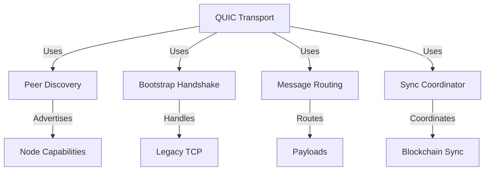

# Other — option-b

# Option B Module Documentation: QUIC Transport, UDP Discovery-Only, No TCP

## Overview

The **Option B** module is designed to transition the network stack of the application to exclusively use QUIC for all payloads while eliminating TCP dependencies. This module aims to ensure that QUIC-only nodes can operate effectively without assuming the availability of TCP, thereby enhancing performance and reliability in peer-to-peer communications.

### Goals

- All application payloads must run over QUIC.
- UDP is permitted only for link-local discovery.
- TCP must be completely removed from default builds, only existing behind a legacy feature flag.
- Discovery advertisements must accurately reflect the node's capabilities.

## Key Components

The module is structured into several phases, each addressing specific issues related to the transition from TCP to QUIC. Below is a summary of each phase and its corresponding components.

### Phase 0: Make QUIC-Only Peers Not Fail

**Objective:** Ensure QUIC-only nodes can discover peers without assuming TCP is available.

- **Files Modified:**
  - `lib-network/src/discovery/local_network.rs`: Remove TCP from the protocols list and only advertise QUIC.
  - `lib-network/src/discovery/unified.rs`: Ensure no TCP defaults are injected into the unified discovery output.

**Acceptance Test:** A QUIC-only node on a LAN should see peers without learning about TCP.

### Phase 1: Remove TCP from Bootstrap Gatekeepers

**Objective:** Ensure the default build boots over QUIC without requiring TCP.

- **Files Modified:**
  - `lib-network/src/bootstrap/handshake.rs`: Make QUIC bootstrap the default and conditionally compile TCP-related code.
  - `lib-network/src/bootstrap/peer_discovery.rs`: Remove TCP selection logic and ensure QUIC candidates are returned.

**Acceptance Test:** A QUIC-only node can bootstrap without any TCP code paths.

### Phase 2: Kill TCP Preference in Routing and Type-Level Defaults

**Objective:** Ensure that the default build cannot select TCP for payload routing.

- **Files Modified:**
  - `lib-network/src/routing/message_routing.rs`: Set QUIC as the highest priority for routing.
  - `lib-network/src/blockchain_sync/sync_coordinator.rs`: Ensure sync uses QUIC-only transport.
  - `lib-network/src/protocols/mod.rs` and `lib-network/src/types/node_address.rs`: Remove TCP/UDP types unless legacy features are enabled.

**Acceptance Test:** The default build should not allow the creation of TCP routes.

### Phase 3: Treat WiFi Direct as Legacy

**Objective:** Prevent the default build from opening TCP streams for WiFi Direct.

- **Files Modified:**
  - `lib-network/src/protocols/wifi_direct.rs` and `lib-network/src/protocols/wifi_direct_handshake.rs`: Move WiFi Direct behind a legacy feature flag.

**Acceptance Test:** The default build should not open TCP streams for WiFi Direct.

### Phase 4: UDP-Based Subsystems Get Explicit Status

**Objective:** Make UDP dependencies explicit, allowing QUIC-only builds to run without DHT/ZDNS unless explicitly enabled.

- **Files Modified:**
  - DHT and ZDNS components should be either rewritten for QUIC or feature-gated.

**Acceptance Test:** The default build should run without DHT/ZDNS while still supporting QUIC mesh and discovery.

### Phase 5: Mesh Config Cleanup

**Objective:** Ensure the configuration does not imply TCP exists when it does not.

- **Files Modified:**
  - `lib-network/src/mesh/config.rs`: Remove TCP listen port from the default config and introduce a QUIC listen port.

**Acceptance Test:** The default configuration should not expose TCP listen settings.

## Architecture Overview

The following diagram illustrates the key components and their relationships within the Option B module:

## Integration with the Codebase

The Option B module interacts primarily with the `lib-network` library, which encompasses various components responsible for networking functionalities. The changes made in this module are crucial for ensuring that the application can operate in environments where TCP is not available or desired.

### Important Considerations

- **Feature Flags:** The module heavily relies on feature flags (e.g., `legacy_tcp`, `legacy_wifi_direct`) to conditionally compile code paths that are not part of the default build. Developers should be aware of these flags when making changes or debugging.
- **Testing:** Each phase includes acceptance tests that must be passed to ensure compliance with the module's goals. Developers should run these tests after making modifications to verify that the intended functionality is preserved.

## Conclusion

The Option B module represents a significant shift towards a QUIC-centric networking model. By following the outlined phases and adhering to the acceptance criteria, developers can contribute effectively to this transition, ensuring a robust and efficient networking stack for the application.