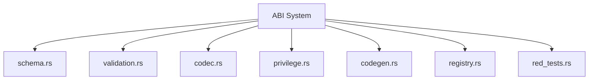

# Other — planning

# Other — Planning Module Documentation

## Overview

The **Other — Planning** module serves as a strategic framework for the development of various features within the blockchain ecosystem. It encompasses several key initiatives, including end-to-end (E2E) validation, execution pipelines, cross-contract call infrastructure, and ABI (Application Binary Interface) standardization. This documentation outlines the purpose, components, and interconnections of the planning module, providing developers with the necessary insights to contribute effectively.

## Purpose

The primary goal of the planning module is to facilitate the design, implementation, and validation of critical features that enhance the blockchain's functionality. This includes ensuring deterministic behavior, enabling cross-contract interactions, and establishing a robust ABI for contract communication. The module is structured to support ongoing development efforts while maintaining a clear focus on architectural integrity and compliance with established standards.

## Key Components

### 1. E2E Validation

**Branch:** `feature/epic-1222-e2e`  
**Status:** PLANNING → IMPLEMENTATION

#### Scope
- Add multi-node E2E tests for contract and DAO lifecycle.
  
#### Implementation Checklist
- [ ] Add deploy/call proposal/vote/execute scenario harness.
- [ ] Add node sync/import replay validation path.
- [ ] Assert deterministic state convergence across nodes.
- [ ] Integrate scenario in CI matrix with stable test fixtures.

### 2. Execution Pipeline

**Branch:** `feature/epic-1222-exec-pipeline`  
**Status:** PLANNING → IMPLEMENTATION

#### Scope
- Wire contract runtime into canonical block processing.
- Extend sync/import BlockExecutor for contract and DAO transaction types.
- Implement DAO proposal execution parameters construction and validation.

#### Implementation Checklist
- [ ] Audit canonical block processing entry points for contract transaction execution hooks.
- [ ] Add parity tests: local commit path vs sync/import path.
- [ ] Implement deterministic execution parameters codec and validation guards.
- [ ] Add regression tests for malformed execution parameters and replay/import parity.

### 3. Cross-Contract Call Infrastructure

**Branch:** `feat/842-cross-contract-calls`  
**Status:** PLANNING → IMPLEMENTATION

#### Design Decisions
- **Call Expression Syntax:** `call <contract_id>::<method>(args...)`
- **Intent Recording Format:** Events as the primary source of truth.
- **Max Recursion Depth:** Hard limit of 16.
- **Error Propagation:** Wrap all errors in `CrossContractError`.
- **State Isolation:** Strict rules to prevent callee from mutating caller state.

#### Implementation Architecture
```
lib-blockchain/src/contracts/calls/
├── mod.rs                         # Module root, exports
├── call.rs                        # CrossContractCall struct + tests
├── validator.rs                   # CallValidator (parameter type checking) + tests
├── executor.rs                    # CallExecutor + CrossContractCallIntent + tests
├── stack.rs                       # CallStack (recursion tracking) + tests
├── errors.rs                      # CrossContractError types + tests
├── type_validator.rs              # TypeValidator (type system) + tests
├── serialization_validator.rs     # SerializationValidator (format detection) + tests
└── cycle_detector.rs              # CycleDetector (cycle prevention) + tests
```

### 4. ABI Standardization

**Branch:** `feat/843-abi-standardization`  
**Status:** ALL THREE PHASES COMPLETE

#### Overview
The ABI standardization initiative aims to create a comprehensive, production-ready ABI system for contract standardization. This system defines deterministic contract interfaces, generates type-safe bindings, validates contract ABIs, and enforces privilege hierarchies.

#### Architecture


### 5. UBI Distribution (Preparation Phase)

**Branch:** `feat/844-ubi-prep-only`  
**Status:** PREP ONLY

#### Strategic Context
UBI is a client of the Treasury Kernel and is not foundational. The preparation phase involves defining the Citizen role, UBI economics, ABI-compatible event schemas, and writing failing tests to ensure compliance with the Treasury Kernel's execution model.

#### Preparation Tasks
- Define Citizen role in Role Registry terms.
- Document UBI economics (amount, epoch, caps).
- Define UBI ABI (event schemas, method signatures).
- Write failing tests (red tests).
- Document UBI as Treasury Kernel client.

## Integration Points

The planning module interacts with several other components within the blockchain ecosystem:

- **ABI Registry:** Ensures that all contracts adhere to the defined ABI standards, facilitating seamless interaction between contracts.
- **Contract Executor:** Manages the execution context for contract calls, ensuring that intents are recorded and events emitted.
- **Treasury Kernel:** Acts as the authoritative executor for economic actions, validating intents and executing effects based on the recorded actions.

## Conclusion

The Other — Planning module is a critical component of the blockchain ecosystem, providing a structured approach to developing and validating essential features. By adhering to the outlined design principles and implementation checklists, developers can contribute effectively to the ongoing evolution of the platform. This documentation serves as a comprehensive guide for understanding the module's purpose, components, and integration points, ensuring clarity and alignment across the development team.