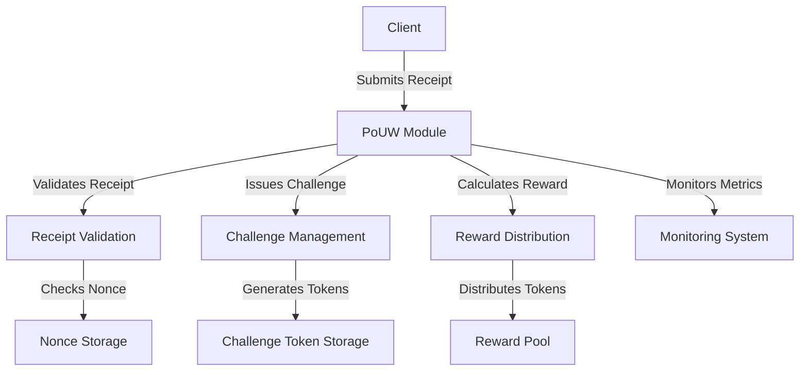

# Other — pouw

# PoUW Module Documentation

## Overview

The **Proof-of-Useful-Work (PoUW)** module is designed to facilitate a decentralized reward system where clients can earn tokens by performing computational work. The module validates work receipts, issues challenges, and manages the distribution of rewards. It is built to be resilient against various failure scenarios and includes mechanisms for monitoring, security, and operational procedures.

## Purpose

The primary purpose of the PoUW module is to ensure that clients can reliably submit work and receive rewards while maintaining the integrity of the system. It addresses potential threats from malicious actors and ensures that the system can recover from various failure scenarios.

## Key Components

### 1. Receipt Validation

The core functionality of the PoUW module revolves around validating receipts submitted by clients. This involves:

- **Signature Verification**: Ensuring that receipts are signed by the correct client using cryptographic signatures.
- **Nonce Deduplication**: Preventing replay attacks by checking that each receipt has a unique nonce.

### 2. Challenge Management

The module issues cryptographic challenges to clients, which they must solve to earn rewards. Key aspects include:

- **Challenge Token Creation**: Generating unique challenge tokens that clients must respond to.
- **Challenge Expiry**: Implementing a time-to-live (TTL) for challenges to prevent hoarding.

### 3. Reward Distribution

Once a receipt is validated, the module calculates and distributes rewards. This includes:

- **Idempotent Reward Calculations**: Ensuring that rewards are calculated only once per valid receipt.
- **Backpressure Mechanisms**: Managing the flow of receipts to prevent overload during high traffic.

### 4. Rate Limiting

To protect against abuse, the module implements rate limiting at both the IP and DID levels. This helps to mitigate denial-of-service (DoS) attacks and ensures fair usage of resources.

### 5. Monitoring and Alerts

The PoUW module integrates with monitoring tools like Prometheus and Grafana to track key metrics, including:

- Total receipts received
- Rejection rates by reason
- Rate limit denials

Alerts are configured to notify operators of potential issues, such as high rejection rates or service unavailability.

## Architecture

The PoUW module is designed to be modular and scalable. Below is a simplified architecture diagram that illustrates the key components and their interactions:

## Failure Scenarios

The PoUW module is designed to handle various failure scenarios effectively. Each scenario has defined detection methods, impacts, recovery steps, and prevention strategies. Key scenarios include:

- **Single Node Failure**: Automatic traffic rerouting and node recovery.
- **Database Primary Failure**: Automatic promotion of standby databases and application connection switching.
- **Rate Limiter State Loss**: Automatic state rebuilding with monitoring for abuse.
- **Nonce Storage Failure**: Fail-safe and fail-unsafe recovery approaches.

For detailed recovery procedures and prevention strategies, refer to the [FAILOVER_SCENARIOS.md](./FAILOVER_SCENARIOS.md).

## Security Considerations

The PoUW module incorporates several security measures to protect against various threats:

- **Signature Verification**: Ensures that only valid receipts are processed.
- **Rate Limiting**: Protects against DoS attacks by limiting the number of requests from clients.
- **Nonce Management**: Prevents replay attacks through unique nonce checks.
- **Credential Management**: Uses secure storage for sensitive information, such as signing keys.

For a comprehensive overview of potential threats and mitigations, see the [THREAT_MODEL.md](./THREAT_MODEL.md).

## Operational Procedures

The PoUW module includes a set of operational procedures to ensure smooth deployment and maintenance:

- **Production Checklist**: A pre-deployment checklist to verify infrastructure, security configurations, and application settings.
- **Runbook**: Detailed operational procedures for common tasks, incident responses, and scaling operations.
- **Monitoring Setup**: Guidelines for setting up Prometheus metrics and alerts.

Refer to the [PRODUCTION_CHECKLIST.md](./PRODUCTION_CHECKLIST.md) and [RUNBOOK.md](./RUNBOOK.md) for more information.

## Conclusion

The PoUW module is a critical component of the decentralized reward system, designed to ensure secure, efficient, and reliable operations. By understanding its architecture, key components, and operational procedures, developers can effectively contribute to its ongoing development and maintenance.