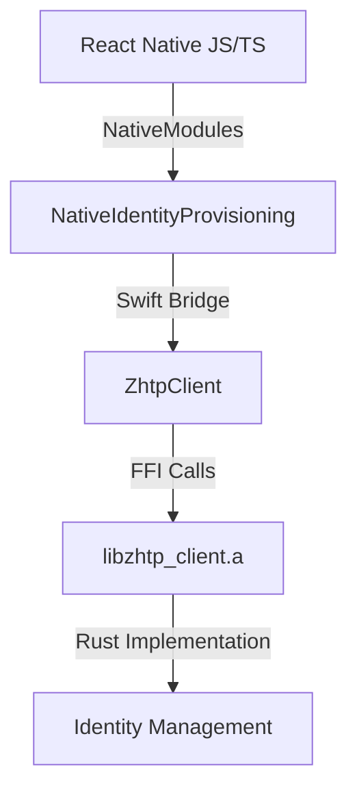

# Other — react-native

# React Native Identity Provisioning Module Documentation

## Overview

The **React Native Identity Provisioning** module provides a native interface for managing cryptographic identities in React Native applications. It leverages post-quantum cryptography to ensure secure identity generation, registration, and session management. This module is built on top of Rust and Swift, utilizing UniFFI for generating Swift bindings, and is designed to work seamlessly with React Native applications.

## Purpose

The primary purpose of this module is to facilitate secure identity management for applications that require strong cryptographic guarantees. It supports functionalities such as:

- Generating and restoring identities
- Signing messages and registration proofs
- Establishing secure sessions through a handshake protocol
- Encrypting and decrypting messages
- Exporting and importing identities securely

## Key Components

### 1. NativeIdentityProvisioning Class

The `NativeIdentityProvisioning` class serves as the bridge between React Native and the native Swift implementation. It exposes various methods to JavaScript, allowing developers to interact with the identity provisioning functionalities.

#### Key Methods

- **Identity Generation**
  - `generateIdentity(deviceId: string)`: Generates a new identity based on a unique device identifier.
  - `restoreIdentityFromSeed(masterSeedBase64: string, deviceId: string)`: Restores an identity from a provided master seed.

- **Public Identity Management**
  - `getPublicIdentity()`: Retrieves the public identity, which can be safely shared with servers.
  - `signRegistrationProof(timestamp: number)`: Signs a registration proof for server registration.

- **Session Management**
  - `initHandshake(channelBindingBase64: string)`: Initializes a handshake with a channel binding.
  - `finalizeHandshake()`: Finalizes the handshake and establishes a secure session.

- **Encryption and Decryption**
  - `encrypt(plaintextBase64: string)`: Encrypts data using the current session.
  - `decrypt(ciphertextBase64: string)`: Decrypts data using the current session.

- **Identity Persistence**
  - `exportIdentityEncrypted(passwordBase64: string)`: Exports the identity in an encrypted format.
  - `importIdentityEncrypted(encryptedBase64: string, passwordBase64: string)`: Imports an identity from an encrypted format.

### 2. IdentityProvisioning Wrapper

The `IdentityProvisioning` class is a singleton wrapper around the native module, providing a more user-friendly interface for JavaScript developers. It encapsulates the native calls and provides methods for identity management, session handling, and encryption.

#### Key Features

- **Singleton Pattern**: Ensures that only one instance of the identity provisioning class exists throughout the application.
- **Convenient Methods**: Provides easy-to-use methods for generating identities, signing messages, and managing sessions.

### 3. PoUWController Class

The `PoUWController` class is responsible for managing Proof-of-Useful-Work (PoUW) receipts. It integrates with the `IdentityProvisioning` module to sign receipts using the device's identity key.

#### Key Methods

- **start()**: Initializes the controller, fetching the current identity and starting the batch submission timer.
- **recordWeb4ManifestRoute()**: Records a successful routing of a Web4 manifest.
- **recordWeb4ContentServed()**: Records the serving of Web4 content to a peer.

### 4. Native Module Interface

The native module interface is defined in `NativeIdentityProvisioning.ts`, which specifies the methods available to JavaScript. This interface ensures type safety and provides clear documentation for developers.

## Architecture Overview

The architecture of the React Native Identity Provisioning module can be visualized as follows:

### Explanation of the Diagram

- **React Native JS/TS**: The entry point for JavaScript code that interacts with the native module.
- **NativeIdentityProvisioning**: The bridge that exposes native functionalities to JavaScript.
- **Swift Bridge**: The layer that connects Swift code with the Rust library.
- **ZhtpClient**: The UniFFI-generated Swift bindings that facilitate communication with the Rust library.
- **libzhtp_client.a**: The compiled Rust library that contains the core identity management logic.

## Integration Steps

To integrate the React Native Identity Provisioning module into your application, follow these steps:

1. **Build the iOS XCFramework**: Follow the instructions in the `INTEGRATION.md` file to build the XCFramework and generate Swift bindings.
2. **Add Files to Your iOS Project**: Include the generated XCFramework and Swift files in your Xcode project.
3. **Update Bridging Header**: Ensure that your bridging header includes the necessary imports for React Native and the generated Swift files.
4. **Add to Podfile**: If using CocoaPods, update your Podfile to include the necessary configurations.
5. **Copy TypeScript Files**: Copy the TypeScript interface files to your React Native project.
6. **Usage**: Use the `IdentityProvisioning` class in your React Native components to manage identities and sessions.

## Troubleshooting

### Common Issues

- **"NativeIdentityProvisioning not available on this platform"**: Ensure that the native module is properly linked and that you have run `pod install`.
- **"Failed to generate identity"**: Check that the Rust library compiled without errors and that the XCFramework contains the correct architectures.
- **Build errors about missing symbols**: Add `-lzhtp_client` to the **Other Linker Flags** in Xcode.

## Security Considerations

- **Private Keys**: Private keys are never exposed to the JavaScript layer and remain in native memory for security.
- **Session Keys**: All encryption and decryption operations are performed natively, ensuring that sensitive data is not exposed to the JavaScript environment.
- **Backup**: The master seed and seed phrase should be handled with care, as they are sensitive information.

## Conclusion

The React Native Identity Provisioning module provides a robust and secure way to manage cryptographic identities in mobile applications. By leveraging native code for cryptographic operations, it ensures that sensitive data remains protected while providing a seamless interface for developers. This documentation serves as a comprehensive guide for integrating and utilizing the module effectively.