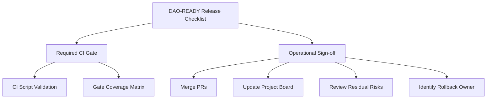

# Other — release

# Other — Release Module Documentation

## Overview

The **Other — release** module is a critical component of the DAO-READY release process, ensuring that all necessary checks and balances are in place before deploying smart contracts, creating or executing DAOs, issuing tokens, and enforcing Treasury Kernel governance. This module serves as a gatekeeper, validating that all conditions are met to maintain the integrity and security of the blockchain environment.

## Purpose

The primary purpose of this module is to provide a structured checklist and documentation for ensuring that the DAO-READY release criteria are met. It outlines the necessary Continuous Integration (CI) gates, operational sign-offs, and residual risks associated with the release process. By adhering to this checklist, developers can ensure that the deployment is secure, deterministic, and compliant with governance constraints.

## Key Components

### 1. DAO-READY Release Checklist

The checklist is divided into two main sections: **Required CI Gate** and **Operational Sign-off**.

#### Required CI Gate

This section outlines the mandatory checks that must pass before a release can be considered DAO-READY:

- **CI Script Validation**: The script `./scripts/validate-dao-ready-gates.sh` must pass on the target branch.
- **Gate Coverage Matrix**: This includes checks for:
  - Token mutation rejection (e.g., `burn`, `transfer`).
  - Token mint authorization checks.
  - Treasury Kernel governance constraints.
  - Nonce replay rejection and crash safety.
  - Cross-node deterministic reconstruction.
  - Valid integration paths for DAO proposals and votes.

#### Operational Sign-off

This section ensures that all necessary operational tasks are completed:

- Merging of primary implementation PRs related to DAO-READY.
- Updating project board statuses to reflect completed tasks.
- Reviewing the residual risk document.
- Identifying rollback owners and verifying rollback paths.

### 2. DAO-READY Residual Risks

This document tracks non-blocking residual risks that may remain after the DAO-READY gates pass. Key risks include:

- **Test-suite Runtime**: Increased CI duration due to extensive integration tests.
- **Legacy API/CLI Pathways**: Potential confusion from older command paths.
- **Warnings in Workspace**: High warning volume that may obscure important signals in CI output.
- **Environment-sensitive Integration Tests**: Flakiness in tests under constrained CI conditions.

### 3. Explicitly Not Residual (Blocking)

Certain conditions are treated as hard blockers and must be enforced by the DAO-READY gates:

- Consensus divergence during replay or restart.
- Unauthorized token minting or token mutation through deprecated paths.
- Bypassing Treasury Kernel authorization constraints.
- Visibility of uncommitted state during crash recovery.

## How It Works

The module operates as a checklist that developers must follow to ensure that all necessary conditions are met before a release. The CI gate script automates the validation of the required checks, while the operational sign-off ensures that all tasks are completed and documented.

### Execution Flow

While there are no internal or outgoing calls detected for this module, the execution flow is primarily driven by the CI process and the manual checks performed by developers. The absence of execution flows indicates that this module serves as a static checklist rather than a dynamic code component.

## Integration with the Codebase

The **Other — release** module connects with various parts of the codebase, particularly those related to smart contract deployment, DAO governance, and token management. It ensures that all components adhere to the defined governance and security standards.

### Mermaid Diagram

The following diagram illustrates the relationship between the DAO-READY release checklist, CI gates, and operational sign-offs:

## Conclusion

The **Other — release** module is essential for maintaining the integrity and security of the DAO-READY release process. By following the outlined checklist and addressing residual risks, developers can ensure a smooth and secure deployment of smart contracts and DAOs. This documentation serves as a guide for developers to understand the module's purpose, components, and integration within the broader codebase.