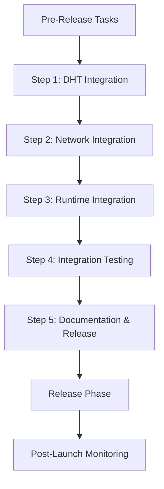

# Other — releases

# Other — Releases Module Documentation

## Overview

The **Other — Releases** module is a critical component of the Sovereign Network's development lifecycle, specifically focused on managing the alpha release process. This module encompasses the planning, execution, and validation of the alpha release, ensuring that all necessary features, tests, and documentation are completed before deployment. The module is structured to facilitate collaboration among developers, testers, and stakeholders, providing a clear roadmap for the release process.

## Purpose

The primary purpose of the Other — Releases module is to:

- Organize and track the progress of the alpha release.
- Ensure that all critical features and fixes are implemented and tested.
- Document the release process, including known issues and future improvements.
- Facilitate communication among team members regarding the status of the release.

## Key Components

### 1. Release Checklist

The **Release Checklist** is a comprehensive document that outlines all tasks required for the alpha release. It includes:

- **Pre-Release Tasks**: Essential tasks that must be completed before the release can proceed, such as merging critical features and ensuring all libraries build successfully.
- **Development Phases**: The release is divided into multiple steps, each with specific tasks and milestones. For example:
  - **Step 1: DHT Integration**: Focuses on integrating the Distributed Hash Table (DHT) with the new identity system.
  - **Step 2: Network Integration**: Involves updating the network components to use the new identity system.
  - **Step 3: Runtime Integration**: Ensures that the identity system is correctly initialized and used across the application.
  - **Step 4: Integration Testing**: Validates that all components work together as expected.
  - **Step 5: Documentation & Release**: Finalizes documentation and prepares for the release.

### 2. Development Phases

Each development phase is broken down into specific tasks, with associated pull requests (PRs) and issue numbers for tracking. For example:

- **Step 1: DHT Integration**
  - Tasks include removing old type aliases, updating routing tables, and adding integration tests.
  
- **Step 2: Network Integration**
  - Tasks focus on updating the mesh server and peer discovery mechanisms.

### 3. Testing Strategy

The **Testing Strategy** outlines the approach for validating the alpha release. It includes:

- **Test Scenarios**: Detailed descriptions of tests to be executed, such as single node restart tests and multi-node network tests.
- **Go/No-Go Criteria**: Specific criteria that must be met for the release to proceed, including NodeId stability and successful peer discovery.

### 4. Release Phase

The **Release Phase** details the final steps before deployment, including:

- **Documentation Updates**: Ensuring that all relevant documentation is updated to reflect the new release.
- **Release Preparation**: Tasks such as creating release tags, building binaries, and preparing announcements.

### 5. Rollback Plan

The **Rollback Plan** outlines the steps to take if critical issues are discovered post-launch. This includes immediate communication with users, investigation of the root cause, and deciding whether to fix forward or roll back.

## Execution Flow

The execution flow of the Other — Releases module is linear, progressing through the defined steps of the release process. Each step must be completed before moving on to the next, ensuring that all necessary tasks are addressed.

## Integration with the Codebase

The Other — Releases module is closely integrated with various components of the Sovereign Network codebase:

- **Identity System**: The module ensures that the new identity system is fully integrated into the DHT and network components.
- **Testing Framework**: The testing strategy leverages existing unit and integration tests to validate the release.
- **Documentation**: The module emphasizes the importance of documentation, ensuring that all changes are well-documented for future reference.

## Conclusion

The Other — Releases module is a vital part of the Sovereign Network's development process, providing a structured approach to managing the alpha release. By organizing tasks, tracking progress, and ensuring thorough testing and documentation, this module helps to mitigate risks and enhance the overall quality of the release. Developers and stakeholders are encouraged to familiarize themselves with the module's components and processes to contribute effectively to the release efforts.