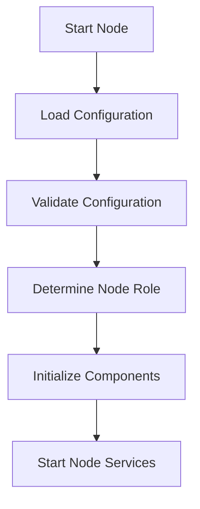

# Other — run-node.log

# ZHTP Orchestrator Node Documentation

## Overview

The **ZHTP Orchestrator Node** is a critical component of the ZHTP blockchain ecosystem. It is responsible for managing the node's lifecycle, including configuration loading, validation, and the initialization of various runtime components. This documentation provides an in-depth look at the node's startup process, its key components, and how it integrates with the overall architecture of the ZHTP system.

## Purpose

The primary purpose of the ZHTP Orchestrator Node is to:

- Load and validate configuration settings.
- Initialize and start various components necessary for node operation.
- Determine the node's role (e.g., FullValidator) based on configuration.
- Facilitate peer discovery and network communication.

## Execution Flow

The execution flow of the ZHTP Orchestrator Node can be summarized in the following steps:

1. **Start Node**: The node is initiated, and the configuration file is loaded.
2. **Load Configuration**: Configuration settings are loaded from the specified TOML file.
3. **Validate Configuration**: The loaded configuration is validated for correctness and completeness.
4. **Determine Node Role**: Based on the configuration, the node's role is determined (e.g., FullValidator).
5. **Initialize Components**: Various components (e.g., crypto, network) are registered and started.
6. **Start Node Services**: The node begins its operational services, including peer discovery.

### Execution Flow Diagram

## Key Components

### 1. Configuration Management

The configuration management is handled by the `zhtp::config` module. It performs the following tasks:

- **Loading Configuration**: Loads settings from the specified TOML file.
- **Environment Setup**: Configures the node for the appropriate environment (e.g., Development, Testnet).
- **Aggregation**: Merges configurations from multiple packages and applies defaults.
- **Validation**: Ensures that the configuration is valid across various parameters, such as port assignments and resource allocations.

### 2. Node Role Determination

The node's role is determined based on specific configuration flags:

- **FullValidator**: If `validator_enabled` is set to true, the node operates as a FullValidator, capable of mining, validating, and storing the full blockchain.

### 3. Runtime Components

The orchestrator initializes several runtime components essential for node functionality:

- **Crypto Component**: Handles cryptographic operations, including key generation and signature verification. It utilizes post-quantum cryptography for enhanced security.
- **Network Component**: Manages peer-to-peer communication and discovery using a mesh networking protocol. It ensures that the node can connect to other nodes in the network.

### 4. Logging

The logging system provides real-time feedback during the node's startup process. It logs important events, such as configuration loading, validation results, and component initialization statuses. This is crucial for debugging and monitoring the node's health.

## Integration with the Codebase

The ZHTP Orchestrator Node is designed to work seamlessly with other modules in the ZHTP ecosystem. It interacts with:

- **Configuration Modules**: For loading and validating settings.
- **Runtime Modules**: For initializing and managing components like crypto and network.
- **Consensus Mechanisms**: To ensure that the node participates correctly in the blockchain's consensus process.

## Conclusion

The ZHTP Orchestrator Node is a foundational element of the ZHTP blockchain, responsible for ensuring that the node is correctly configured, initialized, and ready to participate in the network. Understanding its components and execution flow is essential for developers looking to contribute to the ZHTP codebase or troubleshoot issues related to node operation.