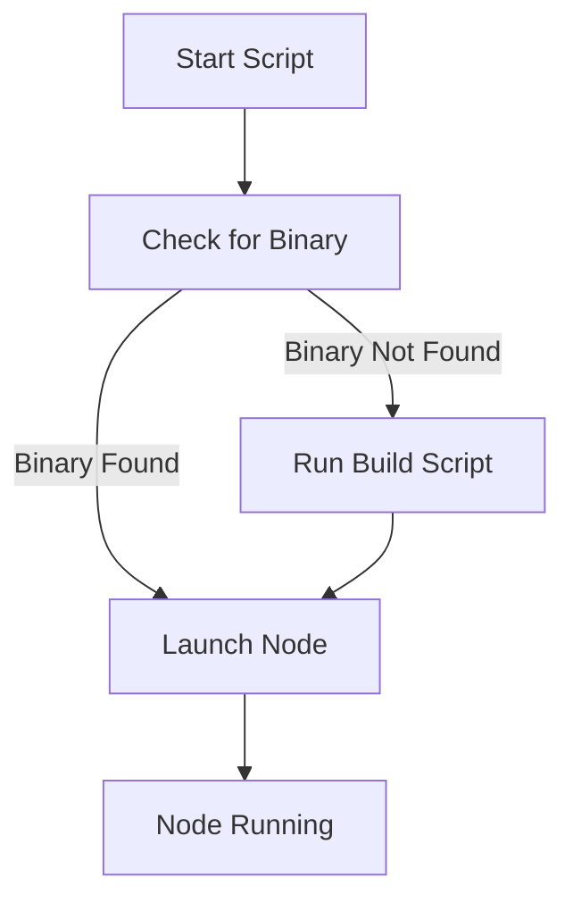

# Other — run-node.sh

# Documentation for the `run-node.sh` Module

## Overview

The `run-node.sh` script is a shell script designed to facilitate the startup of the ZHTP Orchestrator Node. It automates the process of checking for the existence of the required binary, building it if necessary, and then launching the node with a specified configuration file. This module is essential for developers who need to run the ZHTP orchestrator in a local or test environment.

## Purpose

The primary purpose of `run-node.sh` is to streamline the process of starting the ZHTP Orchestrator Node by:

1. Checking for the existence of the compiled binary.
2. Building the binary if it is not found.
3. Launching the node with a specified configuration file.

This script ensures that developers can quickly get the orchestrator up and running without needing to manually check for binaries or run build commands.

## Key Components

### 1. Configuration File

The script accepts an optional argument that specifies the path to the configuration file. If no argument is provided, it defaults to `zhtp/configs/test-node1.toml`. This configuration file is crucial as it contains the settings and parameters that the ZHTP Orchestrator Node will use during its execution.

### 2. Binary Check and Build

The script checks for the existence of the ZHTP binary at `target/release/zhtp`. If the binary is not found, it triggers the `build.sh` script to compile the necessary code. This ensures that the latest version of the orchestrator is always used.

### 3. Node Launch

Once the binary is confirmed to exist, the script launches the ZHTP Orchestrator Node using the command:

```bash
./target/release/zhtp --config "$CONFIG_FILE"
```

This command runs the orchestrator with the specified configuration, allowing it to operate according to the defined parameters.

## Execution Flow

The execution flow of the `run-node.sh` script is straightforward. Below is a simplified representation of the flow:



### Execution Steps

1. **Start Script**: The script begins execution.
2. **Check for Binary**: It checks if the binary exists at the specified path.
3. **Binary Found**: If the binary is found, it proceeds to launch the node.
4. **Binary Not Found**: If the binary is not found, it runs the `build.sh` script to compile the binary.
5. **Launch Node**: After ensuring the binary is available, the script launches the ZHTP Orchestrator Node.
6. **Node Running**: The orchestrator node is now running with the specified configuration.

## Integration with the Codebase

The `run-node.sh` script is a standalone module that interacts with the build system and the ZHTP Orchestrator binary. It does not have any internal or outgoing calls to other modules, making it a simple entry point for starting the orchestrator. 

### Dependencies

- **Build Script**: The script relies on `build.sh` to compile the ZHTP binary if it is not already built.
- **Configuration Files**: The script requires a valid TOML configuration file to run the orchestrator.

## Conclusion

The `run-node.sh` module is a critical utility for developers working with the ZHTP Orchestrator. By automating the build and launch process, it simplifies the workflow and ensures that the orchestrator can be started with minimal effort. Understanding this script is essential for anyone looking to contribute to the ZHTP project or run the orchestrator in a development environment.