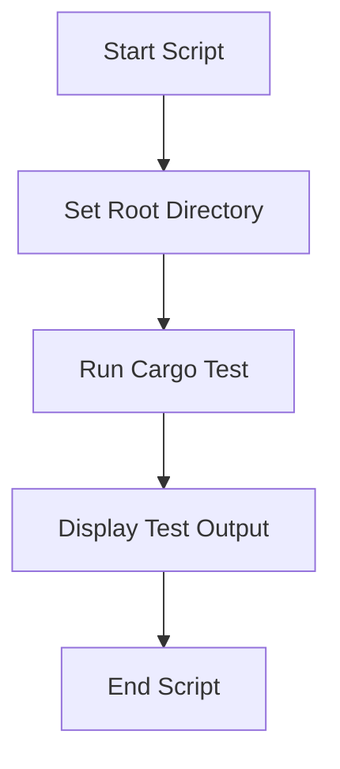

# Other — scripts

# Documentation for the **Other — scripts** Module

## Overview

The **Other — scripts** module contains shell scripts designed to facilitate the execution of integration tests for the `lib-network` library. These tests are specifically focused on the mesh integration functionality and are gated behind a feature flag (`allow-net-tests`) to prevent accidental execution in continuous integration (CI) environments.

## Purpose

The primary purpose of this module is to provide a straightforward way to run integration tests for the `lib-network` library. By using a shell script, developers can easily execute the tests in their local environment, ensuring that the mesh functionality works as expected before changes are committed or merged.

## Key Components

### 1. `run_mesh_integration_tests.sh`

This is the main script in the module. It is responsible for setting up the environment and executing the integration tests. Below is a breakdown of its key components:

- **Shebang and Options**: 
  ```bash
  #!/usr/bin/env bash
  set -euo pipefail
  ```
  This line specifies that the script should be run using Bash and sets options to ensure that the script exits on errors, treats unset variables as errors, and fails on pipe errors.

- **Root Directory Setup**:
  ```bash
  ROOT_DIR="$(cd "$(dirname "${BASH_SOURCE[0]}")/.." && pwd -P)"
  cd "$ROOT_DIR"
  ```
  This section determines the root directory of the project by navigating up from the script's location. This is crucial for ensuring that the script runs in the correct context.

- **Test Execution**:
  ```bash
  RUST_TEST_THREADS=1 cargo test -p lib-network --test mesh_integration --features allow-net-tests -- --nocapture
  ```
  This command runs the integration tests using Cargo, Rust's package manager and build system. The `--features allow-net-tests` flag enables the network tests, while `--nocapture` allows the output of the tests to be displayed in the terminal.

- **Completion Message**:
  ```bash
  echo "Done."
  ```
  This message indicates that the tests have finished running.

### 2. Feature Gating

The integration tests are protected by the `allow-net-tests` feature flag. This means that developers must explicitly enable this feature when running the tests to avoid executing them unintentionally in CI environments. This is a safety measure to ensure that network-related tests do not run unless explicitly intended.

## Execution Flow

The script does not have any internal or outgoing calls to other modules or functions, nor does it have any incoming calls. Its execution flow is linear, starting from the script invocation to the completion of the test execution.

## How to Use

To run the mesh integration tests, follow these steps:

1. **Navigate to the Project Directory**: Open a terminal and change to the root directory of the project where the `lib-network` library is located.

2. **Run the Script**: Execute the script with the following command:
   ```bash
   ./lib-network/scripts/run_mesh_integration_tests.sh
   ```

3. **Observe the Output**: The script will run the tests and display the output in the terminal. Ensure that the `allow-net-tests` feature is enabled in your Cargo configuration.

## Conclusion

The **Other — scripts** module provides a simple yet effective way to run integration tests for the `lib-network` library. By using a shell script, it abstracts the complexity of the test execution process while ensuring that developers can easily validate their changes. The feature gating mechanism adds an additional layer of safety, making it a valuable tool in the development workflow.

### Mermaid Diagram

While this module is straightforward and does not have complex interactions, the following diagram illustrates the flow of execution when running the integration tests:



This diagram summarizes the linear flow of the script, highlighting the key steps involved in executing the integration tests.