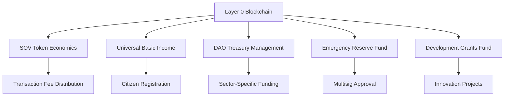

# Other — sov_final

# SOV Final Implementation Module Documentation

**Last Updated:** January 13, 2026  
**Status:** Week 9 COMPLETE ✅ | Week 10 PENDING 🔄  
**Architecture:** Layer 0 Blockchain (Rust WASM Contracts on Native Consensus Engine)  
**Source of Truth:** `06_Financial_Projections_Tokenomics_Models 1.docx` (August 2025)

---

## Overview

The **SOV Final Implementation Module** is designed to create a comprehensive economic layer for the Sovereign Network (SOV) on a Layer 0 blockchain. This module integrates various components, including token economics, governance, treasury management, and universal basic income (UBI) distribution, all while ensuring mathematical accuracy and adherence to the financial projections document.

### Purpose

The primary purpose of this module is to implement a robust economic framework that supports:
- A fixed supply of SOV tokens.
- A transaction fee model that funds various economic activities.
- A UBI system that distributes funds to verified citizens.
- DAO treasury management for sector-specific funding.
- Emergency reserves for crisis management.

---

## Key Components

### 1. Token Economics

#### SOV Token
- **Total Supply:** 1 trillion SOV tokens (fixed).
- **Transaction Fee Rate:** 1% of all transactions.
- **Fee Distribution:**
  - 45% to UBI
  - 30% to Sector DAOs (6% each for 5 DAOs)
  - 15% to Emergency Reserves
  - 10% to Development Grants

#### CBE Corporate Token
- **Total Supply:** 100 billion tokens.
- **Distribution:**
  - 40% for Compensation Pool
  - 30% for Operational Treasury
  - 20% for Performance Incentives
  - 10% for Strategic Reserves

### 2. Universal Basic Income (UBI)

The UBI system is designed to distribute monthly payments to verified citizens based on the transaction volume and fee collection. The formula for UBI per citizen is:

```
UBI per citizen = (Monthly Transaction Volume × 1% × 45%) ÷ Citizen Count
```

### 3. DAO Treasury Management

Five sector-specific DAOs (Healthcare, Education, Energy, Housing, Food) manage their respective funds, each receiving 6% of the total transaction fees. The DAOs are responsible for governance and allocation of their funds.

### 4. Emergency Reserve Fund

The Emergency Reserve Fund accumulates 15% of transaction fees to provide a financial buffer during crises. Access to these funds requires multisig approval to ensure security and governance.

### 5. Development Grants Fund

10% of transaction fees are allocated to the Development Grants Fund, which supports infrastructure and innovation projects within the network.

---

## Architecture Overview

The SOV module operates on a Layer 0 architecture, which is distinct from Ethereum Layer 2 solutions. This architecture allows for native fee distribution and faster execution through WASM contracts.



---

## Implementation Phases

The implementation of the SOV module is divided into six phases, each with specific goals and deliverables:

### Phase 1: Foundation (Weeks 1-2)
- Fix economic constants and create token types.
- Implement fee distribution logic.

### Phase 2: DAOs (Weeks 3-4)
- Create DAO treasury contracts and emergency reserve fund.
- Implement development grants fund.

### Phase 3: UBI (Weeks 5-6)
- Implement UBI distribution contract and citizen registration system.

### Phase 4: Integration (Weeks 7-8)
- Integrate fee distribution into the consensus engine.
- Add SOV transaction types.

### Phase 5: Testing (Weeks 9-10)
- Create comprehensive test suites for financial projections and integration.

### Phase 6: Deployment (Weeks 11-12)
- Develop deployment scripts, CLI tools, and monitoring dashboards.

---

## Testing and Validation

### Testing Strategy
- **Unit Tests:** Ensure individual components function correctly.
- **Integration Tests:** Validate interactions between components.
- **Financial Validation Tests:** Confirm that all calculations match the financial projections document exactly.

### Key Metrics
- **Test Coverage:** Aim for >90% coverage across all tests.
- **Performance Benchmarks:** Validate throughput and response times under load.

---

## Conclusion

The SOV Final Implementation Module is a critical component of the Sovereign Network, providing a comprehensive economic framework that supports sustainable growth and citizen welfare. By adhering to the financial projections and ensuring rigorous testing, this module aims to deliver a robust and efficient economic layer on a Layer 0 blockchain.

**Next Steps:**
- Complete Phase 10 testing and validation.
- Prepare for deployment and operational readiness.

For further details, refer to the source documents:
- `06_Financial_Projections_Tokenomics_Models 1.docx`
- `SOV_L0_IMPLEMENTATION_PLAN.md`
- `SOV_TOKENOMICS_CORRECTED.md`