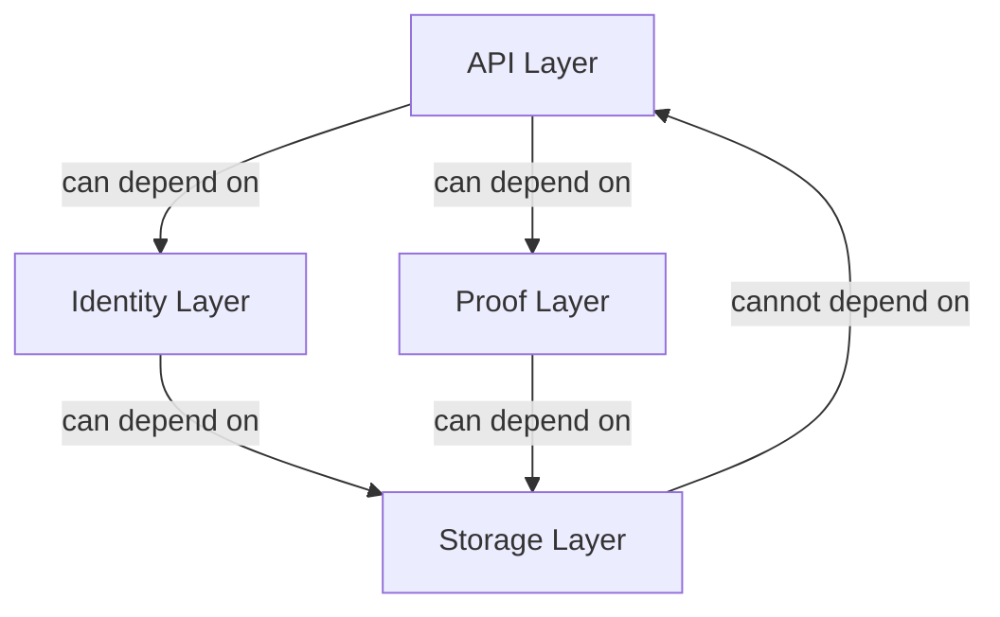

# Other — sovereign-code-reviewer

# Sovereign Code Reviewer Module Documentation

## Overview

The **Sovereign Code Reviewer** module is designed to facilitate context-aware code reviews for projects within the Sovereign Network. It leverages architectural patterns, security rules, performance guidelines, and code quality standards to ensure that code adheres to best practices and is secure against common vulnerabilities. This module is essential for maintaining the integrity and security of the codebase, particularly in sensitive areas such as identity management and cryptographic operations.

## Purpose

The primary purpose of the Sovereign Code Reviewer is to automate the code review process by analyzing code against predefined architectural patterns and security rules. This helps developers identify potential issues early in the development cycle, ensuring that the code is robust, secure, and maintainable.

## Key Components

### 1. Configuration Files

The module relies on a YAML configuration file (`architecture.yaml`) that defines:

- **Critical Areas**: Key parts of the codebase that require special attention during reviews.
- **Patterns**: Architectural patterns that guide how specific functionalities should be implemented.
- **Security Rules**: Guidelines to prevent vulnerabilities related to sensitive data handling and cryptographic operations.
- **Performance Rules**: Recommendations for optimizing performance in asynchronous contexts.
- **Architecture Rules**: Guidelines for maintaining proper layer separation and dependency management.
- **Code Quality Rules**: Standards for writing clean, maintainable code.

### 2. Context Management

The `context` package provides the `ProjectContext` and `ArchitecturePattern` classes, which manage the context in which the code review operates. This includes maintaining state and providing access to architectural patterns defined in the configuration.

```python
from .project_context import ProjectContext, ArchitecturePattern
```

### 3. Data Models

The `models` package contains data structures that represent issues identified during code reviews. Key classes include:

- **Issue**: Represents a specific problem found in the code.
- **ReviewResult**: Encapsulates the outcome of a code review.
- **SelfImprovementReport**: Provides insights for developers to improve their code quality.

```python
from .issue import Issue, Priority, IssueType, IssueClassification
from .review import ReviewResult, SelfImprovementReport
```

### 4. Tools for Integration

The `tools` package includes utilities for integrating with external systems, such as GitHub. The `GitHubIntegration` class allows the code reviewer to interact with GitHub repositories, facilitating automated reviews and feedback.

```python
from .github_integration import GitHubIntegration
```

## Execution Flow

Currently, there are no defined execution flows or internal calls within the Sovereign Code Reviewer module. The module is designed to be invoked as part of a larger code review process, likely triggered by events such as pull requests or commits.

## Architectural Patterns

The architectural patterns defined in `architecture.yaml` guide the implementation of various functionalities. Below is a simplified representation of the architecture layers and their dependencies:



### Layer Dependencies

- **API Layer**: Can depend on Identity and Proof layers but not on Storage.
- **Identity Layer**: Can depend on Storage and Proof layers but not on API or Protocol layers.
- **Proof Layer**: Can depend on Storage but not on API, Identity, or Protocol layers.
- **Protocol Layer**: Can depend on Identity and Storage but not on API.
- **Storage Layer**: Cannot depend on any other layers.

## Security and Performance Guidelines

The module enforces several security and performance guidelines to ensure that the code is not only functional but also secure and efficient. Key rules include:

- **No Plaintext Storage**: Sensitive data must be hashed or encrypted before storage.
- **Constant-Time Comparisons**: All cryptographic operations must use constant-time comparison to prevent timing attacks.
- **Input Validation**: All external data must be validated before processing.
- **Rate Limiting**: Sensitive endpoints must implement rate limiting to prevent brute-force attacks.

## Conclusion

The Sovereign Code Reviewer module is a critical component of the Sovereign Network's development ecosystem. By adhering to the architectural patterns, security rules, and performance guidelines defined in this module, developers can ensure that their code is secure, maintainable, and efficient. This documentation serves as a guide for developers looking to understand and contribute to the Sovereign Code Reviewer module, facilitating a collaborative and secure development environment.