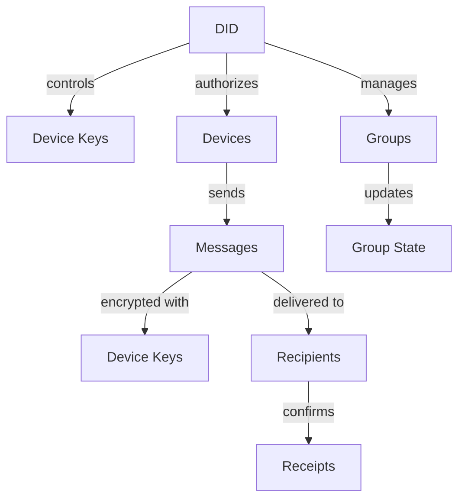

# Other — specs

# Other — Specs Module Documentation

## Overview

The **Other — Specs** module defines the specifications for the Identity and Device Model v1, focusing on user identity management, device authorization, message encryption, delivery semantics, and group management. This module is critical for ensuring secure communication and privacy within the network, while also providing mechanisms for abuse control and recovery.

## Purpose

The primary purpose of this module is to establish a robust framework for user identity and device management, ensuring that communications are secure, private, and resilient against abuse. It outlines how users are identified, how devices are authorized, and how messages are encrypted and delivered, all while maintaining user privacy and network integrity.

## Key Components

### 1. Identity and Device Management

#### 1.1 Decentralized Identifier (DID)
- Each user is uniquely identified by a Decentralized Identifier (DID).
- The DID is controlled by a seed phrase, which is only known to the user.
- The DID document includes:
  - A root verification key derived from the seed.
  - A registry of authorized device keys.
  - Optional service endpoints.

#### 1.2 Multi-Device Support
- Users can authorize multiple devices, each with a unique asymmetric keypair and device ID.
- Adding or removing devices requires a DID-signed update, ensuring that only the user can modify their device list.

### 2. Cryptography and Message Model

#### 2.1 End-to-End Encryption
- Messages are encrypted end-to-end, targeting device keys rather than DIDs directly.
- Nodes in the network do not see plaintext messages or hold keys, ensuring privacy.

#### 2.2 Message Types
- The module supports various message types, including user messages, control messages, receipts, and group state updates. All messages are treated as opaque blobs by the network.

### 3. Message Delivery and Offline Handling

#### 3.1 Store-and-Forward Mechanism
- Nodes may temporarily store encrypted messages for offline recipients, with a Time-to-Live (TTL) to manage storage duration.

#### 3.2 TTL Management
- The sender specifies the TTL for each message, which can range from no storage to a maximum of 30 days. Nodes must delete messages after TTL expiry or upon successful delivery acknowledgment.

### 4. Metadata and Routing Privacy

#### 4.1 Phase 0 and Phase 1
- In Phase 0, nodes can see sender and recipient identifiers, message size, and timing, but not the content.
- Phase 1 introduces sealed-sender envelopes and layered encryption, enhancing privacy by obscuring sender and recipient identities from nodes.

### 5. Group Management

#### 5.1 Group Structure
- Groups are capped at a maximum of 32 members, with a default cap of 16.
- Each group has a unique Group ID and an admin key, which may be a DID or a derived group key.

#### 5.2 Group Encryption Model
- Group messages are encrypted using an epoch-based sender key, which changes with membership updates.

### 6. Abuse, Spam, and DoS Protections

#### 6.1 Network-Level Protections
- Nodes can enforce rate limits, message size caps, and other protections without inspecting message content.

#### 6.2 User-Level Controls
- Users can manage abuse through allowlists, blocklists, and invite-only modes, ensuring they have control over their interactions.

### 7. Proof of Useful Work (PoUW)

#### 7.1 Purpose and Mechanism
- PoUW is designed to price spam and reward genuine participation. Each message includes a PoUW stamp that is verifiable by nodes.

### 8. Recovery Model

#### 8.1 Account Recovery
- Users can recover their DID using the seed phrase, allowing them to re-authorize devices.

#### 8.2 Message Recovery
- No mechanism exists for recovering past messages without the corresponding device keys, emphasizing the importance of key management.

### 9. Legal and Compliance Posture
- Nodes operate as blind relays and do not retain message content or decryption keys, ensuring compliance with privacy standards.

### 10. Hard Protocol Invariants
- The module enforces strict invariants, such as no content decryption by nodes and no long-term message history retention.

## Architecture Overview

The following diagram illustrates the high-level architecture of the Identity and Device Model v1, highlighting the relationships between key components:

## Conclusion

The **Other — Specs** module provides a comprehensive framework for managing user identities, device authorizations, and secure message delivery within a decentralized network. Understanding this module is crucial for developers looking to contribute to the codebase, as it lays the foundation for secure and private communications.