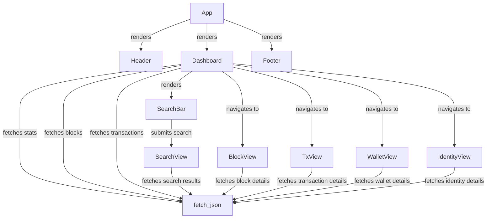

# Other — src

# Explorer Module Documentation

## Overview

The **Explorer** module serves as a web-based interface for interacting with a blockchain. It provides functionalities to view blockchain statistics, blocks, transactions, wallets, and identities. The module is built using the Leptos framework, which allows for reactive UI components in Rust. The primary purpose of this module is to facilitate user interaction with blockchain data, making it accessible and understandable.

## Key Components

### Data Structures

The module defines several data structures that represent the responses from the blockchain API. These structures are serialized and deserialized using the `serde` library.

- **StatsResponse**: Contains statistics about the blockchain, such as the latest block height, total transactions, and active validators.
- **BlockSummary**: Represents a summary of a block, including its height, hash, and timestamp.
- **BlocksResponse**: A collection of `BlockSummary` objects.
- **TxSummary**: Represents a summary of a transaction, including its hash, type, and fee.
- **TransactionsResponse**: A collection of `TxSummary` objects.
- **BlockDetailResponse**: Detailed information about a specific block.
- **TransactionDetailResponse**: Detailed information about a specific transaction.
- **WalletsResponse**: Contains information about wallets associated with a specific identity.
- **IdentityResponse**: Contains details about a blockchain identity.

### Main Components

1. **App Component**: The root component that sets up the router and defines the main layout of the application.
2. **Header Component**: Displays the application title and navigation links.
3. **Footer Component**: Displays footer information.
4. **Dashboard Component**: The main landing page that shows network statistics, latest blocks, and transactions.
5. **SearchBar Component**: A form for users to search for transactions, blocks, wallets, or identities.
6. **SearchView Component**: Displays search results based on user input.
7. **BlockView Component**: Displays detailed information about a specific block.
8. **TxView Component**: Displays detailed information about a specific transaction.
9. **WalletView Component**: Displays information about wallets associated with a specific identity.
10. **IdentityView Component**: Displays details about a specific identity.

### Utility Functions

- **fetch_json**: A generic asynchronous function that fetches JSON data from a given URL and deserializes it into the specified type.
- **short_hash**: A utility function that formats a hash string to a shorter version for display.
- **format_timestamp**: Converts a Unix timestamp into a human-readable format.

## Execution Flow

The application follows a reactive programming model where components fetch data asynchronously and update the UI based on the state of that data. The `fetch_json` function is a key part of this flow, as it is called by various components to retrieve data from the blockchain API.

### Component Interaction

The following diagram illustrates the interaction between key components and the data fetching mechanism:

## How to Contribute

To contribute to the Explorer module, follow these steps:

1. **Clone the Repository**: Start by cloning the repository to your local machine.
2. **Set Up the Environment**: Ensure you have Rust and the necessary dependencies installed.
3. **Run the Application**: Use `cargo run` to start the application and test your changes.
4. **Implement Features or Fix Bugs**: Make your changes in the appropriate files. Follow the existing coding style and conventions.
5. **Write Tests**: Ensure that your changes are covered by tests. Add new tests as necessary.
6. **Submit a Pull Request**: Once your changes are complete, submit a pull request for review.

## Conclusion

The Explorer module is a vital part of the blockchain ecosystem, providing users with an intuitive interface to interact with blockchain data. By understanding its components and how they interact, developers can effectively contribute to its development and enhancement.